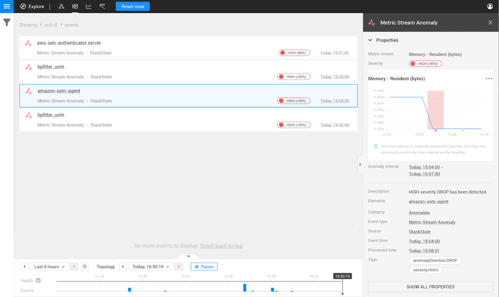

# Autonomous Anomaly Detector

## Overview

Anomaly detection identifies abnormal behavior in your fast-changing IT environment. This helps direct the attention of IT operators to the root cause of problems or can provide an early warning. The Autonomous Anomaly Detector (AAD) requires zero configuration. It is fully autonomous in selecting both the metric streams it will apply anomaly detection to, and the appropriate machine learning algorithms to use for each metric stream. 


Note that a [training period](#training-period) is required before AAD can begin to report anomalies.


### The anomaly detection process

The Autonomous Anomaly Detector \(AAD\) is enabled as soon as the [AAD StackPack has been installed](#install-the-aad-stackpack) in StackState. When the AAD has been enabled, metric streams are identified and analyzed in search of any anomalous behavior based on their past. After the initial training period, detected anomalies will be reported in the following way:
  - The anomaly is marked on the associated metric stream chart.
  - If the anomaly is considered to have a severity level of HIGH, an [anomaly event](#anomaly-events) is generated containing details of the detected anomaly.

### Anomaly events

When an anomaly is detected on a metric stream, a `Metric Stream Anomaly` event is generated. Anomaly events are listed on the Events Perspective and will also be reported as one of the [Probable Causes for any associated problem](/use/problem-analysis/problem_investigation.md#probable-causes). Clicking on a `Metric Stream Anomaly` event will open the Event Details pane on the right-hand side of the screen and provide the following information:

* **Metric Stream** - The name of the metric stream on which the anomaly was detected.
* **Severity** - (HIGH, MEDIUM or LOW). The severity shows how far a metric point has deviated from the expected model. Only HIGH severity anomalies will result in an event being generated, however, MEDIUM and LOW severities will be marked on the metric chart. The percentage reported next to the severity shows how closely the model used matches the metric points reported. A lower percentage indicates more frequent deviations from the predicted metric values. For example, an extreme value reported once over the course of two weeks (when collecting data every minute), would report 80%. Once every 4 weeks corresponds to 90%, once every 8 weeks to 95% etc.
* **Metric chart** - A chart with an extract from the metric stream centered around the detected anomaly. The Anomaly Interval is highlighted in red.
* **Anomaly interval** - The time period during which anomalous behaviour was detected.
* **Description** - ???
* **Elements** - The name of the element (or elements) on which the metric stream is attached

## Installation
    
### Prerequisites

* The AAD StackPack can only be installed within a [Kubernetes setup](../../setup/install-stackstate/kubernetes_install/ "StackState Self-Hosted only"). Please make sure that this is supported by your StackState installation.
* It is also possible to [install the AAD standalone](../../setup/install-stackstate/kubernetes_install/aad_standalone.md "StackState Self-Hosted only") within Kubernetes.
* If you are not sure that you have a Kubernetes setup or would you like to know more, contact [StackState support](https://support.stackstate.com/hc/en-us "StackState Self-Hosted only").

### Install the AAD StackPack

To install the AAD StackPack, simply press the INSTALL button. No other actions need to be taken. A [training period](#training-period) is required before AAD can begin to report anomalies.

### Training period

The AAD will need to train on your data before it can begin reporting anomalies. With data collected in 1 minute buckets, AAD requires a 3-day training period. If historic data exists for relevant metric streams, this will also be used for training the AAD. In this case, the first results can be expected within an hour.

## Frequently Asked Questions

### How are metric streams selected?

The AAD scales to large environments by autonomously prioritizing metric streams based on its knowledge of the 4T data model and user feedback. The metric stream selection algorithm ranks metric streams based on the criteria below:

* The top ranking is given to metric streams with [anomaly health checks](../../use/health-state/anomaly-health-checks.md).
* Components in views that have the most stars by the most users are ranked highest.
* From those components, the metric streams with the highest priorities are ranked highest. See [how to set the priority for a stream](../../configure/telemetry/how_to_use_the_priority_field_for_components.md).

You cannot directly control the stream selected, but you can steer the metric stream selection of the AAD by manipulating the above-mentioned factors.



Know what the AAD is working on. The status UI of the AAD provides various metrics and indicators, including details of what it is currently doing \(see [troubleshooting](../../setup/install-stackstate/kubernetes_install/aad_standalone.md#troubleshooting)\).


### How fast are anomalies detected?

After an initial [training period](#training-period), the AAD ensures that prioritized metric streams are checked for anomalies in a timely fashion. Anomalies occurring in the highest prioritized metric streams are detected within about 5 minutes.

### Can anomalies trigger alerts?

Yes. The AAD itself does not alert on anomalies found, but [anomaly health checks](../../use/health-state/anomaly-health-checks.md) can be added to components to automatically change the health status of the component to `DEVIATING`. This health state change event can then trigger notifications by [adding an event handler](/use/stackstate-ui/views/manage-event-handlers.md) to a view.

## Uninstall

To uninstall the AAD StackPack, simply press the UNINSTALL button. No other actions need to be taken.

## Release Notes

**Autonomous Anomaly Detector StackPack v0.9.2 \(02-04-2021\)**

* Common version bumped from 2.4.3 to 3.0.0
* StackState min version bumped to 4.3.0

**Autonomous Anomaly Detector StackPack v0.8.1 \(22-03-2021\)**

* Check function has been moved to common StackPack

**Autonomous Anomaly Detector StackPack v0.8.0 \(19-03-2021\)**

* Autonomous metric stream anomaly detection check function.

**Autonomous Anomaly Detector StackPack v0.7 \(19-02-2021\)**

* Autonomous Anomaly Detector service GA.

**Autonomous Anomaly Detector StackPack v0.6 BETA \(13-10-2020\)**

* Documentation fixes and minor maintenance work.

**Autonomous Anomaly Detector StackPack v0.2.2 BETA \(04-09-2020\)**

* Releasing Autonomous Anomaly Detector service BETA.

## See also

* [Anomaly detection](../../use/concepts/anomaly-detection.md)
* [Anomaly health checks](../../use/health-state/anomaly-health-checks.md)
