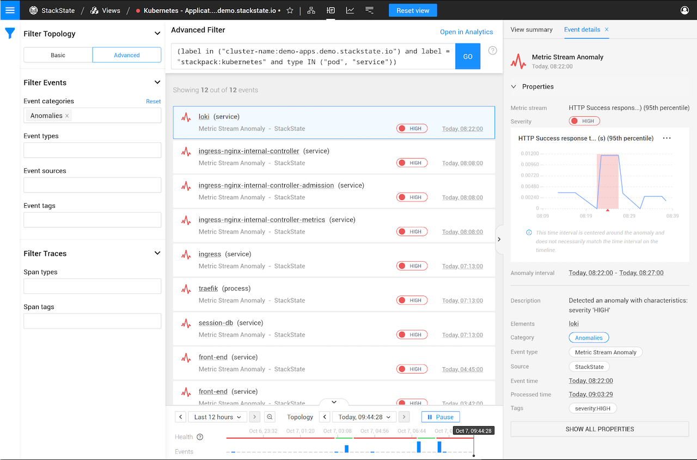

# Autonomous Anomaly Detector

## Overview

Anomaly detection identifies abnormal behavior in your fast-changing IT environment. This helps direct the attention of IT operators to the root cause of problems or can give an early warning. The Autonomous Anomaly Detector (AAD) requires zero configuration. It's fully autonomous in selecting both the metric streams it will apply anomaly detection to, and the appropriate machine learning algorithms to use for each metric stream.

The AAD supports daily and weekly seasonality, creating an anomaly when the observed values differ a lot from the expected values. Daily seasonality is enabled by default.


Note that the AAD requires a [training period](aad.md#training-period) before it can begin to report anomalies.


### The anomaly detection process

The Autonomous Anomaly Detector (AAD) is enabled as soon as the [AAD StackPack has been installed](aad.md#install-the-aad-stackpack) in StackState. When the AAD has been enabled, metric streams are identified and analyzed in search of any anomalous behavior based on their past. After the initial training period, detected anomalies will be reported in the following way:

* The identified anomaly is given a [severity](aad.md#anomaly-severity) (HIGH, MEDIUM or LOW).
* The anomaly and time period during which anomalous behaviour was detected are shown on the associated metric stream chart. The color indicates the anomaly severity.
* If the anomaly is considered to have a severity level of HIGH, an [anomaly event](aad.md#anomaly-events) is generated.

### Anomaly severity

Each identified anomaly is given a severity. This can be HIGH, MEDIUM or LOW. The severity shows how far a metric point has deviated from the expected model and the length of time for which anomalous data has been observed.

| Severity | Description                                                                                                                                                                                                                                                                                                                         |
| :--- |:------------------------------------------------------------------------------------------------------------------------------------------------------------------------------------------------------------------------------------------------------------------------------------------------------------------------------------|
| 🟥 **HIGH** (red) | Reported only when data points with a low probability of occurrence are observed for at least 3 minutes. The least often reported severity. [Generates an anomaly event](aad.md#anomaly-events).                                                                                                                                    |
| 🟧 **MEDIUM** (orange) | Reported for anomalous data observed for a short period of time or slightly anomalous data observed for a longer period of time. Reported less often than LOW severity and more often than HIGH severity anomalies. Useful for root cause analysis and can offer extra insight into HIGH severity anomalies reported on the stream. |
| 🟨 **LOW** (yellow) | Reported when slightly anomalous data is observed. The most often reported anomaly severity. Less frequent occurrences of LOW severity anomalies indicates a higher reliability of anomaly reports from the AAD.                                                                                                                    |

### Anomaly events

When a HIGH severity anomaly is detected on a metric stream, a `Metric Stream Anomaly` event is generated. Anomaly events are listed on the Events Perspective and will also be reported as one of the [Probable Causes for any associated problem](../../use/problem-analysis/problem_investigation.md#probable-causes). Select an event to display detailed information about it in the right panel details tab - **Event details**.

* **Metric Stream** - The name of the metric stream on which the anomaly was detected.
* **Severity** - The [anomaly severity](#anomaly-severity). Anomaly events are only generated for HIGH severity anomalies.
* **Metric chart** - A chart with an extract from the metric stream centered around the detected anomaly.
* **Anomaly interval** - The time period during which anomalous behaviour was detected. This is also shaded on the metric chart.
* **Description** - A description of the observed anomaly.
* **Elements** - The name of the element (or elements) on which the metric stream is attached

### Anomaly feedback


Note that feedback isn't used to train the running instance of the AAD.


Models are selected by the AAD and optimized for each metric stream. The quality of the anomalies reported is determined to a large extent by how well the selected model describes the stream that it runs on. The StackState team works with representative datasets to develop new models and optimize the hyperparameters used for model selection and training the AAD. 

To enable improvement of the AAD, users can add feedback to reported anomalies. This feedback can then be used by StackState to assist in the ongoing development of the AAD.



**StackState Self-Hosted**

Extra information for the [StackState Self-Hosted product](https://docs.stackstate.com/):

    
Use the StackState CLI to export anomaly feedback ready to send to StackState.



The feedback sent to StackState consists of:
* **Thumbs-up, Thumbs-down** votes - Each user can cast one vote per reported anomaly.
* **Comments** - Free-form text entered by users. Note that any comments added to an anomaly will be included in the feedback sent to StackState. Take care not to include sensitive data in comments.
* **Anomaly details** - The description, interval, severity (score), model information, metric query and element, stream names.
* **Metric data** - Data from the metric stream leading up to the anomaly.

## Installation
    

### Install the AAD StackPack

To install the AAD StackPack, simply press the **INSTALL** button. No other actions need to be taken. THe AAD requires a [training period](aad.md#training-period) before it can begin to report anomalies.

### Training period

The AAD will need to train on your data before it can begin reporting anomalies. With data collected in 1 minute buckets, the AAD requires a 2-hour training period. If historic data exists for relevant metric streams, this will also be used for training the AAD. In this case, the first results can be expected within an hour. Up to three days of data are used for training. After the initial training, the AAD will continuously refine its model and adapt to any changes in the data.

For weekly seasonality, the training period needs to be extended to at least three weeks of data. With fine-grained metrics data, this puts a considerable load on the metrics store. The access pattern is quite different from other typical metric data uses. Enabling weekly seasonality therefore must be validated to prevent degraded performance.

## Frequently Asked Questions

### How are metric streams selected?

The AAD scales to large environments by autonomously prioritizing metric streams based on its knowledge of the 4T data model and the stream priority defined by users. The metric stream selection algorithm ranks metric streams based on the criteria below:

* The top ranking is given to metric streams with [anomaly health checks](../../use/checks-and-monitors/anomaly-health-checks.md).
* Components in views that have the most stars by the most users are ranked highest.
* From those components, the metric streams with the highest priorities are ranked highest. See [how to set the priority for a stream](../../use/metrics/set-telemetry-stream-priority.md).
* Anomaly detection will be disabled on streams if more than 20% of their time is flagged as anomalous.

You can't directly control the stream selected, but you can steer the metric stream selection of the AAD by manipulating the above-mentioned factors.



**StackState Self-Hosted**

Extra information for the [StackState Self-Hosted product](https://docs.stackstate.com/):

    
Know what the AAD is working on. The status UI of the AAD provides various metrics and indicators, including details of what the AAD is currently doing.


### How fast are anomalies detected?

After an initial [training period](aad.md#training-period), the AAD ensures that prioritized metric streams are checked for anomalies in a timely fashion. Anomalies occurring in the highest prioritized metric streams are detected within about 5 minutes.

### Can anomalies trigger alerts?

Yes. The AAD itself doesn't alert on anomalies found, but [anomaly health checks](../../use/checks-and-monitors/anomaly-health-checks.md) can be added to components to automatically change the health status of the component to `DEVIATING`. This health state change event can then trigger notifications by [adding an event handler](../../use/events/manage-event-handlers.md) to a view.

## Uninstall

To uninstall the AAD StackPack, simply press the **UNINSTALL** button. No other actions need to be taken.

## Release Notes

**Autonomous Anomaly Detector StackPack v0.9.2 (02-04-2021)**

* Common version bumped from 2.4.3 to 3.0.0
* StackState min version bumped to 4.3.0

## See also

* [Anomaly detection](../../use/concepts/anomaly-detection.md)
* [Anomaly health checks](../../use/checks-and-monitors/anomaly-health-checks.md)
