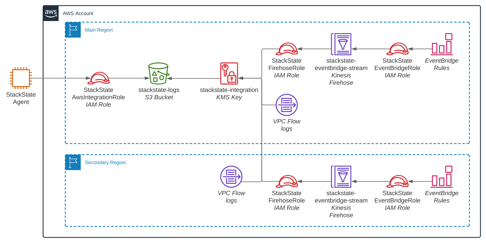

# AWS V2

## Overview

Amazon Web Services \(AWS\) is a major cloud provider. This StackPack enables in-depth monitoring of AWS services.


- The StackState Agent V2 collects all API responses from the target AWS account.
- All services are queried once an hour to gain a full point-in-time snapshot of resources.
- Once a minute, Cloudtrail and Eventbridge events are read to find changes to resources, allowing topology updates in real time.
- Logs are fetched from Cloudwatch and a central S3 bucket once a minute and displayed with the components.
- Metrics are fetched on-demand, through a separate plugin inside StackState.

## Setup

### Prerequisites

To set up the StackState AWS V2 integration, you need to have:

- [StackState Agent V2](agent.md) installed on a machine which can connect to AWS and StackState.
- An AWS account for the StackState Agent to use when deploying resources to the target AWS accounts. It is recommended to use a separate shared account for this and not use any of the accounts that will be monitored by StackState, but this is not required.
  - If StackState Agent is running within an AWS environment, the EC2 instance, EKS or ECS task must have an IAM role attached to it.
  - If StackState Agent is running outside an AWS account, an IAM user must be made available.
- The IAM user/role must have the following IAM policy. This policy grants the IAM principal permission to assume the role created in each target AWS account.

```json
{
  "Version": "2012-10-17",
  "Statement": [
    {
      "Effect": "Allow",
      "Action": "sts:AssumeRole",
      "Resource": "arn:aws:iam::*:role/StackStateAwsIntegrationRole"
    }
  ]
}
```

### Migrate from the AWS V1 (Legacy) integration

The AWS V2 integration has been rebuilt from the ground up. This means that it is not possible to automatically migrate an existing AWS V1 (Legacy) integration to AWS V2. To start using the AWS V2 integration with your AWS instance, the AWS V1 (Legacy) StackPack must first be removed. It is possible to run the AWS V1 (Legacy) StackPack and the AWS V2 StackPack side by side during the migration process, however, this configuration is not supported and will likely not be available in the next major StackState release.

Read how to [uninstall an existing AWS V1 (Legacy) integration](/stackpacks/integrations/aws-legacy.md#uninstall).

The AWS V2 integration is an entirely new StackPack, and migrating existing configuration from the Legacy StackPack is not supported. On upgrading, topology history and health state for instances will be lost, however metrics are fetched directly from CloudWatch and will still be available.

### Deploy AWS Cloudformation stack

The StackState AWS Cloudformation stack is deployed in your AWS account. This provides the minimum level of access required to collect topology, telemetry and logs. There are three methods of deployment:

- [Quick deployment](#quick-deployment) - Deploy all resources to a region in an account using a link.
- [StackState template deployment](#stackstate-template-deployment) - Download a CloudFormation template to integrate into your own deployment workflow.
- [Manual deployment](#manual-deployment) - Deploy all resources manually to gain full control over StackState's access.

#### Quick deployment

All necessary resources in a single region, in one account can be deployed using an automated CloudFormation template.

The CloudFormation template requires 3 parameters:

- **Main Region:** The primary AWS region. This can be any region, as long as this region is the same for every template deployed within the AWS account. Global resources will be deployed in this region such as the IAM role and S3 bucket. Example: `us-east-1`.
- **Agent Account ID:** The AWS account that the StackState Agent is deployed in, or has an IAM user in. This will be the account that the IAM role can be assumed from, the perform actions on the target AWS account. Example: `0123456789012`.
- **External ID:** A shared secret that the StackState agent will present when assuming a role. Use the same value across all AWS accounts that the agent is monitoring. Example: `uniquesecret!1`.

The table below includes links to deploy the template in popular AWS regions. For any regions not listed, follow the steps for the [StackState template deployment](#stackstate-template-deployment).


You must be logged in to the target AWS account in the web console.


| Region Name | Template deployment link |
|:--|:--|
| Ireland       | [eu-west-1 \(console.aws.amazon.com\)](https://eu-west-1.console.aws.amazon.com/cloudformation/home?region=eu-west-1#/stacks/create/review?templateURL=https://stackstate-integrations-resources-eu-west-1.s3.eu-west-1.amazonaws.com/aws-topology/cloudformation/stackstate-resources-1.0.cfn.yaml&stackName=stackstate-resources)                |
| Frankfurt     | [eu-central-1 \(console.aws.amazon.com\)](https://eu-central-1.console.aws.amazon.com/cloudformation/home?region=eu-central-1#/stacks/create/review?templateURL=https://stackstate-integrations-resources-eu-west-1.s3.eu-west-1.amazonaws.com/aws-topology/cloudformation/stackstate-resources-1.0.cfn.yaml&stackName=stackstate-resources)       |
| N. Virginia   | [us-east-1 \(console.aws.amazon.com\)](https://us-east-1.console.aws.amazon.com/cloudformation/home?region=us-east-1#/stacks/create/review?templateURL=https://stackstate-integrations-resources-eu-west-1.s3.eu-west-1.amazonaws.com/aws-topology/cloudformation/stackstate-resources-1.0.cfn.yaml&stackName=stackstate-resources)                |
| Ohio          | [us-east-2 \(console.aws.amazon.com\)](https://us-east-2.console.aws.amazon.com/cloudformation/home?region=us-east-2#/stacks/create/review?templateURL=https://stackstate-integrations-resources-eu-west-1.s3.eu-west-1.amazonaws.com/aws-topology/cloudformation/stackstate-resources-1.0.cfn.yaml&stackName=stackstate-resources)                |
| N. California | [us-west-1 \(console.aws.amazon.com\)](https://us-west-1.console.aws.amazon.com/cloudformation/home?region=us-west-1#/stacks/create/review?templateURL=https://stackstate-integrations-resources-eu-west-1.s3.eu-west-1.amazonaws.com/aws-topology/cloudformation/stackstate-resources-1.0.cfn.yaml&stackName=stackstate-resources)                |
| Hong Kong     | [ap-east-1 \(console.aws.amazon.com\)](https://ap-east-1.console.aws.amazon.com/cloudformation/home?region=ap-east-1#/stacks/create/review?templateURL=https://stackstate-integrations-resources-eu-west-1.s3.eu-west-1.amazonaws.com/aws-topology/cloudformation/stackstate-resources-1.0.cfn.yaml&stackName=stackstate-resources)                |
| Singapore     | [ap-southeast-1 \(console.aws.amazon.com\)](https://ap-southeast-1.console.aws.amazon.com/cloudformation/home?region=ap-southeast-1#/stacks/create/review?templateURL=https://stackstate-integrations-resources-eu-west-1.s3.eu-west-1.amazonaws.com/aws-topology/cloudformation/stackstate-resources-1.0.cfn.yaml&stackName=stackstate-resources) |
| Sydney        | [ap-southeast-2 \(console.aws.amazon.com\)](https://ap-southeast-2.console.aws.amazon.com/cloudformation/home?region=ap-southeast-2#/stacks/create/review?templateURL=https://stackstate-integrations-resources-eu-west-1.s3.eu-west-1.amazonaws.com/aws-topology/cloudformation/stackstate-resources-1.0.cfn.yaml&stackName=stackstate-resources) |

#### StackState template deployment

The CloudFormation template below can be downloaded and used to deploy all necessary resources.

[https://stackstate-integrations-resources-eu-west-1.s3.eu-west-1.amazonaws.com/aws-topology/cloudformation/stackstate-resources-1.0.cfn.yaml](https://stackstate-integrations-resources-eu-west-1.s3.eu-west-1.amazonaws.com/aws-topology/cloudformation/stackstate-resources-1.0.cfn.yaml)

This template can be deployed to multiple AWS accounts and regions at once by deploying it in a CloudFormation StackSet. For more information on how to use StackSets, check the [AWS documentation](https://docs.aws.amazon.com/AWSCloudFormation/latest/UserGuide/what-is-cfnstacksets.html).

#### Manual deployment

The default CloudFormation template gives read-only least-privilege access to only the resources that StackState requires to function. It is recommended that this template is used as it provides an easy upgrade path for future versions, and reduces the maintenance burden.

The IAM role created by StackState is not able to bypass IAM permissions boundaries or Service Control Policies. These can be used as a way to restrict access while retaining the original CloudFormation template and policy.

If these options do not provide enough flexibility, see section [Required AWS resources](#required-aws-resources) for full information on the resources that StackState requires. If the StackState Agent does not have permission to access a certain component, it will skip it.

### Install

Install the AWS V2 StackPack from the StackState UI **StackPacks** &gt; **Integrations** screen. You following parameters provided will be used by StackState to query live telemetry from the AWS account; the AWS Agent V2 must be configured to create topology.

#### Role ARN

Enter the ARN of the IAM Role that was created as part of [Deploy AWS Cloudformation stack](#deploy-aws-cloudformation-stack), example: `arn:aws:iam::<account id>:role/StackStateAwsIntegrationRole`. Replace the `<account id>` with the 12-digit AWS account ID.

#### External ID

A shared secret that StackState will present when assuming a role. Use the same value across all AWS accounts. Example: `uniquesecret!1`

#### AWS Access Key ID (Optional)

The Access Key ID of the IAM user created in [Prerequisites](#prerequisites). If the StackState instance is running within AWS, this can be left empty and the instance will authenticate using the attached IAM role.

#### AWS Secret Access Key (Optional)

The Secret Access Key of the IAM user created in [Prerequisites](#prerequisites). If the StackState instance is running within AWS, this can be left empty and the instance will authenticate using the attached IAM role.

### Configure Agent V2

To enable the AWS check and begin collecting data from AWS, add the following configuration to StackState Agent V2:

1. Edit the Agent integration configuration file `/etc/stackstate-agent/conf.d/aws_topology.d/conf.yaml` to include details of your AWS instances:

    ```yaml
    # values in init_config are used globally; these credentials will be used for all AWS accounts
    init_config:
      aws_access_key_id: # The AWS Access Key ID. Optional if the agent is running on an EC2 instance or ECS/EKS cluster with an IAM role
      aws_secret_access_key: # The AWS Secret Access Key. Optional if the agent is running on an EC2 instance or ECS/EKS cluster with an IAM role
      external_id: uniquesecret!1 # Set the same external ID when creating the CloudFormation stack in every account and region

    instances:
      # Substitute 123456789012 with the Account ID of the target AWS account to read
      - role_arn: arn:aws:iam::123456789012:role/StackStateAwsIntegrationRole
        regions: # The agent will only attempt to find resources in regions specified below
          - 'global' # global is a special "region" for global resources such as Route53
          - 'eu-west-1'
        min_collection_interval: 60
      # Multiple AWS accounts can be specified; make sure a stackpack instance is installed for each
      - role_arn: arn:aws:iam::123456789012:role/StackStateAwsIntegrationRole
        regions: 
          - 'global'
          - 'eu-west-1'
        min_collection_interval: 60
    ```

2. [Restart the StackState Agent](agent.md#start-stop-restart-the-stackstate-agent) to apply the configuration changes.
3. Once the Agent has restarted, wait for data to be collected from AWS and sent to StackState.

### Status

To check the status of the AWS integration, run the status subcommand and look for aws_topology under `Running Checks`:

```bash
sudo stackstate-agent status
```

## Integration details

### Data retrieved

#### Events

The AWS integration does not retrieve any Events data.

#### Metrics

Metrics data is pulled at a configured interval directly from AWS by the StackState CloudWatch plugin. Retrieved metrics are mapped onto the associated topology component.

TODO: are all metrics mapped to components/relations? Also possible to find in a data source?

#### Topology

The following AWS service data is available in StackState as components:

| Service        | Resource                  | Relations                                                                                                      |
| -------------- | ------------------------- | -------------------------------------------------------------------------------------------------------------- |
| API Gateway    | Method                    | SQS Queue, Lambda Function                                                                                     |
| API Gateway    | Method - HTTP Integration |                                                                                                                |
| API Gateway    | Resource                  | API Gateway Method                                                                                             |
| API Gateway    | Rest API                  | API Gateway Stage                                                                                              |
| API Gateway    | Stage                     | API Gateway Resource                                                                                           |
| Auto Scaling   | Group                     | EC2 Instance, Classic Load Balancer, Auto Scaling Target Group                                                 |
| CloudFormation | Stack                     | All Supported Resources\*, Nested CloudFormation Stack                                                         |
| DynamoDB       | Stream                    |                                                                                                                |
| DynamoDB       | Table                     | DynamoDB Stream                                                                                                |
| EC2            | Instance                  | EC2 Security Group                                                                                             |
| EC2            | Security Group            | EC2 Instance                                                                                                   |
| EC2            | Subnet                    | EC2 Instance, EC2 VPC                                                                                          |
| EC2            | VPC                       | EC2 Security Group, EC2 Subnet                                                                                 |
| EC2            | VPN Gateway               | EC2 VPC                                                                                                        |
| ECS            | Cluster                   | EC2 Instance, ECS Service, ECS Task, Route53 Hosted Zone                                                       |
| ECS            | Service                   | Load Balancing Target Group, ECS Task                                                                          |
| ECS            | Task                      |                                                                                                                |
| Kinesis        | Data Stream               | Kinesis Firehose Delivery Stream                                                                               |
| Kinesis        | Firehose Delivery Stream  | S3 Bucket                                                                                                      |
| Lambda         | Alias                     |                                                                                                                |
| Lambda         | Function                  | All Supported Resources\* (Input), EC2 VPC, Lambda Alias                                                       |
| Load Balancing | Application Load Balancer | EC2 VPC, Load Balancing Target Group, Load Balancing Target Group Instance                                     |
| Load Balancing | Classic Load Balancer     | EC2 Instance, EC2 VPC                                                                                          |
| Load Balancing | Network Load Balancer     | EC2 VPC, Load Balancing Target Group, Load Balancing Target Group Instance                                     |
| Load Balancing | Target Group              | EC2 VPC                                                                                                        |
| Load Balancing | Target Group Instance     | EC2 Instance                                                                                                   |
| RDS            | Cluster                   | RDS Instance                                                                                                   |
| RDS            | Instance                  | EC2 VPC, EC2 Security Group                                                                                    |
| Redshift       | Cluster                   | EC2 VPC                                                                                                        |
| Route53        | Domain                    |                                                                                                                |
| Route53        | Hosted Zone               |                                                                                                                |
| S3             | Bucket                    | Lambda Function                                                                                                |
| SNS            | Topic                     | All Supported Resources\*                                                                                      |
| SQS            | Queue                     |                                                                                                                |
| Step Functions | Activity                  |                                                                                                                |
| Step Functions | State                     | Step Functions (All), Lambda Function, DynamoDB Table, SQS Queue, SNS Topic, ECS Cluster, Api Gateway Rest API |
| Step Functions | State Machine             | Step Functions (All)                                                                                           |

\* "All Supported Resources" means that relations will be made to any other resource on this list, should the resource type support it.

#### Traces

The AWS integration does not retrieve any Traces data.

### Required AWS resources



Above is a graph with a high-level of overview of all resources necessary to run the AWS agent with full capabilities. Capabilities are split into 3 categories:

- Hourly full topology updates
- Event-based single component updates
- Event-based relation updates

Hourly full topology updates can be achieved with only an IAM role in the account, to allow access to APIs. For event-based updates, events have to be captured using AWS services and placed into an S3 bucket for the agent to read.

Setting up the agent resources manually assumes that you have intermediate to high level AWS skills; the majority of installations should use the provided CloudFormation template unless there are environment-specific issues that must be worked around.

#### IAM Role

The bare minimum necessary to run the agent is an IAM role, with necessary permissions. The agent will always attempt to fetch as much data as possible for the supported resources. If a permission is omitted, the agent will attempt to create a component with the data it has.

For example, if the permission `s3:GetBucketTagging` is omitted, the agent will fetch all S3 buckets and their associated configuration, but the tags section will be empty.

Below is an IAM policy with all the required permissions. [See here for the full JSON object](aws-policies.md#stackstateawsintegrationrole).

IAM is a global service. Only one IAM role is necessary per account.

#### S3 Bucket

The S3 bucket is used to store all incoming events from EventBridge and other event-based sources. The agent then reads objects from this bucket. These events are used to provide features such as real-time topology updates, and creating relations between components based on event data such as VPC FlowLogs.

Only one S3 bucket is necessary per account; all regions can send to the same bucket.

#### EventBridge Rule

A catch-all rule for listening to all events for services supported by the AWS StackPack. All matched rules are sent to a Kinesis Firehose delivery stream. The JSON rule object can be found [here](aws-policies.md#stseventbridgerule).

A rule must be created in each region where events are captured, sending to a Firehose delivery stream in the same region.

#### Kinesis Firehose

Used to receive and batch events from EventBridge. This delivery stream batches events per 60 seconds, and pushes an object to S3. Setting this value any higher negligibly decreases storage costs while increasing the delay in topology updates, so using 60 seconds is recommended.

The Prefix must be set to `AWSLogs/${AccountId}/EventBridge/${Region}/` (where `${AccountId}` and `${Region}` are replaced with the region e.g. eu-west-1 and account ID). The files must be compressed using the GZIP option.

A delivery stream must be created in each region where events are captured, however the target S3 bucket can exist in any region.

#### All other IAM roles

Several services need special IAM roles to allow services to send data to each other. These two IAM roles:

- [Kinesis Firehose Role](aws-policies.md#stackstatefirehoserole-usd-region) - Gives permission for Firehose to send data to an S3 bucket.
- [EventBridge Role](aws-policies.md#stackstateeventbridgerole-usd-region) - Give permission for EventBridge to send data to Kinesis Firehose

IAM is a global service. While IAM roles can be shared, it is recommended that an IAM role is created per service, per region and the policies tailored to allow only least-privilege access to the destination resource. Sample policies can be found here.

#### KMS Key (Optional)

A KMS Customer Managed Key (CMK) can be used to secure data at rest in S3. The KMS key is assigned for use in the Firehose Delivery Stream, and the S3 bucket also uses the KMS key as its default key.

Use of a KMS is key is not necessary for the operation of the StackPack, however as it is a requirement in many environments, the CloudFormation template includes this by default.

A KMS key must be created in each region where events are captured. A sample policy can be found [here](aws-policies.md#stackstate-integration-kms-key).

### Costs

TODO: Similar info to below

The AWS lightweight agent uses Amazon resources \(Lambda and Kinesis\) for which Amazon will charge a minimal fee. Amazon also charges a fee for the use of CloudWatch metrics. Metrics are only retrieved when viewed or when a check is configured on a CloudWatch metric.

### AWS views in StackState

When the AWS integration is enabled, three [views](../../use/views.md) will be created in StackState for each instance of the StackPack.

- **AWS - \[instance_name\] - All** - includes all resources retrieved from AWS by the StackPack instance.
- **AWS - \[instance_name\] - Infrastructure** - includes only Networking, Storage and Machines resources retrieved from AWS by the StackPack instance.
- **AWS - \[instance_name\] - Serverless** - includes only S3 buckets, lambdas and application load balancers retrieved from AWS by the StackPack instance.

### AWS actions in StackState

Components retrieved from AWS will have an additional [action](../../configure/topology/component_actions.md) available in the component context menu and component details pane on the right side of the screen. This provides a deep link through to the relevant AWS console at the correct point.

For example, in the StackState Topology Perspective:

- Components of type aws-subnet have the action **Go to Subnet console**, which links directly to this component in the AWS Subnet console.
- Components of type ec2-instance have the action **Go to EC2 console**, which links directly to this component in the EC2 console.

### Tags and labels

The AWS StackPack converts tags in AWS to labels in StackState. In addition, the following special tags are supported:

| Tag                      | Description                                                           |
| :----------------------- | :-------------------------------------------------------------------- |
| `stackstate-identifier`  | Adds the specified value as an identifier to the StackState component |
| `stackstate-environment` | Places the StackState component in the environment specified          |

## Troubleshooting

TODO: Create a similar troubleshooting guide for AWS V2

Troubleshooting steps can be found in the StackState support Knowledge base guide to [troubleshoot the StackState AWS StackPack](https://support.stackstate.com/hc/en-us/articles/360016959719-Troubleshooting-StackState-AWS-StackPack).

## Uninstall

To uninstall the StackState AWS StackPack, click the _Uninstall_ button from the StackState UI **StackPacks** &gt; **Integrations** &gt; **AWS** screen. This will remove all AWS specific configuration in StackState.

Once the AWS StackPack has been uninstalled, you will need to delete the StackState AWS Cloudformation stack from the AWS account being monitored. Follow these steps:

### Web console

1. Go to the CloudFormation service - ensure you are in the same region as the desired deployed CloudFormation template.
2. Select the CloudFormation template. This will be named `stackstate-resources` if created via the quick deploy method, otherwise the name was user-defined.
3. In the top right of the console, select "Delete".

If the template is in the main region, the S3 bucket used by StackState is not automatically cleaned up as CloudFormation is not able to delete a bucket with objects in it. Follow these steps:

1. Go to the S3 service
2. Select (don't open) the bucket named `stackstate-logs-${AccountId}` where `AccountId` is the 12-digit identifer of your AWS account.
3. Select "Empty", and follow the steps to delete all objects in the bucket.
4. Select "Delete", enter the bucket name and continue.

### Command line

These steps assume you already have the AWS CLI installed and configured with access to the target account. If not, follow the AWS documentation here.

1. Delete the CloudFormation template: `aws cloudformation delete-stack --stack-name stackstate-resources --region <region>`.
2. If `--region` is the main region, follow these steps to delete the S3 bucket. Empty the S3 bucket. This is a versioned S3 bucket, so each object version must be deleted individually. If there are more than 1000 items in the bucket this command will fail; it's likely more convenient to perform this in the web console.

    ```bash
    aws s3api delete-objects --bucket stackstate-logs-$(aws sts get-caller-identity --query Account --output text) \
        --delete "$(aws s3api list-object-versions \
        --bucket stackstate-logs-$(aws sts get-caller-identity --query Account --output text) \
        --output json \
        --query '{Objects: Versions[].{Key:Key,VersionId:VersionId}}')"
    ```

3. Delete the S3 bucket: `aws s3api delete-bucket --bucket stackstate-logs-$(aws sts get-caller-identity --query Account --output text)`

If you wish to use a specific AWS profile or an IAM role during uninstallation, [check the AWS docs](https://docs.aws.amazon.com/cli/latest/userguide/cli-configure-options.html) for all options.

## Release notes

### 1.0.0 (2021-??-??)

#### Improvements

- Full rewrite of the AWS Stackpack to use the StackState Agent V2
- Improved AWS multi-account support using IAM roles for account access
- Improved AWS multi-region support - each instance can create topology for multiple regions at once
- New, refreshed icon set, using the latest AWS branding

## See also
