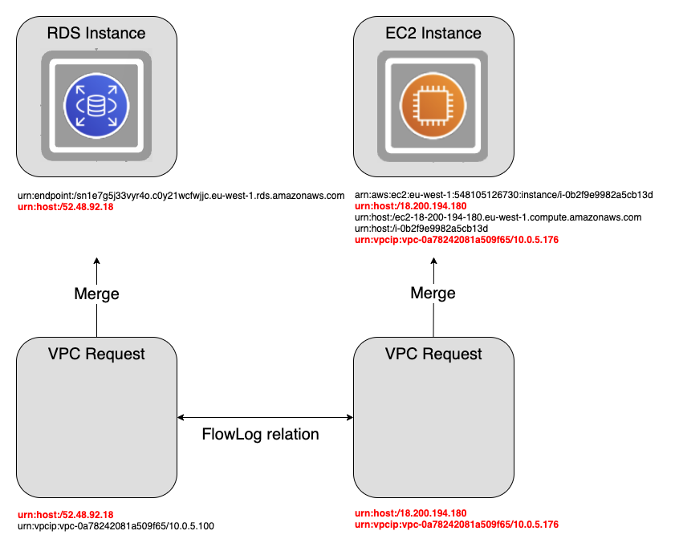

# VPC Flow Logs documentation

**Flow Log support**

The Flow Log integration inside the aws-v2 agent analyses VPC Flow Logs that are stored in the S3 bucket that contains the logs for the AWS account every minute. This bucket is the same bucket from where the CloudTrail events are processed by the agent. The Flow Logs contain meta information about the network traffic inside VPCs. Only private network traffic is considered and traffic from NAT gateways and application load balancers is currently ignored. The integration will output placeholder components and relations between those placeholders. The placeholder components will have URNs that consist of the public and private IP addresses of the network interfaces related to the traffic seen. The placeholders will be merged with the actual components in StackState so the relations can be seen between the actual components.

Example diagram:



S3 objects that have been processed will be deleted from the bucket to make sure they will not be processed again. On the default S3 bucket, object versioning is enabled, this means objects will not actually will immediately delete. We require this setting to be enabled to make sure we never actually delete objects. On the default S3 bucket there also is a lifecycle configuration that will expire (delete) both current and non-current object versions after one day. When using a non default bucket you can set these expiry periods differently.

**Compatibility with components**

The compatibility of Flow Logs with components is set up to be generic. If components have a static public or private IP address and emit the proper URNs. For public IP addresses `urn:host:/{ip-address}`, for private IP addresses the URN has the form `urn:vpcip:{vpc-id}/{ip-address}`.

Currently, the Flow Log implementation is compatible with EC2 instances and RDS database instances.

**Flow Log setup**

For each VPC that you want analyses a Flow Log needs to be configured. Settings for the Flow Log:

```yaml
Type: AWS::EC2::FlowLog
Properties:
	LogDestinationType: s3
	LogDestination: your bucket arn OR the default bucket arn
	LogFormat: omit OR at least ${version} ${account-id} ${interface-id} ${srcaddr} ${dstaddr} ${srcport} ${dstport} ${protocol} ${packets} ${bytes} ${start} ${end} ${action} ${log-status}
	MaxAggregationInterval: 60 (1 minute)
	ResourceId: ID of the VPC
	ResourceType: VPC
		TrafficType: ACCEPT | ALL | REJECT (there is currently no difference in handling ACCEPTED or REJECTED traffic)
```

The process of adding Flow Logs for new VPCs could be automated using a Lambda that creates the Flow Log that is triggered by a CloudTrail event.

**Activating Flow Log support**

The integration is currently not activated by default. It can be activated using the boolean setting "process_flow_logs"

Here is an example configuration for the agent with the flow logs activated using a non-default bucket name:

```yaml
init_config:
	aws_access_key_id: 'your key'
	aws_secret_access_key: 'your secret'
	external_id: 'your external id'
instances:
	- role_arn: 'your role'
		log_bucket_name: 'your bucket name'
		regions:
		- 'global'
		- 'eu-west-1'
```

This can be the standard bucket created by the provisioning script which is always named "stackstate-logs-{AWS-account-id}" or some other bucket defined in the instance settings with the name "log_bucket_name".