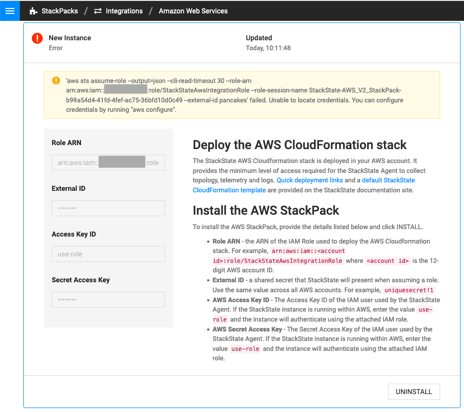
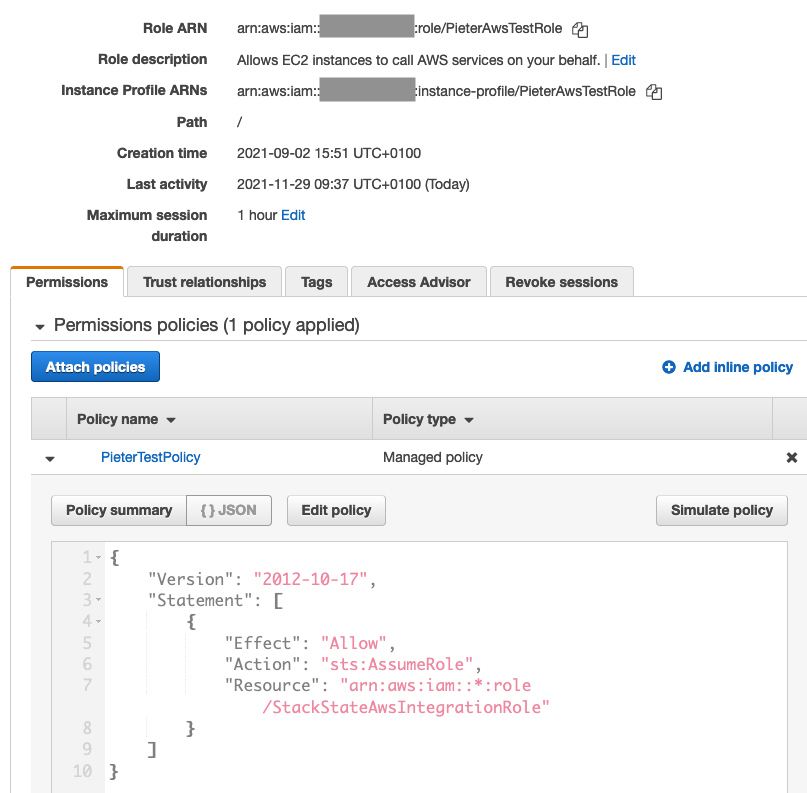
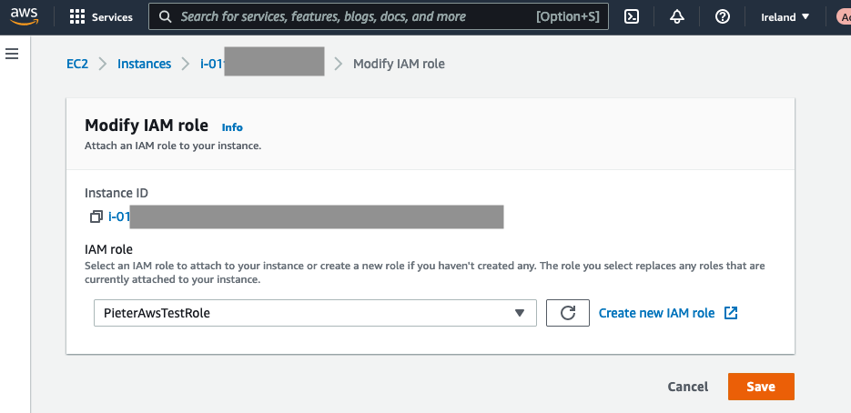
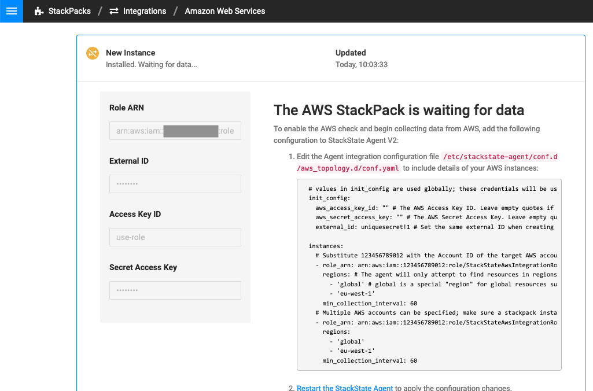

# AWS EC2 role setup for AWS StackPack use-role option

If StackState is running within an AWS environment on an EC2 instance it can have an IAM role with attached to the EC2 instance that enables AWS StackPack to be installed with `use-role` option.

## Error when IAM policy is not attached 

If the IAM policy is not attached to EC2 instance role the following error happens during AWS StackPack installation with `use-role` option.

To fix this we need to attach the appropriate role to EC2 instance. Take note of the node group role name. The AWS StackPack instance is in Error State. Press the `UNINSTALL` button to remove it.

## Create EC2 instance role

1. Create a policy that allows `AssumeRole` action for `arn:aws:iam::*:role/StackStateAwsIntegrationRole` resource. Take note of the policy name.
2. Create a EC2 instance role and attach policy from the previous step.

This policy is one of the prerequisites for [AWS Integration Setup](https://docs.stackstate.com/stackpacks/integrations/aws/aws#prerequisites). 

## Attach role to EC2 instance

Attach the role to the EC2 instance.

## Repeat the AWS StackPack installation

Installation of AWS StackPack using `use-role` option now finishes successfully.

