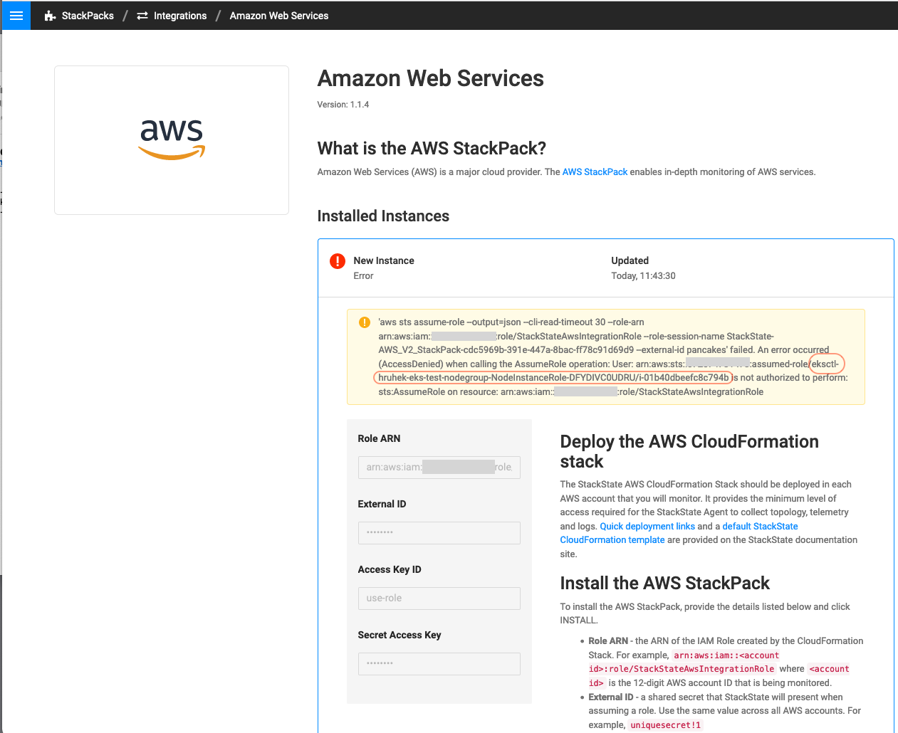
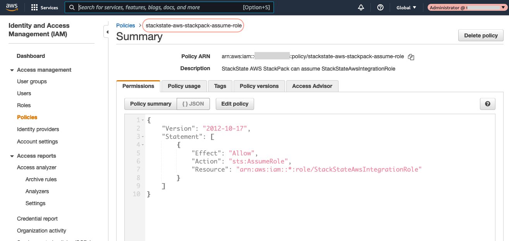
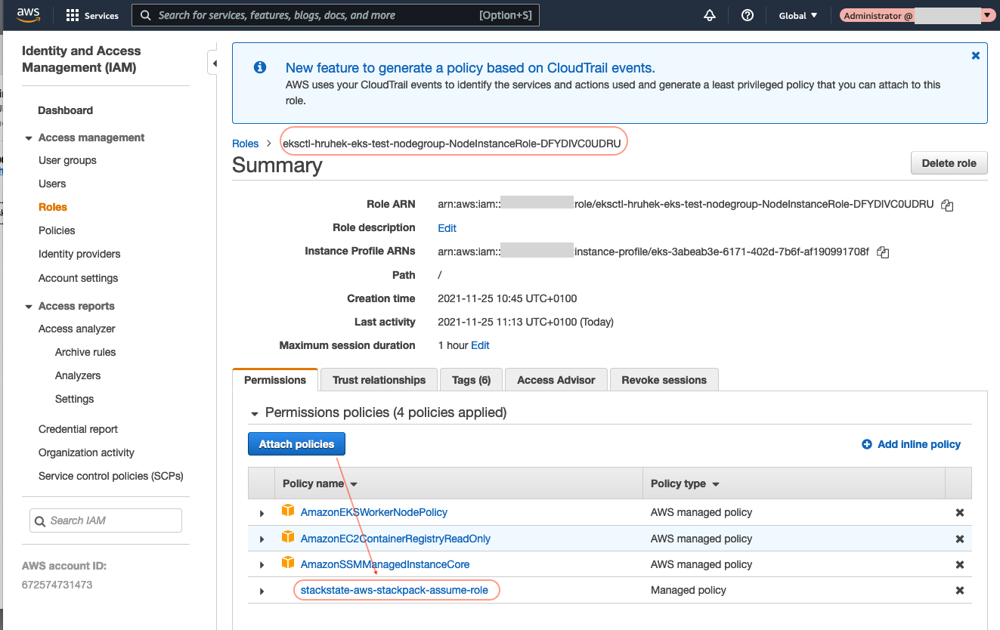
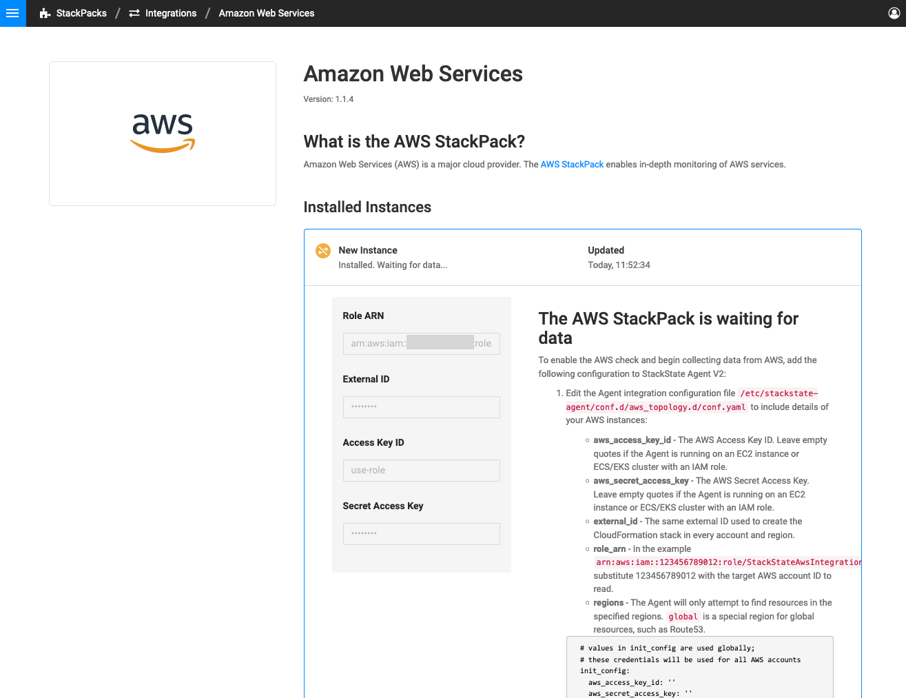

# AWS EKS policy setup for AWS StackPack use-role option

If StackState is running within an AWS environment on an EKS cluster it can have an IAM role with attached to its node group that enables AWS StackPack to be installed with `use-role` option.

In the following example uses AWS EKS cluster with Amazon EC2 Linux managed nodes. 

## Error when IAM policy is not attached 

If the IAM policy is not attached to node group role the following error happens during AWS StackPack installation with `use-role` option.

To fix this we need to attach the appropriate policy to node group role. Take note of the node group role name. The AWS StackPack instance is in Error State. Press the `UNINSTALL` button to remove it.

## Find the missing policy

Find the policy that allows `AssumeRole` action for `arn:aws:iam::*:role/StackStateAwsIntegrationRole` resource.

This policy is one of the prerequisites for [AWS Integration Setup](https://docs.stackstate.com/stackpacks/integrations/aws/aws#prerequisites). 

Take note of the policy name.

## Attach policy to node-group role

Find the node group role and attach the policy to it.

## Repeat the AWS StackPack installation

Installation of AWS StackPack using `use-role` option now finishes successfully.

