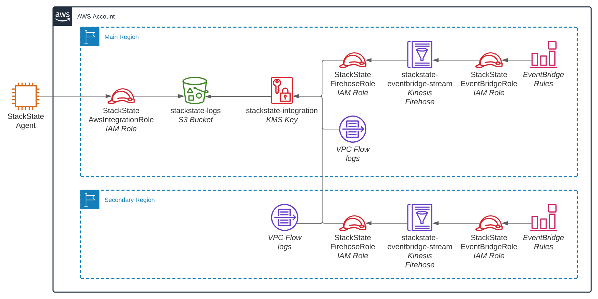

# AWS

## Overview

Amazon Web Services \(AWS\) is a major cloud provider. This StackPack enables in-depth monitoring of AWS services. 


* StackState Agent V2 collects all service responses from the target AWS account.
* Topology is updated in real time:
  * Once an hour, all services are queried to gain a full point-in-time snapshot of resources.
  * Once a minute, Cloudtrail and Eventbridge events are read to find changes to resources.
* Logs are retrieved once a minute from CloudWatch and a central S3 bucket. These are mapped to associated components in StackState.
* Metrics are retrieved on-demand by the StackState CloudWatch plugin. These are mapped to associated components in StackState.
* [VPC FlowLogs](#configure-vpc-flowlogs) are retrieved once a minute from the configured S3 bucket. Private network traffic inside VPCs is analysed to create relations between EC2 and RDS database components in StackState.
* Communication between NodeJS Lambda functions and the AWS services that they communicate with is monitored using [OpenTelemetry traces](#traces).


## Setup

### Prerequisites

To set up the StackState AWS integration, you need to have:

* [StackState Agent V2](../../../setup/agent/about-stackstate-agent.md) installed on a machine which can connect to both AWS and StackState.
* AWS CLI version 2.0.4 or later is installed on the environment where StackState is running.
* The following AWS accounts:
  * At least one target AWS account that will be monitored.
  * An AWS account for StackState and the StackState Agent to use when retrieving data from the target AWS account(s). It's recommended to use a separate shared account for this and not use any of the accounts that will be monitored by StackState, but this isn't required. 
  * A user or role with a policy attached with the action to allow assuming the role stsIntegrationRole in the account that will be monitored. For details see the StackState docs on the required AWS policy.

### AWS accounts

It's recommended to have two different AWS accounts: One that's being monitored and another used for data collection.

* **Monitor Account** - used to [deploy a CloudFormation Stack](#deploy-the-aws-cloudformation-stack). The CloudFormation stack will create an IAM role that has the permissions required to retrieve data from this Monitor Account (`StackStateAwsIntegrationRole`). 
* **Data Collection Account** - used by StackState and StackState Agent to retrieve data from the Monitor Account. Requires an AWS policy granting permissions to assume the role `StackStateAwsIntegrationRole` in the Monitor Account. 

#### AWS policy

The policy below grants permission to assume the role `StackStateAwsIntegrationRole` that's created in each target AWS Monitor Account when the CloudFormation Stack is deployed. StackState and StackState Agent require this policy to collect data from the AWS Monitor Account. The policy should be created and attached to the AWS user(s) or IAM role(s) that will be used by StackState and the StackState Agent:

```javascript
{
  "Version": "2012-10-17",
  "Statement": [
    {
      "Effect": "Allow",
      "Action": "sts:AssumeRole",
      "Resource": "arn:aws:iam::*:role/StackStateAwsIntegrationRole"
    }
  ]
}
```

The policy can be made available to StackState and the StackState Agent in one of the following ways:

* **If StackState or StackState Agent run on EC2 or EKS AND the Data Collection Account and Monitor Account are in the same AWS organization**: 
  * [Attach an IAM role to the EC2 instance or EKS pod](#iam-role-on-ec2-or-eks).
* **In all other situations**: 
  * StackState: Attach the policy to the user [configured when the AWS StackPack instance is installed](#install-the-aws-stackpack).
  * StackState Agent: Attach the policy to the user [configured in the Agent AWS check](#configure-the-aws-check).

#### IAM role on EC2 or EKS

StackState Agent collects topology, logs and (if configured) VPC flow logs, and StackState pulls CloudWatch metrics from AWS. If StackState Agent or StackState run in an AWS environment and the Data Collection Account and Monitor Account are in the same AWS organization, an IAM role can be attached to the EC2 instance or EKS pod that they run on and used for authentication. This removes the need to specify an AWS Access Key ID and Secret when a StackPack instance is installed or in the Agent AWS check configuration.


Note: The AWS Data Collection Account and Monitor Account must be a part of the same AWS organization to be able to authenticate using an IAM role in this way. For details, see the AWS documentation on [AWS organizations \(docs.aws.amazon.com\)](https://docs.aws.amazon.com/organizations/latest/userguide/orgs_introduction.html). 


To attach an IAM role and use it for authentication:

1. If you did not already do so, in AWS, [create the required AWS policy](#aws-policy).
2. Attach the created policy to the relevant IAM role:
   * [StackState/Agent running on EC2](aws-sts-ec2.md)
   * [StackState/Agent running on EKS](aws-sts-eks.md)
3. **To use the IAM role for StackState (CloudWatch metrics)**: When you install an AWS StackPack instance, set the following parameter values:
   * **AWS Access Key ID**: `use-role` 
   * **AWS Secret Access Key**: `use-role` 
4. **To use the IAM role for StackState Agent**: 
   * **Agent on EC2**: When you configure the AWS check, leave empty quotes for the parameters `aws_access_key_id` and `aws_secret_access_key`.
   * **Agent on EKS**: When you configure the AWS check as a cluster check (required for an Agent running on Kubernetes), leave empty quotes for the parameters `aws_access_key_id` and `aws_secret_access_key` in the `values.yaml` file used to deploy the Cluster Agent.

### Deploy the AWS CloudFormation Stack

The StackState AWS CloudFormation Stack should be deployed in each AWS account that you will monitor. It provides the minimum level of access required for StackState and the StackState Agent to collect topology, telemetry and logs.

* [Quick deployment](aws.md#quick-deployment) - Deploy all resources to a region in an account using a link.
* [StackState CloudFormation template](aws.md#stackstate-template-deployment) - Download the StackState CloudFormation template to integrate into your own deployment workflow.


For special environments where the CloudFormation template may not function correctly, advanced AWS users can refer to the [required AWS resources](aws.md#required-aws-resources) for a reference on all resources that must be manually created..

**It's recommended to use the** [**StackState CloudFormation template**](aws.md#stackstate-template-deployment) **wherever possible** as this provides an easy upgrade path for future versions and reduces the maintenance burden.


#### Quick deployment

The necessary resources can be deployed for one account in a single region using an automated CloudFormation template.

The table below includes links to deploy the template in popular AWS regions. For any regions not listed, follow the steps described for the [StackState template deployment](aws.md#stackstate-template-deployment).


* To use [OpenTelemetry Traces](/stackpacks/integrations/opentelemetry/opentelemetry-nodejs.md), set the `IncludeOpenTelemetryTracing` value to `true`.
* You must be logged in to the target AWS account in the web console.


| Region Name | Template deployment link                                                                                                                                                                                                                                                                                                                             |
| :--- |:-----------------------------------------------------------------------------------------------------------------------------------------------------------------------------------------------------------------------------------------------------------------------------------------------------------------------------------------------------|
| Ireland | [eu-west-1 \(console.aws.amazon.com\)](https://eu-west-1.console.aws.amazon.com/cloudformation/home?region=eu-west-1#/stacks/create/review?templateURL=https://stackstate-integrations-resources-eu-west-1.s3.eu-west-1.amazonaws.com/aws-topology/cloudformation/stackstate-resources-1.3.cfn.yaml&stackName=stackstate-resources)                  |
| Frankfurt | [eu-central-1 \(console.aws.amazon.com\)](https://eu-central-1.console.aws.amazon.com/cloudformation/home?region=eu-central-1#/stacks/create/review?templateURL=https://stackstate-integrations-resources-eu-west-1.s3.eu-west-1.amazonaws.com/aws-topology/cloudformation/stackstate-resources-1.3.cfn.yaml&stackName=stackstate-resources)         |
| N. Virginia | [us-east-1 \(console.aws.amazon.com\)](https://us-east-1.console.aws.amazon.com/cloudformation/home?region=us-east-1#/stacks/create/review?templateURL=https://stackstate-integrations-resources-eu-west-1.s3.eu-west-1.amazonaws.com/aws-topology/cloudformation/stackstate-resources-1.3.cfn.yaml&stackName=stackstate-resources)                  |
| Ohio | [us-east-2 \(console.aws.amazon.com\)](https://us-east-2.console.aws.amazon.com/cloudformation/home?region=us-east-2#/stacks/create/review?templateURL=https://stackstate-integrations-resources-eu-west-1.s3.eu-west-1.amazonaws.com/aws-topology/cloudformation/stackstate-resources-1.3.cfn.yaml&stackName=stackstate-resources)                  |
| N. California | [us-west-1 \(console.aws.amazon.com\)](https://us-west-1.console.aws.amazon.com/cloudformation/home?region=us-west-1#/stacks/create/review?templateURL=https://stackstate-integrations-resources-eu-west-1.s3.eu-west-1.amazonaws.com/aws-topology/cloudformation/stackstate-resources-1.3.cfn.yaml&stackName=stackstate-resources)                  |
| Hong Kong | [ap-east-1 \(console.aws.amazon.com\)](https://ap-east-1.console.aws.amazon.com/cloudformation/home?region=ap-east-1#/stacks/create/review?templateURL=https://stackstate-integrations-resources-eu-west-1.s3.eu-west-1.amazonaws.com/aws-topology/cloudformation/stackstate-resources-1.3.cfn.yaml&stackName=stackstate-resources)                  |
| Singapore | [ap-southeast-1 \(console.aws.amazon.com\)](https://ap-southeast-1.console.aws.amazon.com/cloudformation/home?region=ap-southeast-1#/stacks/create/review?templateURL=https://stackstate-integrations-resources-eu-west-1.s3.eu-west-1.amazonaws.com/aws-topology/cloudformation/stackstate-resources-1.3.cfn.yaml&stackName=stackstate-resources)   |
| Sydney | [ap-southeast-2 \(console.aws.amazon.com\)](https://ap-southeast-2.console.aws.amazon.com/cloudformation/home?region=ap-southeast-2#/stacks/create/review?templateURL=https://stackstate-integrations-resources-eu-west-1.s3.eu-west-1.amazonaws.com/aws-topology/cloudformation/stackstate-resources-1.3.cfn.yaml&stackName=stackstate-resources)   |

#### StackState template deployment

The default StackState CloudFormation template can be used to deploy all necessary resources. It can be deployed to multiple AWS accounts and regions at once by deploying it in a CloudFormation StackSet. It's recommended to use this template as it provides an easy upgrade path for future versions and reduces the maintenance burden compared to creating a custom template.

* [Download the default StackState CloudFormation template \(stackstate-integrations-resources-eu-west-1.s3.eu-west-1.amazonaws.com\)](https://stackstate-integrations-resources-eu-west-1.s3.eu-west-1.amazonaws.com/aws-topology/cloudformation/stackstate-resources-1.3.cfn.yaml)

The template requires the following parameters:

* **MainRegion** - The primary AWS region. This can be any region, as long as this region is the same for every template deployed within the AWS account. Global resources will be deployed in this region such as the IAM role and S3 bucket. Example: `us-east-1`.
* **StsAccountId** - The 12-digit AWS account ID to be monitored. This will be the AWS account that the IAM role can be assumed from, to perform actions on the target AWS account. Example: `0123456789012`.
* **ExternalId** - A shared secret that the StackState Agent will present when assuming a role. Use the same value across all AWS accounts that the Agent is monitoring. Example: `uniquesecret!1`.
* **IncludeOpenTelemetryTracing** - Default: `disabled`. Set to `enabled` to include the OpenTelemetry layer in your deployment. Required to [retrieve OpenTelemetry traces from AWS Lambda scripts running NodeJS](/stackpacks/integrations/opentelemetry/opentelemetry-nodejs.md).
* **Post fix** - Optional. Value to append to all resource names when deploying the stack multiple times in the same account.

For more information on how to use StackSets, check the AWS documentation on [working with AWS CloudFormation StackSets \(docs.aws.amazon.com\)](https://docs.aws.amazon.com/AWSCloudFormation/latest/UserGuide/what-is-cfnstacksets.html).

### Install the AWS StackPack

Install the AWS StackPack from the StackState UI **StackPacks** &gt; **Integrations** screen. You will need to enter the following details, these will be used to configure the StackPack instance within StackState and for StackState to query live telemetry from the AWS account. To create topology in StackState, you will also need to configure the AWS check on StackState Agent V2.

* **Role ARN** - the ARN of the IAM Role created by the cloudFormation stack. For example, `arn:aws:iam::<account id>:role/StackStateAwsIntegrationRole` where `<account id>` is the 12-digit AWS account ID being monitored. 
* **External ID** - a shared secret that StackState will present when assuming a role. Use the same value across all AWS accounts. For example, `uniquesecret!1`
* **AWS Access Key ID** - The Access Key ID of the IAM user that will be used by StackState to collect CloudWatch metrics. This is the same as the IAM user used by the Agent to collect topology data and logs from AWS. If StackState is running within AWS, it may also be possible to [authenticate with an IAM role](#iam-role-on-ec2-or-eks).
* **AWS Secret Access Key** - The Secret Access Key of the IAM user that will be used by StackState to collect CloudWatch metrics. This is the same as the IAM user used by the Agent to collect topology data and logs from AWS. If StackState is running within AWS, it may also be possible to [authenticate with an IAM role](#iam-role-on-ec2-or-eks).

### Configure the AWS check

To enable the AWS check and begin collecting topology and log data from AWS, add the configuration below to StackState Agent V2.




If StackState Agent is running on Kubernetes, the AWS check should be configured as a [cluster check](/setup/agent/kubernetes-openshift.md#enable-cluster-checks).

1. If you don't already have it, you will need to add the StackState helm repository to the local helm client:

   ```text
    helm repo add stackstate https://helm.stackstate.io
    helm repo update
   ```
   
2. Update the `values.yaml` file used to deploy the `stackstate-agent` with details of your AWS instance:
    - **aws_access_key_id** - The AWS Access Key ID. Leave empty quotes to [use an attached IAM role](/stackpacks/integrations/aws/aws-sts-eks.md).
    - **aws_secret_access_key** - The AWS Secret Access Key. Leave empty quotes to [use an attached IAM role](/stackpacks/integrations/aws/aws-sts-eks.md).
    - **external_id** - The same external ID used to create the CloudFormation stack in every account and region.
    - **role_arn** - In the example `arn:aws:iam::123456789012:role/StackStateAwsIntegrationRole`, substitute 123456789012 with the target AWS account ID to read.
    - **regions** - The Agent will only attempt to find resources in the specified regions. `global` is a special region for global resources, such as Route53.
    ```yaml
    clusterAgent:
      config:
        override:
    #clusterAgent.config.override -- Defines kubernetes_state check for checksAgent agents. Auto-discovery
    #with ad_identifiers doesn't work here. Use a specific URL instead.
        - name: conf.yaml
          path: /etc/stackstate-agent/conf.d/aws_topology.d
          data: |
            cluster_check: true

            init_config:
              aws_access_key_id: ''
              aws_secret_access_key: ''
              external_id: uniquesecret!1 
              # full_run_interval: 3600

            instances:
            - role_arn: arn:aws:iam::123456789012:role/StackStateAwsIntegrationRole
                regions:
                - global
                - eu-west-1
                collection_interval: 60 # The amount of time in seconds between each scan. Decreasing this value won't appreciably increase topology update speed.
                # apis_to_run:
                #   - ec2
                # log_bucket_name: '' 
                # tags:
                #   - foo:bar
    ```

3. Deploy the `checks_agent` using the updated `values.yaml`:
   * **Kubernetes:**
    ```yaml
    helm upgrade --install \
    --namespace stackstate \
    --create-namespace \
    --set-string 'stackstate.apiKey'='<STACKSTATE_RECEIVER_API_KEY>' \
    --set-string 'stackstate.cluster.name'='<KUBERNETES_CLUSTER_NAME>' \
    --set-string 'stackstate.cluster.authToken=<CLUSTER_AUTH_TOKEN>' \
    --set-string 'stackstate.url'='<STACKSTATE_RECEIVER_API_ADDRESS>' \
    --values values.yaml \
    stackstate-agent stackstate/stackstate-agent    
    ```

   * **OpenShift:**

    ```yaml
    helm upgrade --install \
    --namespace stackstate \
    --create-namespace \
    --set-string 'stackstate.apiKey'='<STACKSTATE_RECEIVER_API_KEY>' \
    --set-string 'stackstate.cluster.name'='<OPENSHIFT_CLUSTER_NAME>' \
    --set-string 'stackstate.cluster.authToken=<CLUSTER_AUTH_TOKEN>' \
    --set-string 'stackstate.url'='<STACKSTATE_RECEIVER_API_ADDRESS>' \
    --set 'agent.scc.enabled'=true \
    --set 'kube-state-metrics.podSecurityContext.enabled'=false \
    --set 'kube-state-metrics.containerSecurityContext.enabled'=false \
    --values values.yaml \
    stackstate-agent stackstate/stackstate-agent    
    ```




If StackState Agent is running on a Linux VM:

1. Edit the Agent integration configuration file `/etc/stackstate-agent/conf.d/aws_topology.d/conf.yaml` to include details of your AWS instances:
    
    - **aws_access_key_id** - The AWS Access Key ID. Leave empty quotes to [use an attached IAM role](/stackpacks/integrations/aws/aws-sts-ec2.md).
    - **aws_secret_access_key** - The AWS Secret Access Key. Leave empty quotes to [use an attached IAM role](/stackpacks/integrations/aws/aws-sts-ec2.md).
    - **external_id** - The same external ID used to create the CloudFormation stack in every account and region.
    - **role_arn** - In the example `arn:aws:iam::123456789012:role/StackStateAwsIntegrationRole`, substitute 123456789012 with the target AWS account ID to read.
    - **regions** - The Agent will only attempt to find resources in the specified regions. `global` is a special region for global resources, such as Route53.

   ```yaml
   # values in init_config are used globally; 
   # these credentials will be used for all AWS accounts
   init_config:
     aws_access_key_id: ''
     aws_secret_access_key: ''
     external_id: uniquesecret!1 
     # full_run_interval: 3600

   instances:
     - role_arn: arn:aws:iam::123456789012:role/StackStateAwsIntegrationRole
       regions:
         - global # a special "region" used for global resources
         - eu-west-1
       # min_collection_interval: 60 # use in place of collection_interval for Agent V2.14.x or earlier 
       collection_interval: 60 # The amount of time in seconds between each scan. Decreasing this value won't appreciably increase topology update speed.
       # apis_to_run:
       #   - ec2
       # log_bucket_name: '' 
       # tags:
       #   - foo:bar
   ```

2. You can also add optional configuration and filters: 
    - **full_run_interval** - Optional. The time in seconds between a full AWS topology scan. Intermediate runs only fetch events.
    - **collection_interval** - The amount of time in seconds between each scan. Decreasing this value won't appreciably increase topology update speed.
    - **apis_to_run** - Optionally whitelist specific AWS services. It isn't recommended to set this; instead rely on IAM permissions.
    - **log_bucket_name** - The S3 bucket that the Agent should read events from. This value should only be set in custom implementations.
    - **tags** - Optional. Can be used to apply specific tags to all reported data in StackState.

3. [Restart the StackState Agent](/setup/agent/about-stackstate-agent.md#deployment) to apply the configuration changes.
4. Once the Agent has restarted, wait for data to be collected from AWS and sent to StackState.



### Configure VPC FlowLogs

VPC FlowLogs can be analysed to retrieve relations between EC2 instances and RDS database instances. For each VPC that you want to analyse, a FlowLog needs to be configured. The process of adding FlowLogs for new VPCs could be automated using a Lambda triggered by a CloudTrail event that creates the FlowLog. Relations will be retrieved for EC2 instances and RDS database instances with a static public or private IP address and emit the proper URNs. For public IP addresses `urn:host:/{ip-address}`, for private IP addresses the URN has the form `urn:vpcip:{vpc-id}/{ip-address}`.

For further details, see [Required AWS resources - VPC FlowLogs](#vpc-flowlogs).

To configure a VPC FlowLog from the AWS console:

1. From the **VPC Dashboard**, choose **Your VPCs** under **VIRTUAL PRIVATE CLOUD**.
2. Select the VPC that you want to configure.
3. Select **Flow logs** on the lower TAB-bar.
4. Click **Create flow log**.
5. Add the settings as shown in the screenshot.


### Use an HTTP proxy

StackState and the StackState Agent require access to the internet to call the AWS APIs. If direct internet access can't be given, an HTTP proxy can be used to proxy the API calls. 

In the StackState AWS integration, CloudWatch metrics are pulled directly by StackState, while events and topology data are collected by the StackState Agent. This means that proxy details must be configured in two places to handle all requests - StackState for CloudWatch metrics and StackState Agent for topology and events data.

* **To configure a proxy for events and topology data collected by StackState Agent**, see how to [use an HTTP/HTTPS proxy for StackState Agent](/setup/agent/agent-proxy.md).
* **To configure a proxy for CloudWatch metrics collected by StackState**, follow the steps below:
  1. In the StackState UI, go to **Settings** > **Telemetry Sources** > **CloudWatch sources**.
  2. Find the CloudWatch source for which you want to configure a proxy. Open the **...** menu to the right and select **Edit**.
  3. Enter the proxy details in **Proxy URI**.
  4. Click **TEST CONNECTION** to check that the proxy can be used to successfully connect to CloudWatch.
  5. Click **UPDATE** to save the proxy settings. Be aware that you may need to [unlock](/stackpacks/about-stackpacks.md#locked-configuration-items) it before this succeeds.

### Status

To check the status of the AWS integration, run the status subcommand and look for `aws_topology` under `Running Checks`:

```bash
sudo stackstate-agent status
```

## Integration details

### Data retrieved

The AWS integration retrieves the following data:

* [Events](#events)
* [Metrics](#metrics)
* [Topology](#topology)
* [Traces](#traces)

#### Events

The AWS StackPack supports the following event:

* EC2 Instance Run State: when the instance is started, stopped, or terminated. This will appear as the Run State in the EC2 instance component.

AWS events are primarily used to provide real-time updates to topology. These events aren't displayed as StackState events.

#### Metrics

Metrics data is pulled at a configured interval directly from AWS by the StackState CloudWatch plugin. Retrieved metrics are mapped onto the associated topology component.

#### Topology

The AWS service data shown below is available in StackState as components with the associated relations. The retrieved topology can be further enhanced by enabling [OpenTelemetry traces](/stackpacks/integrations/opentelemetry/opentelemetry-nodejs.md).

| Service | Resource | Relations |
| :--- | :--- | :--- |
| API Gateway | Method | SQS Queue, Lambda Function |
| API Gateway | Method - HTTP Integration |  |
| API Gateway | Resource | API Gateway Method |
| API Gateway | Rest API | API Gateway Stage |
| API Gateway | Stage | API Gateway Resource |
| Auto Scaling | Group | EC2 Instance, Classic Load Balancer, Auto Scaling Target Group |
| CloudFormation | Stack | All Supported Resources\*, Nested CloudFormation Stack |
| DynamoDB | Stream |  |
| DynamoDB | Table | DynamoDB Stream |
| EC2 | Instance | EC2 Security Group |
| EC2 | Security Group | EC2 Instance |
| EC2 | Subnet | EC2 Instance, EC2 VPC |
| EC2 | VPC | EC2 Security Group, EC2 Subnet |
| EC2 | VPN Gateway | EC2 VPC |
| ECS | Cluster | EC2 Instance, ECS Service, ECS Task, Route53 Hosted Zone |
| ECS | Service | Load Balancing Target Group, ECS Task |
| ECS | Task |  |
| Kinesis | Data Stream | Kinesis Firehose Delivery Stream |
| Kinesis | Firehose Delivery Stream | S3 Bucket |
| Lambda | Alias |  |
| Lambda | Function | All Supported Resources\* \(Input\), EC2 VPC, Lambda Alias, RDS Instance\*\* |
| Load Balancing | Application Load Balancer | EC2 VPC, Load Balancing Target Group, Load Balancing Target Group Instance |
| Load Balancing | Classic Load Balancer | EC2 Instance, EC2 VPC |
| Load Balancing | Network Load Balancer | EC2 VPC, Load Balancing Target Group, Load Balancing Target Group Instance |
| Load Balancing | Target Group | EC2 VPC |
| Load Balancing | Target Group Instance | EC2 Instance |
| RDS | Cluster | RDS Instance |
| RDS | Instance | EC2 VPC, EC2 Security Group |
| Redshift | Cluster | EC2 VPC |
| Route53 | Domain |  |
| Route53 | Hosted Zone |  |
| S3 | Bucket | Lambda Function |
| SNS | Topic | All Supported Resources\* |
| SQS | Queue |  |
| Step Functions | Activity |  |
| Step Functions | State | Step Functions \(All\), Lambda Function, DynamoDB Table, SQS Queue, SNS Topic, ECS Cluster, Api Gateway Rest API |
| Step Functions | State Machine | Step Functions \(All\) |

* **\* "All Supported Resources"** - relations will be made to any other resource on this list, should the resource type support it.
* \*\* This relation is made by finding valid URIs in the environment variables of the resource. For example, the DNS hostname of an RDS instance will create a relation.

#### Traces

OpenTelemetry creates traces from the AWS services that your Lambdas interacts with. Retrieved traces are available in the Traces Perspective and are also used to enhance the retrieved topology. 

➡️ [Learn more about how to set up and use OpenTelemetry](/stackpacks/integrations/opentelemetry/opentelemetry-nodejs.md)

### Required AWS resources

A high-level of overview of all resources necessary to run the StackState Agent with full capabilities is provided in the graph below. Users with intermediate to high level AWS skills can use these details to set up the StackState Agent resources manually. For the majority of installations, this isn't the recommended approach. Use the provided [StackState CloudFormation template](aws.md#stackstate-template-deployment) unless there are environment-specific issues that must be worked around.



Hourly and event-based updates collect data:

* Hourly full topology updates - collected by the StackState Agent using an IAM role with access to the AWS services.
* Event-based updates for single components and relations - captured using AWS services and placed into an S3 bucket for the StackState Agent to read.

If the StackState Agent doesn't have permission to access a certain component, it will skip it.

#### StackState Agent IAM Role

The bare minimum necessary to run the StackState Agent is an IAM role with necessary permissions. The Agent will always attempt to fetch as much data as possible for the supported resources. If a permission is omitted, the Agent will attempt to create a component with the data it has.

For example, if the permission `s3:GetBucketTagging` is omitted, the Agent will fetch all S3 buckets and their associated configuration, but the tags section will be empty.

* [IAM policy with all required permissions - JSON object](aws-policies.md#stackstateawsintegrationrole)


IAM is a global service. Only one IAM role is necessary per account.


#### S3 Bucket


Once the Agent has finished reading a file in this bucket, the file will be **deleted**. Don't use an existing bucket for this, the Agent should have its own bucket to read from. The S3 bucket won't be read from if it doesn't have bucket versioning enabled, to protect data.


The S3 bucket is used to store all incoming events from EventBridge and other event-based sources. The Agent then reads objects from this bucket. These events are used for features such as real-time topology updates, and creating relations between components based on event data such as VPC FlowLogs. If the S3 bucket isn't available to the Agent it will fall back to reading CloudTrail directly, which introduces a 15-minute delay in real-time updates. EventBridge events and VPC FlowLogs are only available via the S3 bucket.


Only one S3 bucket is necessary per account; all regions can send to the same bucket.


#### EventBridge Rule

A catch-all rule for listening to all events for services supported by the AWS StackPack. All matched rules are sent to a Kinesis Firehose delivery stream.

* [EventBridge Rule - JSON object](aws-policies.md#stseventbridgerule)
* [EventBridge IAM Role - JSON](aws-policies.md#stackstateeventbridgerole-region) - Give permission for EventBridge to send data to Kinesis Firehose


A rule must be created in each region where events are captured, each sending to a Firehose delivery stream in the same region.


#### Kinesis Firehose

Kinesis Firehose is used to receive and batch events from EventBridge. This delivery stream batches events per 60 seconds and pushes an object to S3. 60 seconds is the recommended value - setting this value any higher will negligibly decrease storage costs while increasing the delay in topology updates.

The Prefix must be set to `AWSLogs/${AccountId}/EventBridge/${Region}/`, where `${AccountId}` and `${Region}` are the account ID and region, for example, eu-west-1. Files must be compressed using the GZIP option.


A delivery stream must be created in each region where events are captured, however, the target S3 bucket can exist in any region.


* [Kinesis Firehose IAM Role - JSON](aws-policies.md#stackstatefirehoserole-region) - Gives permission for Firehose to send data to an S3 bucket.

#### KMS Key \(Optional\)

A KMS Customer Managed Key \(CMK\) can be used to secure data at rest in S3. The KMS key is used in the Firehose Delivery Stream. The S3 bucket also uses the KMS key as its default key.

Use of a KMS is key isn't necessary for the operation of the StackPack, however as encryption at rest is a requirement in most environments, the CloudFormation template includes this by default.


A KMS key must be created in each region where events are captured.


* [Sample KMS Key policy](aws-policies.md#stackstate-integration-kms-key).

#### VPC FlowLogs


VPC FlowLogs support is currently experimental.


A VPC configured to send flow logs to the `stackstate-logs-${AccountId}` S3 bucket. The Agent requires the AWS default format for VPC FlowLogs, and expects data to be aggregated every 1 minute. The FlowLogs contain meta information about the network traffic inside VPCs. Only private network traffic is considered, traffic from NAT gateways and application load balancers will be ignored. 

S3 objects that have been processed will be deleted from the bucket to make sure they won't be processed again. On the default S3 bucket, object versioning is enabled, this means objects won't actually be immediately deleted. A lifecycle configuration will expire (delete) both current and non-current object versions after one day. When using a non default bucket, you can set these expiry periods differently.

If configuring FlowLogs using CloudFormation, the `stackstate-resources` template exports the ARN of the S3 bucket it creates, so this can be imported into your template.


A [FlowLog must be configured](#configure-vpc-flowlogs) for each VPC that you want to analyse.


* [AWS Flow Logs documentation](https://docs.aws.amazon.com/vpc/latest/userguide/flow-logs.html)

### Costs

The AWS StackPack CloudFormation template with all resources necessary to run the AWS check on the StackState Agent. The installed resources are kept as minimal as possible. All costs incurred are minimal but variable, with costs scaling depending on how many events are emitted in a given account. In practice, the costs created by the AWS integration will be negligible.

* Kinesis Firehose: priced by the amount of data processed. Events use very small amounts of data. [Firehose pricing \(aws.amazon.com\)](https://aws.amazon.com/kinesis/data-firehose/pricing/)
* S3: priced by amount of data stored, and amount of data transferred. Running the Agent inside of AWS will reduce data transfer costs. [S3 pricing \(aws.amazon.com\)](https://aws.amazon.com/s3/pricing/)
* KMS: a flat fee of $1 per month per key, with additional costs per request. [KMS pricing \(aws.amazon.com\)](https://aws.amazon.com/kms/pricing/)
* CloudWatch metrics: priced per metric retrived. Metrics are only retrieved when viewed or when a check is configured on a CloudWatch metric. [CloudWatch pricing \(aws.amazon.com\)](https://aws.amazon.com/cloudwatch/pricing/)

### AWS views in StackState

When the AWS integration is enabled, three [views](../../../use/stackstate-ui/views/about_views.md) will be created in StackState for each instance of the StackPack.

* **AWS - \[instance\_name\] - All** - includes all resources retrieved from AWS by the StackPack instance.
* **AWS - \[instance\_name\] - Infrastructure** - includes only Networking, Storage and Machines resources retrieved from AWS by the StackPack instance.
* **AWS - \[instance\_name\] - Serverless** - includes only S3 buckets, lambdas and application load balancers retrieved from AWS by the StackPack instance.

### AWS actions in StackState

Components retrieved from AWS will have an additional [Action](/use/stackstate-ui/perspectives/topology-perspective.md#actions) available in the component context menu and in the right panel details tab - **Component details** - when the component is selected. This provides a deep link through to the relevant AWS console at the correct point.

For example, in the StackState Topology Perspective:

* Components of type aws-subnet have the action **Go to Subnet console**, which links directly to this component in the AWS Subnet console.
* Components of type ec2-instance have the action **Go to EC2 console**, which links directly to this component in the EC2 console.

### Tags and labels

#### Tags added as labels in StackState

The following labels will be added to imported AWS topology in StackState:

* `stackpack:aws-v2` 
* All tags that exist for the imported element in AWS.
* All `tags` specified for the associated instance in the [Agent AWS check configuration](#configure-the-aws-check). You can add a custom label to all topology imported by an instance of the AWS StackPack by adding it to the Agent AWS check configuration.



**StackState Self-Hosted**

Extra information for the [StackState Self-Hosted product](https://docs.stackstate.com/):

    



#### AWS tags used to build StackState topology

The special tags listed below can be added in AWS to influence how the imported topology is built in StackState:

* `stackstate-identifier` - The specified value will be added as an identifier to the StackState component.
* `stackstate-environment` - The StackState component will be placed in the specified environment.

## Troubleshooting

Check the StackState support site for:

* [The AWS StackPack troubleshooting guide](https://support.stackstate.com/hc/en-us/articles/4402736972050-Troubleshooting-StackState-AWS-StackPack).
* [Known issues relating to the AWS StackPack](https://support.stackstate.com/hc/en-us/search?utf8=%E2%9C%93&query=tags%3Aaws-v2).

## Uninstall

### Uninstall StackPack

To uninstall the StackState AWS StackPack, click the _Uninstall_ button from the StackState UI **StackPacks** &gt; **Integrations** &gt; **AWS** screen. This will remove all AWS specific configuration in StackState.

### Remove AWS resources

To clean up the remaining resources inside your AWS account, remove any configured VPC flow logs and delete the StackState AWS Cloudformation stack from the AWS account being monitored. This can be done using the [AWS web console](aws.md#aws-web-console) or the [AWS CLI](aws.md#aws-cli).

#### AWS Web console

To delete the StackState AWS Cloudformation stack from an AWS account using the AWS web console:

1. Disable the EventBridge rule: 
   1. Go to EventBridge. 
   2. Find and open the rule with a name that starts with `stackstate-resources-StsEventBridgeRule`.
   3. Click the **Disable** button.
2. Delete all FlowLogs that send to this bucket:
   1. Go to the VPC service.
   2. Select each VPC in the VPCs list. 
   3. Look in the **FlowLogs** tab in the **Details** section.
   4. Delete any FlowLogs that are sent to the S3 bucket starting with `stackstate-logs`.
3. Delete objects in the S3 bucket:
   1. Go to the S3 service.
   2. Select \(don't open\) the bucket named `stackstate-logs-${AccountId}` where `${AccountId}` is the 12-digit identifier of your AWS account.
   3. Select **Empty** and follow the steps to delete all objects in the bucket.
5. Delete the CloudFormation template:
   1. Go to the CloudFormation service. 
   2. Select the StackState CloudFormation template. This will be named `stackstate-resources` if created via the quick deploy method, otherwise the name was user-defined.
   3. In the top right of the console, select **Delete**.

#### AWS CLI


The steps below assume that you already have the AWS CLI installed and configured with access to the target account. If not, follow the AWS documentation to [install and configure the AWS CLI \(docs.aws.amazon.com\)](https://docs.aws.amazon.com/cli/latest/userguide/cli-chap-configure.html).


To delete the StackState AWS Cloudformation stack from an AWS account using the AWS CLI:

1. Set the region to remove StackState resources from:

   ```bash
   REGION="<region>"
   ```

2. Set the S3 bucket that will be deleted:

   ```bash
    BUCKET=$(aws cloudformation describe-stack-resource \
      --region $REGION \
      --stack-name stackstate-resources \
      --logical-resource-id StsLogsBucket \
      --query "StackResourceDetail.PhysicalResourceId" \
      --output=text) && echo "Found Bucket: ${BUCKET}"
   ```
   
3. Disable the EventBridge rule: 

   ```bash
    aws events disable-rule \
        --region $REGION \
        --name "$(aws cloudformation describe-stack-resource \
            --stack-name stackstate-resources \
            --logical-resource-id StsEventBridgeRule \
            --region $REGION \
            --query "StackResourceDetail.PhysicalResourceId" \
            --output=text)"
   ```
   
4. Delete all FlowLogs that send to this bucket:

   ```bash
    aws ec2 delete-flow-logs \
        --region $REGION \
        --flow-log-ids "$(aws ec2 describe-flow-logs \
            --region $REGION \
            --query "FlowLogs[?LogDestination=='arn:aws:s3:::$BUCKET'].[FlowLogId]" \
            --output=text | tr '\n' ' ')"
   ```

5. Delete objects in the S3 bucket. This is a versioned S3 bucket, so each object version will be deleted individually. Note that if there are more than 1000 items in the bucket this command will fail, it's likely more convenient to perform this in the [AWS web console](#aws-web-console):

   ```bash
    sleep 60 # To make sure all objects have finished writing to bucket
    aws s3api delete-objects \
        --region $REGION \
        --bucket "$BUCKET" \
        --delete "$(aws s3api list-object-versions \
            --region $REGION \
            --bucket "$BUCKET" \
            --output=json \
            --query='{Objects: Versions[].{Key:Key,VersionId:VersionId}}')" \
        --output=text
   ```

6. Delete the CloudFormation template:

   ```bash
    aws cloudformation delete-stack --region $REGION \
        --stack-name stackstate-resources
   ```
   


Find out how to [uninstall using a specific AWS profile or an IAM role \(docs.aws.amazon.com\)](https://docs.aws.amazon.com/cli/latest/userguide/cli-configure-options.html).

## Release notes

**AWS StackPack v1.2.1 (2022-06-10)**

- Improvement: Documentation updated.

**AWS StackPack v1.2.0 (2022-03-03)**

- Improvement: Added OpenTelemetry information STAC-15902

**AWS StackPack v1.1.4 (2021-11-16)**

- Improvement: Updated AWS CLI prerequisite text


## See also

* [Use and set up OpenTelemetry for NodeJS](/stackpacks/integrations/opentelemetry/opentelemetry-nodejs.md)
* [AWS policies](aws-policies.md)
* [Working with AWS CloudFormation StackSets \(docs.aws.amazon.com\)](https://docs.aws.amazon.com/AWSCloudFormation/latest/UserGuide/what-is-cfnstacksets.html)
* [Uninstall using a specific AWS profile or an IAM role \(docs.aws.amazon.com\)](https://docs.aws.amazon.com/cli/latest/userguide/cli-configure-options.html)

