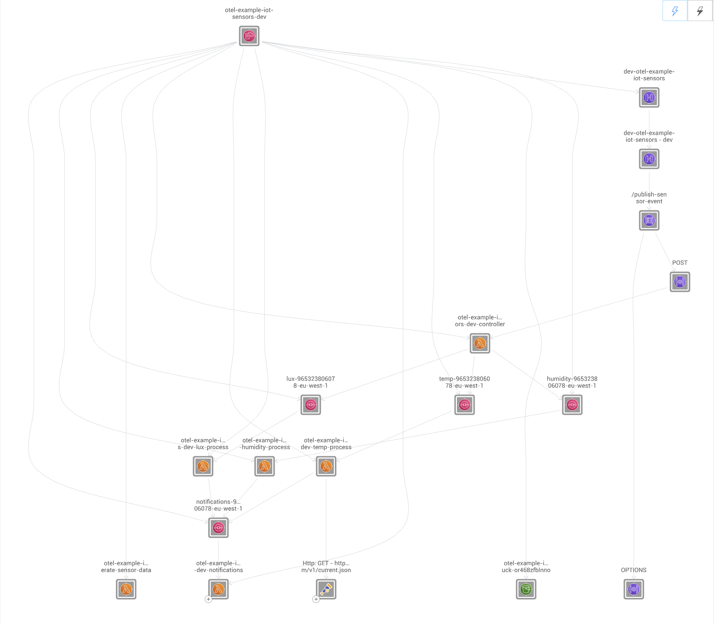
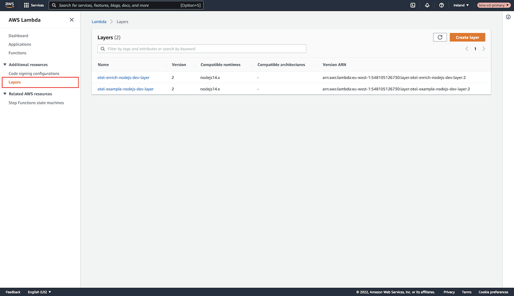
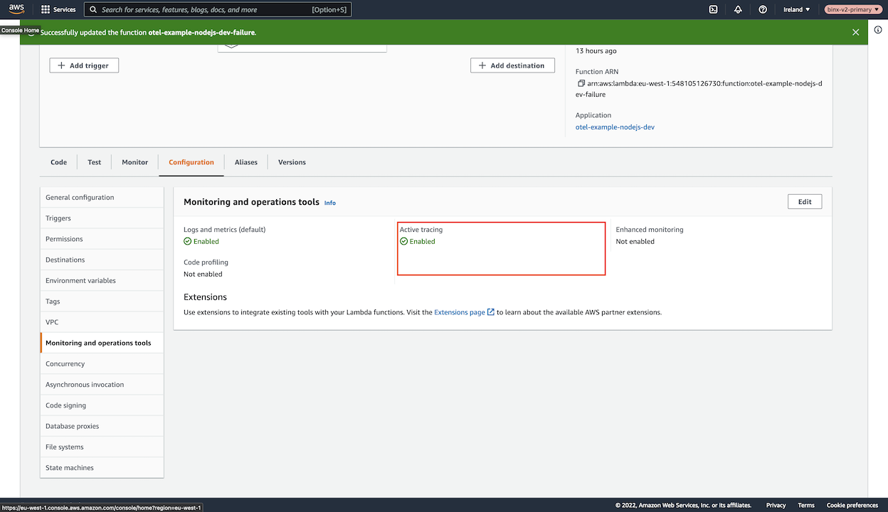
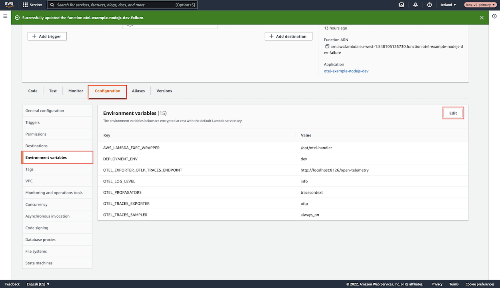

# OpenTelemetry

## Overview

StackState provides an out-of-the-box OpenTelemetry solution for serverless AWS Lambda applications built with NodeJS. A modified OpenTelemetry Lambda Layer, based on the officially released [AWS Distro for OpenTelemetry Lambda \(aws-otel.github.io\)](https://aws-otel.github.io/docs/getting-started/lambda), gives a plug-and-play user experience.

OpenTelemetry has the following benefits:

- Lambda functions can include the OpenTelemetry Lambda Layer solution to collect trace data without the need to change any code.
- The specific AWS Service that a Lambda communicates with is shown in StackState. 

The StackState OpenTelemetry Lambda Layer can be used with AWS Lambda scripts running NodeJS 14.x (or later) and will transform the Topology in StackState as follows: 

| Without OpenTelemetry | With OpenTelemetry | 
|:---|:---|
|  |  |

## Setup

### Prerequisites

To set up OpenTelemetry traces, you need to have:
* [StackState Agent](/setup/agent/about-stackstate-agent.md) v2.16 (or later)
* StackState Agent should have [traces enabled](/setup/agent/advanced-agent-configuration.md#enable-traces). If traces are not enabled on the Agent, OpenTelemetry will not generate any data.
* AWS Lambda scripts running `NodeJS 14.x` (or later)
  * These will be the Lambda functions you wish to add OpenTelemetry support to.
  * They should be able to communicate with the StackState Agent.
* The [AWS StackPack](/stackpacks/integrations/aws/aws.md) should be installed and configured in StackState. The AWS StackPack CloudFormation template will deploy the latest supported OpenTelemetry Lambda Layer, which is required for AWS OpenTelemetry functionality.

### Supported Services

The following AWS Services and External Services with AWS OpenTelemetry Tracing are supported:

Communication from **AWS Lambda** to:
- AWS Lambda
- AWS SQS
- AWS SNS
- AWS S3
- AWS StepFunction
- HTTP Endpoints

### Installation

Follow the steps below to set up OpenTelemetry tracing for a NodeJS AWS Lambda script.


Note that the installation steps should be completed for every Lambda function that you wish to add OpenTelemetry tracing to.


1. [Verify that the Lambda Layer exists](#verify-that-the-lambda-layer-exists)
2. [Set up tracing](#set-up-tracing)
3. [Add the required environment variables](#add-environment-variables)

After these steps have been completed, you should be ready to send traces to your StackState Agent.

To test the configuration, execute the associated Lambda function. New Topology relations should be created and visible in the StackState UI within a minute or so. Relations will be created wherever your Lambda is communicating with any of the [supported services](#supported-services).

#### Verify that the Lambda Layer exists

Go to the [AWS Lambda Layers \(console.aws.amazon.com\)](https://console.aws.amazon.com/lambda/home#/layers) page listing all available **Lambda Layer** functions.



Change the region in the top-right corner to the region where you deployed the [AWS StackPack](/stackpacks/integrations/aws/aws.md) cloudformation template.


Verify that there is a **Lambda Layer** called `stackstate-otel-nodejs`.
  - If the Lambda Layer is not present, then the AWS StackPack CloudFormation Template installed may not be the latest one containing the Lambda Layer.
  - Follow the [AWS StackPack](../../../../stackpacks/integrations/aws/aws.md) documentation to verify the installation of this StackPack

**OR**

  - Lambda Layers are **AWS REGION** based meaning, if you deployed the [AWS StackPack](/stackpacks/integrations/aws/aws.md) CloudFormation template in another region other than where your targeted Lambda lives, you will also have to deploy the [AWS StackPack](/stackpacks/integrations/aws/aws.md) CloudFormation template inside the same region.
  
Head over to your [Lambda functions](https://console.aws.amazon.com/lambda/home#/functions) page and navigate to the Lambda you wish to add OpenTelemetry support to.

Underneath the `Code` tab, scroll down to the `Layers` section and click the `Add a layer` button on the right side.


Select the `Custom Layer` radio box under the `Choose a layer` section. This will show two dropdowns at the very bottom of the page.


In the first dropdown, select the Lambda Layer `stackstate-otel-nodejs`


In the second dropdown, select **THE LATEST VERSION** number, and click the `Add` button in the bottom right corner


#### Set up tracing

An **REQUIREMENT** to allow tracing to work is something called X-Ray headers.

To achieve this, you can do **ONE** of the following steps:

-[ Enable **Active Pass-through**](#enable-active-pass-through) on your Lambda Function. 
  - This means that the X-Ray headers are available, but X-Ray is still disabled; thus, **NO EXTRA COSTS** will be accumulated through using Pass-Through X-Ray
  - You can only achieve this through a CLI command

**OR**

- [Enable X-Ray Active Tracing](#enable-x-ray-active-tracing) on the Lambda function. 
  - This is the more expensive option as X-Ray will charge per Lambda execution.

##### Enable Active Pass-through

To enable Active Pass-through you need the [AWS CLI](https://docs.aws.amazon.com/cli/latest/userguide/getting-started-install.html) installed. You can follow the steps [on this link](https://docs.aws.amazon.com/cli/latest/userguide/getting-started-install.html) to set up AWS CLI on your machine.

After you install the AWS CLI run the following command in your terminal to set up your AWS Credentials

- `aws configure`

To verify if your Lambda function is running in Active Pass-Through run the following command:

```shell
aws lambda get-function-configuration \
--region <CHANGE TO THE REGION OF YOUR LAMBDA FUNCTION> \
--function-name <CHANGE TO THE NAME OF YOUR LAMBDA FUNCTION> \
--query 'TracingConfig.Mode'
```

You should be greeted with one of the following messages:
- `Disabled` or `None`
- `Active`
- `PassThrough`

If the outcome of the command is `Active` or `PassThrough` then there is no need for the following command.

Run this command if your `get-function-configuration` cli command was `Disabled` or `None`

```shell
aws lambda update-function-configuration \
--region <CHANGE TO THE REGION OF YOUR LAMBDA FUNCTION> \
--function-name <CHANGE TO THE NAME OF YOUR LAMBDA FUNCTION> \
--tracing-config "Mode=PassThrough"
```

This will now change your Lambda to Pass-Through. 

You can verify this by running the following command again
- Unfortunately there is no way to verify this on the Console only through a CLI command

```shell
aws lambda get-function-configuration \
--region <CHANGE TO THE REGION OF YOUR LAMBDA FUNCTION> \
--function-name <CHANGE TO THE NAME OF YOUR LAMBDA FUNCTION> \
--query 'TracingConfig.Mode'
```

##### Enable X-Ray Active Tracing

To enable Active X-Ray Tracing head over to your `Configuation` Tab inside your Lambda.

Then under the `Monitoring and operations tools` section click the `Edit` button


Check the radio box `Active tracing` to true and click the `Save` button in the bottom right corner


You can verify if Tracing is enabled by looking at the `Active tracing` block



#### Add environment variables

For OpenTelemetry to start capturing traces certain environment variables is required.

Create all the following environment variables in the **Configuration** tab under **Environment variables** section. Click the **Edit** button to add more.



- Note that the environment variable responsible for routing information from your Lambda to the StackState Agent is `OTEL_EXPORTER_OTLP_TRACES_ENDPOINT`
  - This endpoint needs to point to the `ip:trace-agent-port/open-telemetry` of your StackState Agent
- StackState Agent OpenTelemetry Information
  - Trace Agent Port: `8126`
  - OpenTelemetry StackState Agent Path: `/open-telemetry`

#### Required Environment variables

| Key | Description                                                                                                                                                             | Value                                            |
|:---|:------------------------------------------------------------------------------------------------------------------------------------------------------------------------|:-------------------------------------------------|
| `AWS_LAMBDA_EXEC_WRAPPER` | Allows the Lambda to root execution through OpenTelemetry. This allows OpenTelemetry to set up everything required to capture traces when the Lambda function executes. | `/opt/otel-handler`                              |
| `OTEL_LOG_LEVEL` | The amount of logging showed in the Lambda post-execution window.                                                                                                       | `info`                                           |
| `OTEL_PROPAGATORS` | The OpenTelemetry propagator context.                                                                                                                                   | `tracecontext`                                   |
| `OTEL_TRACES_EXPORTER` | The type of export used with OpenTelemetry.                                                                                                                             | `otlp`                                           |
| `OTEL_TRACES_SAMPLER` | When execution data should be sampled.                                                                                                                                  | `always_on`                                      |
| `OTEL_EXPORTER_OTLP_TRACES_ENDPOINT` | Routing information from the Lambda to StackState Agent                                                                                                                 | `http://stackstate-agent-ip:8126/open-telemetry` |

#### Optional Environment variables

| Key | Description                                                                                                                                                                                                                                                         | Default |
|:---|:--------------------------------------------------------------------------------------------------------------------------------------------------------------------------------------------------------------------------------------------------------------------|:--------|
| `HTTP_MASK_SENSITIVE_INFORMATION` | If your HTTP URL traces path contains sensitive information you can mask it by changing this env variable to true. For example `http://www.url.com/user/USERID/edit#test?query=123` will be captured as `http://www.url.com` effectivly removing everything except the hostname | false   |
| `HTTP_REMOVE_HASH_DATA` | Remove hash information from a the captured HTTP URL traces. For example `http://www.url.com#test?query=123` will be captured as `http://www.url.com?query=123`                                                                                                     | false   |
| `HTTP_REMOVE_QUERY_DATA` | Remove query information from a the captured HTTP URL traces. For example `http://www.url.com#test?query=123` will be captured as `http://www.url.com#test`                                                                                                         | false    |


## Upgrade

To upgrade the OpenTelemetry Lambda Layer to the latest version, including the Lambda function using the Lambda Layer follow these steps:

Make sure the latest [AWS StackPack](/stackpacks/integrations/aws/aws.md) is installed. The StackPack documentation contains the link to the latest OpenTelemetry Lambda Layer in the CloudFormation template.

After the latest StackPack CloudFormation template has been deployed, there should be a new version for the `stackstate-otel-nodejs` lambda layer. This can be confirmed by heading over to the page [AWS Lambda Layers \(console.aws.amazon.com\)](https://console.aws.amazon.com/lambda/home#/layers). 


Click on the layer `stackstate-otel-nodejs` to enter and view the details of the layer.

The **Created** box on the right side should have a relative new time when it was created.


Alternatively you can head over to any of you current Lambda Functions that is currently using the `stackstate-otel-nodejs` layer and compare what version they are using against the version that is displayed under the **Version** block for the layer.

Head over to a Lambda function using the OpenTelemetry `stackstate-otel-nodejs` Lambda layer. Scroll down to the **Layers** section, and click the **Edit** button on the right side.


Change the version for the `stackstate-otel-nodejs` layer to the latest version.


Your Lambda will now use the latest OpenTelemetry Layer

## Disable OpenTelemetry Traces

To disable OpenTelemetry tracing you can simply head over to the Lambda's **configuration** tab and under the **Environment variables** section and remove the environment variable called `AWS_LAMBDA_EXEC_WRAPPER`.


This will disable the code routing through the OpenTelemetry Lambda Layer and restore your Lambda to the original running state


