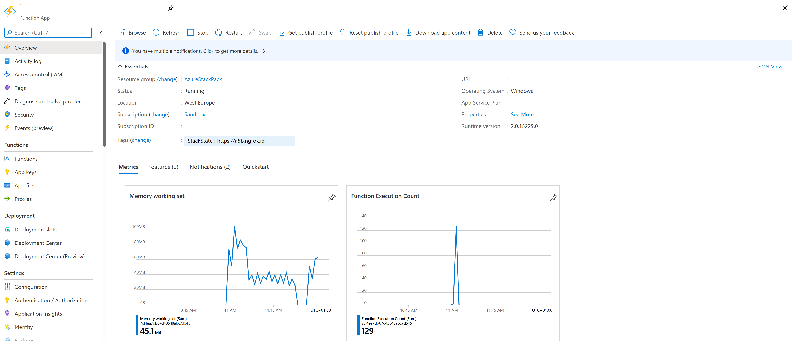
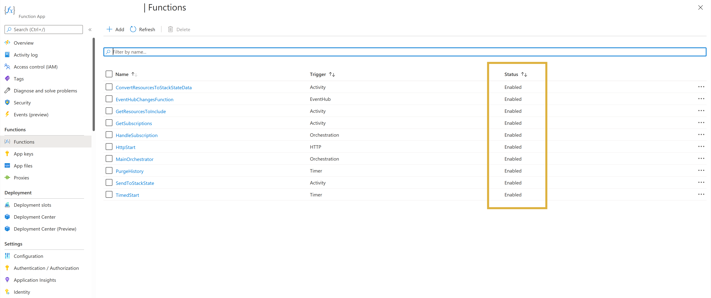

# Azure

## Overview

Microsoft Azure is a cloud computing service created by Microsoft for building, testing, deploying, and managing applications and services. This StackPack enables in-depth monitoring of the following Azure resource types:

|  |  |  |
| :--- | :--- | :--- |
| Azure Kubernetes Service \(AKS\) | Function Apps | SQL Servers |
| Application Gateways | Key Vault storage | Storage Accounts |
| Application Insights | Load Balancers | Virtual Machines |
| App Service Plans | Network Interfaces | Virtual Networks |
| Availability Sets | Network Security Groups | Web Apps |
| Compute Disks | Operations Management |  |
| Event Hubs | Public IP Addresses |  |

Azure is a [StackState curated integration](/stackpacks/integrations/about_integrations.md#stackstate-curated-integrations).


* The StackState Azure Agent is [a collection of Azure functions](azure.md#stackstate-azure-functions) that connect to the [Azure APIs](azure.md#rest-api-endpoints) at a configured interval to collect information about available resources.
  * `TimedStart` triggers data collection every 2 hours.
  * `EventHubChangesFunction` collects the deltas. 
  * `SendToStackState` pushes [retrieved data](azure.md#data-retrieved) to StackState.
* StackState translates incoming data into topology components and relations.
* The StackState Azure plugin pulls available telemetry data per resource on demand from Azure, for example when a component is viewed in the StackState UI or when a health check is run on the telemetry stream.
* StackState maps retrieved telemetry \(metrics\) onto the associated Azure components and relations.

## Setup

### Prerequisites

To set up the StackState Azure integration, you need to have:

* PowerShell version &gt;= 5.0 or Bash.
* The [Azure CLI \(learn.microsoft.com\)](https://learn.microsoft.com/en-us/cli/azure/install-azure-cli?view=azure-cli-latest).
* A Resource Group where the StackState resources can be deployed. We recommend that you create a separate resource group for all the resources related to StackState.
* An Azure Service Principal \(SPN\) for the StackState Azure Agent with the following permissions:
  * `Contributor` role for the StackPack Resource Group to deploy and delete resources.
  * `Reader` role for each of the subscriptions the StackPack instance will monitor.
* If StackState is installed on premise and behind a firewall, the [IP addresses used by Azure monitor \(learn.microsoft.com\)](https://learn.microsoft.com/en-us/azure/azure-monitor/app/ip-addresses) need to be reachable.
* StackState should not be configured to use a [custom trust store](/configure/security/self-signed-certificates.md).

### Install StackPack

Install the Azure StackPack from the StackState UI **StackPacks** &gt; **Integrations** screen. You will need to provide the following parameters:

* **Azure instance name** - the user-defined name of the Azure instance shown in configurations such as views.
* **Client Id** - the client ID of the Azure Service Principal.
* **Client Secret** - the client secret used to authenticate the client.
* **Tenant Id** - the ID of the Azure Tenant / Active Directory.

### Deploy Azure Agent

To enable the Azure integration and begin collecting data from Azure, you will need to deploy the StackState Azure Agent to your Azure instance. The StackState Azure agent is a collection of [Azure functions](azure.md#stackstate-azure-functions) that connect to [Azure REST API endpoints](azure.md#rest-api-endpoints). You can deploy one or more StackState Azure Agents, each will collect data from resources related to the configured `Reader` roles in the Azure Service Principle.

1. Download the manual installation zip file. This is included in the Azure StackPack and can be accessed at the link provided in StackState after you install the Azure StackPack.
2. Make sure you have created a resource group in one of your subscriptions where the StackState Azure Agent can be deployed.
3. Run one of the install scripts below, specifying the `Client Id` and `Client Secret` - these are the `appId` and `password` from the Service Principal you created before installing the Azure StackPack.



```text
./stackstate.monitor.sh \
    <AZURE_tenantId> \
    <STACKSTATE_BASE_URL> \
    <STACKSTATE_RECEIVER_API_KEY> \
    <AZURE_subscriptionId> \
    <AZURE_clientId> \
    <AZURE_clientSecret> \
    <AZURE_resourceGroupName>
```

You can also specify two additional (positional) arguments after the `<AZURE_resourceGroupName>`: 
- The StackPack Instance URL (topology identifier), default `{tenantId}_{first 25 chars of client ID}`.
- The Azure function App name, default `{tenantId}_{first 25 chars of client ID}`.




```text
az login
az login
./stackstate.monitor.ps1 `
-tenantId <AZURE_tenantId> `
-stsApiUrl <STACKSTATE_BASE_URL> `
-stsApiKey <STACKSTATE_RECEIVER_API_KEY> `
-subscriptionId <AZURE_subscriptionId> `
-servicePrincipalId <AZURE_clientId> `
-servicePrincipalSecret <AZURE_clientSecret> `
-resourceGroupName <AZURE_resourceGroupName>
```

You can also specify two additional arguments: 
- `-stsInstanceUrl` - The StackPack Instance URL (topology identifier), default `{tenantId}_{first 25 chars of client ID}`.
- `-functionAppName` - The Azure function App name, default `{tenantId}_{first 25 chars of client ID}`.





Note that the install script is optimized to run with Azure CLI versions 2.24.0 and earlier. When running with Azure CLI versions 2.24.1 and above, you may see deprecation warnings.


### Status

You can check the status of the Azure integration in Azure resource group. Open the **FunctionApp** and check the available metrics or the full list of **Functions** from the left menu. The status of all functions should be **Enabled**.





### Upgrade

When a new version of the Azure StackPack is available in your instance of StackState, you will be prompted to upgrade in the StackState UI on the page **StackPacks** &gt; **Integrations** &gt; **Azure**. For a quick overview of recent StackPack updates, check the [StackPack versions](../../setup/upgrade-stackstate/stackpack-versions.md) shipped with each StackState release.

For considerations and instructions on upgrading a minor or patch release of a StackPack, see [how to upgrade a StackPack](../about-stackpacks.md#upgrade-a-stackpack).

To upgrade to a new major release of the Azure StackPack:

1. Completely remove the StackState Azure resources, either in Azure directly or using the provided deprovisioning script, and uninstall the current StackPack. For details see [uninstall the Azure StackPack](azure.md#uninstall).
2. Install the new version from the page **StackPacks** &gt; **Integrations** &gt; **Azure**.
3. Install the new StackState Azure resources using the install script, see [deploy the StackState Azure agent](azure.md#deploy-azure-agent).

## Integration details

### Data retrieved

#### Events

The Azure integration does not retrieve any Events data.

#### Metrics

Metrics data is pulled on demand directly from Azure by the StackState Azure plugin, for example when a component is viewed in the StackState UI or when a health check is run on the telemetry stream. Retrieved metrics are mapped onto the associated topology component.

#### Topology

Each Azure integration retrieves topology data for resources associated with the associated Azure Service Principal.

| Data | Description |
| :--- | :--- |
| Components | Components retrieved from Azure are tagged with the associated Azure `instance_name`, `resource_group` and `subscription_name`. |
| Relations |  |

#### Traces

The Azure integration does not retrieve any Traces data.

### REST API endpoints

The Azure integration uses the following Azure REST API endpoints, scroll right for the SDK details:

| Resource | Endpoint | SDK \(Version\) |
| :--- | :--- | :--- |
| Metric definitions | {resourceUri}/providers/Microsoft.Insights/metricDefinitions?api-version=2018-01-01 | github.com/Azure/azure-sdk-for-java \(1.16.0\) |
| Metric values | {resourceUri}/providers/Microsoft.Insights/metrics?api-version=2018-01-01 | github.com/Azure/azure-sdk-for-java \(1.16.0\) |
| AKS Managed Cluster | resourceGroups/{resourceGroupName}/providers/Microsoft.ContainerService/managedClusters?api-version=2018-03-31 | Microsoft.Azure.Management.ResourceManager.Fluent \(1.18.0\) |
| Availability Sets | resourceGroups/{resourceGroupName}/providers/Microsoft.Compute/availabilitySets?api-version=2018-06-01 | Microsoft.Azure.Management.ResourceManager.Fluent \(1.18.0\) |
| ApplicationGateways | resourceGroups/{resourceGroupName}/providers/Microsoft.Network/applicationGateways?api-version=2018-04-01 | Microsoft.Azure.Management.ResourceManager.Fluent \(1.18.0\) |
| ApplicationInsights | providers/Microsoft.Insights/components?api-version=2015-05-01 | Microsoft.Azure.Management.ApplicationInsights \(0.2.0-preview\) |
| Classic Storage Account | resourceGroups/{resourceGroupName}/providers/Microsoft.ClassicStorage/storageAccounts?api-version=2016-11-01 | None |
| Classic Storage Account Keys | resourceGroups/{resourceGroupName}/providers/Microsoft.ClassicStorage/storageAccounts/{accountName}/listKeys?api-version=2016-11-01 | None |
| Classic Cloud Services | resourceGroups/{resourceGroupName}/providers/Microsoft.ClassicCompute/domainNames?api-version=2018-06-01 | None |
| Classic Cloud Services Deployment Slots | resourceGroups/{resourceGroupName}/providers/Microsoft.ClassicCompute/domainNames/{cloudServiceName}/deploymentSlots/{stage}?$expand=roles/instances?api-version=2018-06-01 | None |
| Compute Disks | resourceGroups/{resourceGroupName}/providers/Microsoft.Compute/disks?api-version=2018-04-01 | Microsoft.Azure.Management.ResourceManager.Fluent \(1.18.0\) |
| Eventhub Namespaces | resourceGroups/{resourceGroupName}/providers/Microsoft.EventHub/namespaces?api-version=2017-04-01 | Microsoft.Azure.Management.ResourceManager.Fluent \(1.18.0\) |
| KeyVault | resources?$filter=resourceType eq 'Microsoft.KeyVault/vaults'&api-version=2015-11-01 | Microsoft.Azure.Management.ResourceManager.Fluent \(1.18.0\) |
| LoadBalancers | resourceGroups/{resourceGroupName}/providers/Microsoft.Network/loadBalancers?api-version=2018-04-01 | Microsoft.Azure.Management.ResourceManager.Fluent \(1.18.0\) |
| NetworkInterfaces | resourceGroups/{resourceGroupName}/providers/Microsoft.Network/networkInterfaces?api-version=2018-04-01 | Microsoft.Azure.Management.ResourceManager.Fluent \(1.18.0\) |
| NetworkSecurityGroups | resourceGroups/{resourceGroupName}/providers/Microsoft.Network/networkSecurityGroups?api-version=2018-04-01 | Microsoft.Azure.Management.ResourceManager.Fluent \(1.18.0\) |
| PublicIPAddresses | resourceGroups/{resourceGroupName}/providers/Microsoft.Network/publicIPAddresses?api-version=2018-04-01 | Microsoft.Azure.Management.ResourceManager.Fluent \(1.18.0\) |
| RouteTables | resourceGroups/{resourceGroupName}/providers/Microsoft.Network/routeTables?api-version=2018-04-01 | Microsoft.Azure.Management.ResourceManager.Fluent \(1.18.0\) |
| ServerFarms | resourceGroups/{resourceGroupName}/providers/Microsoft.Web/serverfarms?api-version=2018-02-01 | Microsoft.Azure.Management.ResourceManager.Fluent \(1.18.0\) |
| SQL Servers | resourceGroups/{resourceGroupName}/providers/Microsoft.Sql/servers?api-version=2015-05-01-preview | Microsoft.Azure.Management.ResourceManager.Fluent \(1.18.0\) |
| SQL Server ElasticPools | resourceGroups/{resourceGroupName}/providers/Microsoft.Sql/servers/{serverName}/elasticPools?api-version=2014-04-01 | Microsoft.Azure.Management.ResourceManager.Fluent \(1.18.0\) |
| SQL Server Databases | resourceGroups/{resourceGroupName}/providers/Microsoft.Sql/servers/{serverName}/databases?api-version=2014-04-01 | Microsoft.Azure.Management.ResourceManager.Fluent \(1.18.0\) |
| Storage Accounts | resourceGroups/{resourceGroupName}/providers/Microsoft.Storage/storageAccounts?api-version=2017-10-01 | Microsoft.Azure.Management.ResourceManager.Fluent \(1.18.0\) |
| Storage Account Keys | resourceGroups/{resourceGroupName}/providers/Microsoft.Storage/storageAccounts/{accountName}/listKeys?api-version=2017-10-01 | Microsoft.Azure.Management.ResourceManager.Fluent \(1.18.0\) |
| Traffic Manager Profiles | resourceGroups/{resourceGroupName}/providers/Microsoft.Network/trafficmanagerprofiles?api-version=2018-04-01 | Microsoft.Azure.Management.ResourceManager.Fluent \(1.18.0\) |
| Virtual Machine | resourceGroups/{resourceGroupName}/providers/Microsoft.Compute/virtualMachines?api-version=2018-06-01 | Microsoft.Azure.Management.ResourceManager.Fluent \(1.18.0\) |
| Virtual Networks | resourceGroups/{resourceGroupName}/providers/Microsoft.Network/virtualNetworks?api-version=2018-04-01 | Microsoft.Azure.Management.ResourceManager.Fluent \(1.18.0\) |
| Web Apps | resourceGroups/{resourceGroupName}/providers/Microsoft.Web/sites?api-version=2017-10-01 | Microsoft.Azure.Management.ResourceManager.Fluent \(1.18.0\) |

### StackState Azure functions

There are a number of methods in the `TopologyDurableFunction` class:

| Function | Descrtipion |
| :--- | :--- |
| `TimedStart` | Timed trigger to start the MainOrchestrator. |
| `HttpStart` | HTTP trigger to start the MainOrchestrator manually for testing or after a first deployment from the StackPack. |
| `MainOrchestrator` | The orchestrator containing the main workflow: GetSubscriptions -&gt;  HandleSubscription \(for each subscription\) -&gt;  SendToStackState. |
| `GetSubscriptions` | Fetches all subscriptions that the service principle has access to. |
| `HandleSubscription` | Sub-orchestrator, contains the workflow: GetResourcesToInclude -&gt;  ConvertResourcesToStackStateData \(for each set of resources, grouped by type\) |
| `GetResourcesToInclude` | Fetches all resources in a subscription and filters out those that are ignored. |
| `ConvertResourcesToStackStateData` | Receives a group of resources and calls the ResourceTypeConverter class in the Core project. |
| `EventHubChangesFunction` | Listens to events for all currently supported resource types on `insights-operational-Logs` and provides incremental updates to StackState about your Azure environment. |
| `SendToStackState` | Receives a Synchronization object and sends it to StackState. |
| `PurgeHistory` | Durable functions store their state and history in Azure Blob Storage. This Azure Function does a daily cleanup of the data from the currentdate -2 months to the currentdate -1 month. |

### Azure views in StackState

When the Azure integration is enabled, a [view](../../use/stackstate-ui/views/about_views.md) will be created in StackState for each instance of the StackPack. Each view shows components filtered by the Azure `instance_name` tag and is named **Azure\_\[instance\_name\]**.

## Troubleshooting

Troubleshooting steps can be found in the StackState support Knowledge base guide to [troubleshoot the StackState Azure StackPack](https://support.stackstate.com/hc/en-us/articles/360016450300-Troubleshooting-StackState-Azure-StackPack).

## Uninstall

The Azure StackPack can be uninstalled by clicking the _Uninstall_ button from the StackState UI **StackPacks** &gt; **Integrations** &gt; **Azure** screen. This will remove all Azure specific configuration in StackState. You can also stop and delete the created resources \(within the resource group specified when running the manual installation\). They have been labeled with the tag `StackState`.

To do so, you can use the scripts in the manual installation zip file you downloaded when installing the StackState Azure agent. You can download this file again at anytime from the StackState UI **StackPacks** &gt; **Integrations** &gt; **Azure** screen.



```bash
./stackstate.monitor.deprovisioning.sh \
    <your TENANT_ID> \
    <STACKSTATE_BASE_URL>
```



```text
./stackstate.monitor.deprovisioning.ps1 `
-tenantId <your TENANT_ID> `
-stsApiUrl <STACKSTATE_BASE_URL>
```



## Release notes

**Azure StackPack v4.2.0 (2021-12-15)** 

- Feature: Added two options to installation script:
  - to specify Azure function name for the integration
  - to specify stackpack instance URL (topology identifier)

**Azure StackPack v4.1.1 \(2021-04-02\)**

* Improvement: Enable auto grouping on generated views.
* Improvement: Common bumped from 2.2.3 to 2.5.1
* Improvement: Update documentation.
* Improvement: StackState min version bumped to 4.3.0

## See also

* [Troubleshooting the Azure StackPack](https://support.stackstate.com/hc/en-us/articles/360016450300-Troubleshooting-StackState-Azure-StackPack)
* [Service principals in Azure \(learn.microsoft.com\)](https://learn.microsoft.com/en-us/azure/active-directory/develop/app-objects-and-service-principals#service-principal-object)
* [IP addresses used by Azure monitor \(learn.microsoft.com\)](https://learn.microsoft.com/en-us/azure/azure-monitor/app/ip-addresses)

