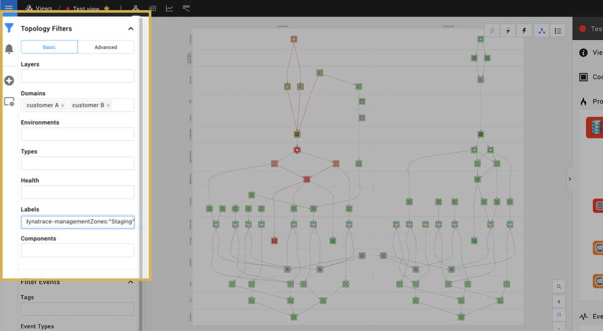

# 💠 Dynatrace


**This page describes StackState version 4.4.**

Go to the [documentation for the latest StackState release](https://docs.stackstate.com/).


## Overview

The Dynatrace StackPack creates a synchronization between a Dynatrace instance and StackState. When the integration is enabled, Dynatrace Smartscape topology and events for the configured `relative_time` \(default 1 hour\) will be available in StackState.


* Agent V2 connects to the configured [Dynatrace API](dynatrace.md#rest-api-endpoints) to retrieve Smartscape topology and events data.
* Agent V2 pushes [retrieved data](dynatrace.md#data-retrieved) to StackState.
* [Topology data](dynatrace.md#topology) is translated into components and relations. 
* [Tags](dynatrace.md#tags) defined in Dynatrace are added to components and relations in StackState.
* [Events](dynatrace.md#events) are available in the StackState Events Perspective and listed in the details pane of the StackState UI.

## Setup

### Pre-requisites

To set up the Dynatrace integration you will need to have:

* [StackState Agent V2](../../setup/agent/about-stackstate-agent.md)\) installed on a machine that can connect to both Dynatrace and StackState.
* A running Dynatrace instance.
* A [Dynatrace API Token](#dynatrace-api-token) with access to read the Smartscape Topology and Events.

### Install

Install the Dynatrace StackPack from the StackState UI **StackPacks** &gt; **Integrations** screen. You will need to provide the following parameters:

* **Dynatrace URL** - the Dynatrace URL from which topology will be collected. 
* **Dynatrace Instance Name** - the user-defined name of the Dynatrace account shown in configurations such as views. 

### Configure

To enable the Dynatrace check and begin collecting data from Dynatrace, add the following configuration to StackState Agent V2:


Example Dynatrace Agent integration configuration file: [conf.yaml.example \(github.com\)](https://github.com/StackVista/stackstate-agent-integrations/blob/master/dynatrace/stackstate_checks/dynatrace/data/conf.yaml.example)


1. Edit the Agent integration configuration file `/etc/stackstate-agent/conf.d/dynatrace.d/conf.yaml` to include details of your Dynatrace instance:
   * **url** - the base URL of the Dynatrace instance.
     - SaaS url example - https://{your-environment-id}.live.dynatrace.com
     - Managed url example - https://{your-domain}/e/{your-environment-id} 
   * **token** - a [Dynatrace API token](#dynatrace-api-token) with access to the required [Dynatrace API endpoints](dynatrace.md#rest-api-endpoints). Use [secrets management](../../configure/security/secrets_management.md) to store tokens outside of the configuration file.

     ```text
     # Section used for global dynatrace check config
     init_config:

     instances:
     # mandatory
     - url: <url>  #the base URL of the Dynatrace instance.
       # SaaS url example - https://{your-environment-id}.live.dynatrace.com
       # Managed url example - https://{your-domain}/e/{your-environment-id} 
       token: <token>
       # verify: True  # default True
       # timeout: 10
       # cert: /path/to/cert.pem
       # keyfile: /path/to/key.pem
       # domain: <domain>  # default 'dynatrace'
       # environment: <environment>  # default 'production'
       # relative_time : <relative_time> # default 'hour'
       # events_bootstrap_days: 5  # default 5 days
       # events_process_limit: 10000  # default 10k events
       # tags:
       #   - foo:bar
     ```
2. Optional: Add a **domain** and **environment** in the `conf.yaml` file to specify where imported Dynatrace topology will end up in StackState \(default domain=dynatrace and environment=production\).
3. [Restart the StackState Agent\(s\)](../../setup/agent/about-stackstate-agent.md#deploy-and-run-stackstate-agent-v2) to apply the configuration changes.
4. Once the Agent has restarted, wait for data to be collected from Dynatrace and sent to StackState.

#### Dynatrace API token

The API Token configured in StackState Agent V2 must have the permission **Access problems and event feed, metrics, and topology** \(API value `DataExport`\). Note that this token must be generated by an admin Dynatrace user in Settings > Integrations > Dynatrace API. For details, see [Dynatrace API token permissions \(dynatrace.com\)](https://www.dynatrace.com/support/help/dynatrace-api/basics/dynatrace-api-authentication/#token-permissions).

You can check if the generated token is working using the curl command:

```yaml
curl --request GET \
  --url https://mySampleEnv.live.dynatrace.com/api/v1/config/clusterversion \
  --header 'Authorization: Api-Token abcdefjhij1234567890' 
                                                
curl --request GET \
  --url https://myonpremise.dynatrace.stacstate.com/e/2342AD33afadsf/api/v1/config/clusterversion \
  --header 'Authorization: Api-Token abcdefjhij1234567890' 
```

### Status

To check the status of the Dynatrace integration, run the status subcommand and look for Dynatrace under `Running Checks`:

```text
sudo stackstate-agent status
```

### Upgrade

When a new version of the Dynatrace StackPack is available in your instance of StackState, you will be prompted to upgrade in the StackState UI on the page **StackPacks** &gt; **Integrations** &gt; **Dynatrace**. For a quick overview of recent StackPack updates, check the [StackPack versions](../../setup/upgrade-stackstate/stackpack-versions.md) shipped with each StackState release.

For considerations and instructions on upgrading a StackPack, see [how to upgrade a StackPack](../about-stackpacks.md#upgrade-a-stackpack).

## Integration details

### REST API endpoints

The API endpoints used in the StackState integration are listed below:

* `/api/v1/entity/applications`
* `/api/v1/entity/infrastructure/hosts`
* `/api/v1/entity/infrastructure/processes`
* `/api/v1/entity/infrastructure/process-groups`
* `/api/v1/entity/services`
* `/api/v1/events`


Refer to the Dynatrace documentation for details on [how to create an API Token](https://www.dynatrace.com/support/help/shortlink/api-authentication#generate-a-token).


### Data retrieved

#### Events

The Dynatrace check retrieves all events and their parameters from Dynatrace for the configured `relative_time` \(default 1 hour\). Retrieved events are available in the StackState Events Perspective and listed in the details pane of the StackState UI.

#### Metrics

The Dynatrace check does not retrieve any metrics data.

#### Tags

All tags defined in Dynatrace will be retrieved and added to the associated components and relations in StackState. The Dynatrace integration also understands [common tags](../../configure/topology/tagging.md#common-tags) and applies these to topology in StackState.

#### Topology

The Dynatrace check retrieves the following topology data from Dynatrace:

| Data | Description |
| :--- | :--- |
| Components | Smartscape Applications, Hosts, Processes, Process-Groups and Services. |
| Relations | Relations between the imported components are included in the component data retrieved from Dynatrace. |

#### Traces

The Dynatrace check does not retrieve any traces data.

### Dynatrace filters for StackState views

When the Dynatrace integration is enabled, the following additional keys can be used to filter views in the StackState UI:

* dynatrace-ManagementZones
* dynatrace-EntityID
* dynatrace-Tags
* dynatrace-MonitoringState

For example, to filter a view by Dynatrace Management Zone, add the key `dynatrace-managementZones:<value>` to the **Labels** filter box.



### Open source

The code for the Dynatrace check is open source and available on GitHub at: [https://github.com/StackVista/stackstate-agent-integrations/tree/master/dynatrace](https://github.com/StackVista/stackstate-agent-integrations/tree/master/dynatrace)

## Troubleshooting

Troubleshooting steps for any known issues can be found in the [StackState support Knowledge base](https://support.stackstate.com/hc/en-us/search?category=360002777619&filter_by=knowledge_base&query=Dynatrace).

## Uninstall

To uninstall the Dynatrace StackPack and disable the Dynatrace check:

1. Go to the StackState UI **StackPacks** &gt; **Integrations** &gt; **Dynatrace** screen and click **UNINSTALL**.
   * All Dynatrace specific configuration will be removed from StackState.
2. Remove or rename the Agent integration configuration file, for example:

   ```text
    mv dynatrace.d/conf.yaml dynatrace.d/conf.yaml.bak
   ```

3. [Restart the StackState Agent\(s\)](../../setup/agent/about-stackstate-agent.md#deploy-and-run-stackstate-agent-v2) to apply the configuration changes.

## Release notes

**Dynatrace StackPack v1.1.2 \(2021-06-24\)**

* Improvement: Changed which events send DEVIATING health state

**Dynatrace StackPack v1.1.1 \(2021-04-12\)**

* Improvement: Common bumped from 2.5.0 to 2.5.1

**Dynatrace StackPack v1.1.1 \(2021-04-02\)**

* Feature: Gather Events from your Dynatrace instance and provides Health info about Dynatrace components.
* Feature: Support for Dynatrace tags.
* Improvement: Enable auto grouping on generated views.
* Improvement: Common bumped from 2.2.3 to 2.5.1
* Improvement: StackState min version bumped to 4.3.0

**Dynatrace StackPack v1.0.0**

* Feature: Gathers Topology from your Dynatrace instance and allows visualization of your Dynatrace components and the relations between them.

## See also

* [StackState Agent V2](../../setup/agent/about-stackstate-agent.md)
* [StackState Agent integrations - Dynatrace \(github.com\)](https://github.com/StackVista/stackstate-agent-integrations/tree/master/dynatrace)
* [How to generate a Dynatrace API token \(dynatrace.com\)](https://www.dynatrace.com/support/help/shortlink/api-authentication#generate-a-token)
* [Permissions for Dynatrace API tokens \(dynatrace.com\)](https://www.dynatrace.com/support/help/shortlink/api-authentication#token-permissions)

