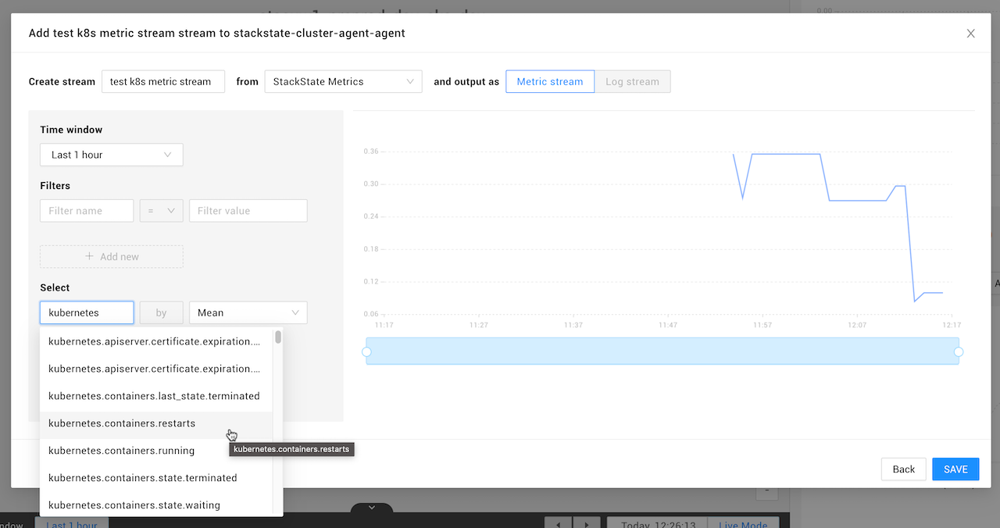

# Kubernetes


**This page describes StackState version 4.3.**

The StackState 4.3 version range is End of Life (EOL) and no longer supported. We encourage customers still running the 4.3 version range to upgrade to a more recent release.

Go to the [documentation for the latest StackState release](https://docs.stackstate.com/).


## Overview

The Kubernetes integration is used to create a near real-time synchronization of topology and associated internal services from a Kubernetes cluster to StackState. This StackPack allows monitoring of the following:

* Workloads
* Nodes, pods, containers and services
* Configmaps, secrets and volumes


* Data is retrieved by the deployed [StackState Agents](#stackstate-agents) and then pushed to StackState via the Agent StackPack and the Kubernetes StackPack.
* In StackState:
  * [Topology data](kubernetes.md#topology) is translated into components and relations.
  * [Tags](kubernetes.md#tags) defined in Kubernetes are added to components and relations in StackState.
  * [Metrics data](kubernetes.md#metrics) is stored and accessible within StackState. Relevant metrics data is mapped to associated components and relations in StackState.
  * [Kubernetes events](kubernetes.md#events) are available in the StackState UI Events Perspective and listed in the details pane on the right of the StackState UI.

## StackState Agents

The Kubernetes integration collects topology data in a Kubernetes cluster as well as metrics and events. To achieve this, different types of StackState Agent are  used:

| Component | Required? | Pod name |
|:---|:---|
| [StackState Cluster Agent](#stackstate-cluster-agent) | ✅ | `stackstate-cluster-agent` |
| [StackState Agent](#stackstate-agent) | ✅ | `stackstate-cluster-agent-agent` |
| [StackState ClusterCheck Agent](#stackstate-clustercheck-agent) | - | `stackstate-cluster-agent-clusterchecks` |


To integrate with other services, a separate instance of the [StackState Agent](/stackpacks/integrations/agent.md) should be deployed on a standalone VM. It is not currently possible to configure a StackState Agent deployed on a Kubernetes cluster with checks that integrate with other services.


### StackState Cluster Agent

StackState Cluster Agent is deployed as a Deployment. There is one instance for the entire Kubernetes cluster:
  * Topology and events data for all resources in the cluster are retrieved from the Kubernetes API.
  * Control plane metrics are retrieved from the Kubernetes API.

When cluster checks are enabled, cluster checks configured here are run by one of the deployed [StackState ClusterCheck Agent](#stackstate-clustercheck-agent) pods.

### StackState Agent

StackState Agent V2 is deployed as a DaemonSet with one instance **on each node** in the Kubernetes cluster:
  * Host information is retrieved from the Kubernetes API.
  * Container information is collected from the Docker daemon.
  * Metrics are retrieved from kubelet running on the node.

By default, metrics are also retrieved from kube-state-metrics if that is deployed on the same node as the StackState Agent pod. This can cause issues on a large Kubernetes cluster. To avoid this, it is advisable to enable cluster checks so that metrics are gathered from kube-state-metrics by a dedicated [StackState ClusterCheck Agent](#stackstate-clustercheck-agent).

### StackState ClusterCheck Agent

Deployed only when `clusterChecks.enabled` is set to `true` in `values.yaml` when the StackState Cluster Agent is deployed. When deployed, default is one instance per cluster. When enabled, cluster checks configured on the [StackState Cluster Agent](#stackstate-cluster-agent) are run by one of the deployed StackState ClusterCheck Agent pods. This is useful to run checks that do not need to run on a specific node and monitor non-containerized workloads such as:

* Out-of-cluster datastores and endpoints (for example, RDS or CloudSQL).
* Load-balanced cluster services (for example, Kubernetes services).

Read how to [enable cluster checks](#cluster-checks).

## Setup

### Prerequisites

The following prerequisites are required to install the Kubernetes StackPack and deploy the StackState Agent and Cluster Agent:

* A Kubernetes Cluster must be up and running.
* A recent version of Helm 3.
* A user with permissions to create privileged pods, ClusterRoles and ClusterRoleBindings:
  * ClusterRole and ClusterRoleBinding are needed to grant StackState Agents permissions to access the Kubernetes API.
  * StackState Agents need to run in a privileged pod to be able to gather information on network connections and host information.

### Install

Install the Kubernetes StackPack from the StackState UI **StackPacks** &gt; **Integrations** screen. You will need to provide the following parameters:

* **Kubernetes Cluster Name** - A name to identify the cluster. This does not need to match the cluster name used in `kubeconfig`, however, that is usually a good candidate for a unique name.

If the Agent StackPack is not already installed, this will be automatically installed together with the Kubernetes StackPack. This is required to work with the StackState Agent, which will need to be deployed on each node in the Kubernetes cluster.

### Deploy the StackState Agent and Cluster Agent

For the Kubernetes integration to retrieve topology, events and metrics data, you will need to have the following installed on your Kubernetes cluster:

* A StackState Agent on each node in the cluster
* StackState Cluster Agent on one node
* kube-state-metrics


To integrate with other services, a separate instance of the [StackState Agent](/stackpacks/integrations/agent.md) should be deployed on a standalone VM. It is not currently possible to configure a StackState Agent deployed on a Kubernetes cluster with checks that integrate with other services.


The StackState Agent, Cluster Agent and kube-state-metrics can be installed together using the Cluster Agent Helm Chart:

1. If you do not already have it, you will need to add the StackState helm repository to the local helm client:

   ```text
    helm repo add stackstate https://helm.stackstate.io
    helm repo update
   ```

2. Deploy the StackState Agent, Cluster Agent and kube-state-metrics with the helm command provided in the StackState UI after you have installed the StackPack. For large Kubernetes clusters, consider enabling [cluster checks](#cluster-checks) to run the kubernetes_state check in a StackState ClusterCheck Agent pod.


**stackstate.cluster.authToken**

In addition to the variables included in the provided helm command, it is also recommended to provide a `stackstate.cluster.authToken`. This is an optional variable, however, if not provided a new, random value will be generated each time a helm upgrade is performed. This could leave some pods in the cluster with an incorrect configuration.

For example:

```text
helm upgrade --install \
--namespace stackstate \
--create-namespace \
--set-string 'stackstate.apiKey=<your-api-key>' \
--set-string 'stackstate.cluster.name=<your-cluster-name>' \
--set-string 'stackstate.cluster.authToken=<your-cluster-token>' \
--set-string 'stackstate.url=<your-stackstate-url>/receiver/stsAgent' \
stackstate-cluster-agent stackstate/cluster-agent
```


Full details of the available values can be found in the [Cluster Agent Helm Chart documentation \(github.com\)](https://github.com/StackVista/helm-charts/tree/master/stable/cluster-agent).

### Status

To check the status of the Kubernetes integration, check that the StackState Cluster Agent \(`cluster-agent`\) pod and all of the StackState Agent \(`cluster-agent-agent`\) pods have status ready.

```text
❯ kubectl get deployment,daemonset --namespace stackstate

NAME                                                 READY   UP-TO-DATE   AVAILABLE   AGE
deployment.apps/stackstate-cluster-agent             1/1     1            1           5h14m
NAME                                                 DESIRED   CURRENT   READY   UP-TO-DATE   AVAILABLE   NODE SELECTOR   AGE
daemonset.apps/stackstate-cluster-agent-agent        10        10        10      10           10          <none>          5h14m
```

## Checks

### Cluster checks

Optionally, the chart can be configured to start additional StackState Agent V2 pods (1 by default) as StackState ClusterCheck Agent pods that run cluster checks. Cluster checks are configured on the [StackState Cluster Agent](#stackstate-cluster-agent) are run by one of the deployed [StackState ClusterCheck Agent](#stackstate-clustercheck-agent) pods.

#### Enable cluster checks

To enable cluster checks and the cluster check Agent pods, create a `values.yaml` file to deploy the `cluster-agent` Helm chart and add the following YAML segment:

```yaml
clusterChecks:
  enabled: true
```

### Kubernetes_state check

The kubernetes_state check is responsible for gathering metrics from kube-state-metrics and sending them to StackState. It is configured on the StackState Cluster Agent and runs in the StackState Agent pod that is on the same node as the kube-state-metrics pod.

#### Run as a cluster check

In a default deployment, the pod running the StackState Cluster Agent and every deployed StackState Agent need to be able to run the check. In a large Kubernetes cluster, this can consume a lot of memory as every pod must be configured with sufficient CPU and memory requests and limits. Since only one of those Agent pods will actually run the check, a lot of CPU and memory resources will be allocated, but will not be used.

To remedy that situation, the kubernetes_state check can be configured to run as a cluster check. The YAML segment below shows how to do that in the `values.yaml` file used to deploy the `cluster-agent` chart:

```yaml
clusterChecks:
# clusterChecks.enabled -- Enables the cluster checks functionality _and_ the clustercheck pods.
  enabled: true
agent:
  config:
    override:
# agent.config.override -- Disables kubernetes_state check on regular agent pods.
    - name: auto_conf.yaml
      path: /etc/stackstate-agent/conf.d/kubernetes_state.d
      data: |
clusterAgent:
  config:
    override:
# clusterAgent.config.override -- Defines kubernetes_state check for clusterchecks agents. Auto-discovery
#                                 with ad_identifiers does not work here. Use a specific URL instead.
    - name: conf.yaml
      path: /etc/stackstate-agent/conf.d/kubernetes_state.d
      data: |
        cluster_check: true

        init_config:

        instances:
          - kube_state_url: http://YOUR_KUBE_STATE_METRICS_SERVICE_NAME:8080/metrics
```

## Integration details

### Data retrieved

The Kubernetes integration retrieves the following data:

* [Events](kubernetes.md#events)
* [Metrics](kubernetes.md#metrics)
* [Tags](kubernetes.md#tags)
* [Topology](kubernetes.md#topology)

#### Events

The Kubernetes integration retrieves all events from the Kubernetes cluster. The table below shows which event category will be assigned to each event type in StackState:

| StackState event category | Kubernetes events |
| :--- | :--- |
| **Activities** | `BackOff`<br />`ContainerGCFailed`<br />`ExceededGracePeriod`<br />`FileSystemResizeSuccessful`<br />`ImageGCFailed`<br />`Killing`<br />`NodeAllocatableEnforced`<br />`NodeNotReady`<br />`NodeSchedulable`<br />`Preempting`<br />`Pulling`<br />`Pulled`<br />`Rebooted`<br />`Scheduled`<br />`Starting`<br />`Started`<br />`SuccessfulAttachVolume`<br />`SuccessfulDetachVolume`<br />`SuccessfulMountVolume`<br />`SuccessfulUnMountVolume`<br />`VolumeResizeSuccessful` |
| **Alerts** | `NotTriggerScaleUp` |
| **Changes** | `Created` \(created container\)<br />`NodeReady`<br />`SandboxChanged`<br />`SuccesfulCreate` |
| **Others** | All other events |

#### Metrics

The Kubernetes integration makes all metrics from the Kubernetes cluster available in StackState. Relevant metrics are automatically mapped to the associated components.

All retrieved metrics can be browsed or added to a component as a telemetry stream. Select the data source **StackState Metrics** and type `kubernetes` in the **Select** box to get a full list of all available metrics.



#### Topology

The Kubernetes integration retrieves components and relations for the Kubernetes cluster.

**Components**

The following Kubernetes topology data is available in StackState as components:

|  |  |
| :--- | :--- |
| Cluster | Ingress |
| Namespace | Job |
| Node | Persistent Volume |
| Pod | ReplicaSet |
| Container | Secret |
| ConfigMap | Service |
| CronJob | StatefulSet |
| DaemonSet | Volume |
| Deployment |  |

**Relations**

The following relations between components are retrieved:

* Container → Volume
* CronJob → Job
* DaemonSet → Pod
* Deployment → ReplicaSet
* Job → Pod
* Ingress → Service
* Namespace → CronJob, DaemonSet, Deployment, Job, ReplicaSet, Service, StatefulSet
* Node → Cluster relation
* Pod → ConfigMap, Container, Deployment, Node, Secret, Volume
* ReplicaSet →  Pod
* Service → ExternalService, Pod
* StatefulSet → Pod
* Direct communication between processes
* Process → Process communication via Kubernetes service
* Process → Process communication via headless Kubernetes service

#### Traces

The Kubernetes integration does not retrieve any traces data.

#### Tags

All tags defined in Kubernetes will be retrieved and added to the associated components and relations in StackState.

### REST API endpoints

The StackState Agent talks to the kubelet and kube-state-metrics API.

The StackState Agent and Cluster Agent connect to the Kubernetes API to retrieve cluster wide information and Kubernetes events. The following API endpoints used:

| Resource type | REST API endpoint |
| :--- | :--- |
| Cluster &gt; ComponentStatus | `GET /api/v1/componentstatuses` |
| Cluster &gt; Event | `GET /apis/events.k8s.io/v1/events` |
| Cluster &gt; Namespace | `GET /api/v1/namespaces` |
| Cluster &gt; Node | `GET /api/v1/nodes` |
| Services &gt; Endpoints | `GET /api/v1/namespaces/{namespace}/endpoints` |
| Services &gt; Ingress | `GET /apis/networking.k8s.io/v1/namespaces/{namespace}/ingresses` |
| Services &gt; Service | `GET /api/v1/namespaces/{namespace}/services` |
| Workloads &gt; CronJob | `GET /apis/batch/v1beta1/namespaces/{namespace}/cronjobs` |
| Workloads &gt; DaemonSet | `GET /apis/apps/v1/namespaces/{namespace}/daemonsets` |
| Workloads &gt; Deployment | `GET /apis/apps/v1/namespaces/{namespace}/deployments` |
| Workloads &gt; Job | `GET /apis/batch/v1/namespaces/{namespace}/jobs` |
| Workloads &gt; Pod | `GET /api/v1/namespaces/{namespace}/pods` |
| Workloads &gt; ReplicaSet | `GET /apis/apps/v1/namespaces/{namespace}/replicasets` |
| Workloads &gt; StatefulSet | `GET /apis/apps/v1/namespaces/{namespace}/statefulsets` |
| Config and Storage &gt; ConfigMap | `GET /api/v1/namespaces/{namespace}/configmaps` |
| Config and Storage &gt; Secret | `GET /api/v1/secrets` |
| Config and Storage &gt; PersistentVolume | `GET /api/v1/persistentvolumes` |
| Config and Storage &gt; PersistentVolumeClaimSpec | `GET /api/v1/namespaces/{namespace}/persistentvolumeclaims` |
| Config and Storage &gt; VolumeAttachment | `GET /apis/storage.k8s.io/v1/volumeattachments` |
|  | `/version` |
|  | `/healthz` |

For further details, refer to the [Kubernetes API documentation \(kubernetes.io\)](https://kubernetes.io/docs/reference/kubernetes-api/).

### Component actions

A number of [actions](../../use/perspectives/topology-perspective.md#actions) are added to StackState when the Kubernetes StackPack is installed. They are available from the **Actions** section on the right of the screen when a Kubernetes component is selected or from the component context menu, displayed when you hover over a Kubernetes component in the Topology Perspective

| Action | Available for<br />component types | Description |
| :--- | :--- | :--- |
| **Show configuration and storage** | pods<br />containers | Display the selected pod or container with its configmaps, secrets and volumes |
| **Show dependencies \(deep\)** | deployment<br />replicaset<br />replicationcontroller<br />statefulset<br />daemonset<br />job<br />cronjob<br />pod | Displays all dependencies \(up to 6 levels deep\) of the selected pod or workload. |
| **Show pods** | deployment<br />replicaset<br />replicationcontroller<br />statefulset<br />daemonset<br />job<br />cronjob | Displays the pods for the selected workload. |
| **Show pods & services** | namespace | Opens a view for the pods/services in the selected namespace |
| **Show services** | namespace | Open a view for the service and ingress components in the selected namespace |
| **Show workloads** | namespace | Show workloads in the selected namespace |

Details of installed actions can be found in the StackState UI **Settings** &gt; **Actions** &gt; **Component Actions** screen.

### Kubernetes views in StackState

When the Kubernetes integration is enabled, the following Kubernetes views are available in StackState for each cluster:

* Kubernetes - Applications -
* Kubernetes - Infrastructure -
* Kubernetes - Namespaces -
* Kubernetes - Workload Controllers -

### Open source

The code for the StackState Agent Kubernetes check is open source and available on GitHub at:

* [https://github.com/StackVista/stackstate-agent/tree/master/pkg/collector/corechecks/cluster](https://github.com/StackVista/stackstate-agent/tree/master/pkg/collector/corechecks/cluster)
* [https://github.com/stackvista/stackstate-agent](https://github.com/stackvista/stackstate-agent)
* [https://github.com/StackVista/stackstate-agent-integrations/tree/master/kubernetes](https://github.com/StackVista/stackstate-agent-integrations/tree/master/kubernetes)

## Troubleshooting

Troubleshooting steps for any known issues can be found in the [StackState support Knowledge base](https://support.stackstate.com/hc/en-us/search?utf8=%E2%9C%93&query=kubernetes).

## Uninstall

To uninstall the Kubernetes StackPack, go to the StackState UI **StackPacks** &gt; **Integrations** &gt; **Kubernetes** screen and click **UNINSTALL**. All Kubernetes StackPack specific configuration will be removed from StackState.

To uninstall the StackState Cluster Agent and the StackState Agent from your Kubernetes cluster, run a Helm uninstall:

```text
helm uninstall <release_name> --namespace <namespace>

# If you used the standard install command provided when you installed the StackPack
helm uninstall stackstate-cluster-agent --namespace stackstate
```

## Release notes

**Kubernetes StackPack v3.9.1 \(2021-04-02\)**

* Improvement: Enable auto grouping on generated views.
* Improvement: Update documentation.
* Improvement: Common bumped from 2.4.1 to 2.5.0
* Improvement: StackState min version bumped to 4.3.0

**Kubernetes StackPack v3.8.0 \(2021-03-08\)**

* Feature: Namespaces are now a component in StackState with a namespaces view for each cluster
* Feature: New component actions for quick navigation on workloads, pods and namespaces
* Feature: Added a "Pod Scheduled" metric stream to pods
* Feature: Secrets are now a component in StackState
* Improvement: The "Desired vs Ready" checks on workloads now use the "Ready replicas" stream instead of the replicas stream.
* Improvement: Use standard \(blue\) Kubernetes icons
* Bug fix: Fixed Kubernetes synchronization when a component had no labels but only tags

**Kubernetes StackPack v3.7.2 \(2020-08-18\)**

* Feature: Introduced the Release notes pop up for customer

**Kubernetes StackPack v3.7.1 \(2020-08-10\)**

* Feature: Introduced Kubernetes specific component identifiers

**Kubernetes StackPack v3.7.0 \(2020-08-04\)**

* Improvement: Deprecated stackpack specific layers and introduced a new common layer structure.

**Kubernetes StackPack v3.6.0 \(2020-06-19\)**

* Improvement: Set the stream priorities on all streams.

## See also

* [Agent StackPack](agent.md)
* [StackState Agent Kubernetes check \(github.com\)](https://github.com/StackVista/stackstate-agent-integrations/tree/master/kubernetes)
* [StackState Cluster Agent Helm Chart \(github.com\)](https://github.com/StackVista/helm-charts/tree/master/stable/cluster-agent)
* [Kubernetes API documentation \(kubernetes.io\)](https://kubernetes.io/docs/reference/kubernetes-api/)
