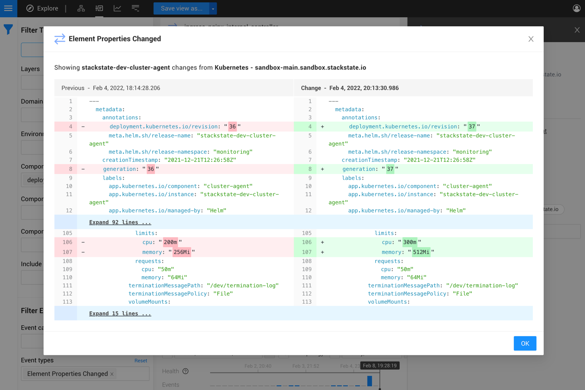
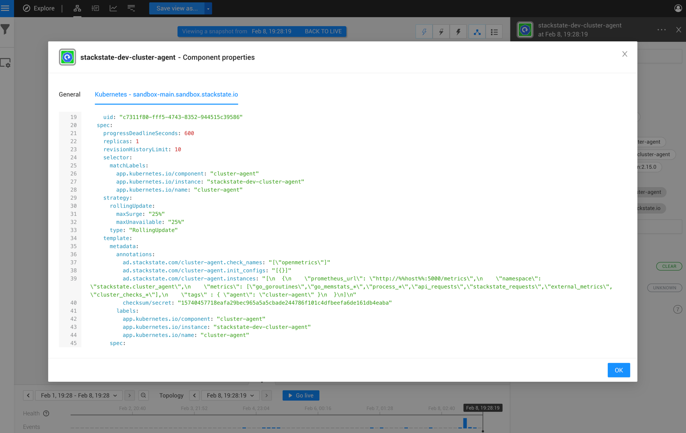

# 💠 OpenShift

## Overview

The OpenShift integration is used to create a near real-time synchronization of topology and associated internal services from an OpenShift cluster to StackState. This StackPack allows monitoring of the following:

* Workloads
* Nodes, pods, containers and services
* Configmaps, secrets and volumes


The OpenShift integration collects topology data in an OpenShift cluster as well as metrics and events.

* Data is retrieved by the deployed [StackState Agents](../../setup/agent/kubernetes-openshift.md#stackstate-agent-types) and then pushed to StackState via the Agent StackPack and the OpenShift StackPack.
* In StackState:
  * [Topology data](openshift.md#topology) is translated into components and relations.
  * [Tags](openshift.md#tags) defined in OpenShift are added to components and relations in StackState.
  * Relevant [metrics data](openshift.md#metrics) is mapped to associated components and relations in StackState. All retrieved metrics data is stored and accessible within StackState.
  * [OpenShift events](openshift.md#events) are available in the StackState UI Events Perspective. They're also included the **Event** list in the right panel **View summary** tab and the details tabs - **Component details** and **Direct relation details**.
  * [Object change events](openshift.md#events) are created for every detected change to `spec` or `metadata` in OpenShift objects

## Setup

### Prerequisites

The following prerequisites are required to install the OpenShift StackPack and deploy the StackState Agent and Cluster Agent:

* An OpenShift Cluster must be up and running.
* A recent version of Helm 3.
* A user with permissions to create privileged pods, ClusterRoles, ClusterRoleBindings and SCCs:
  * ClusterRole and ClusterRoleBinding are needed to grant StackState Agents permissions to access the OpenShift API.
  * StackState Agents need to run in a privileged pod to be able to gather information on network connections and host information.

### Supported container runtimes

From StackState Agent V2.16, the following container runtimes are supported:

* containerd
* CRI-O
* Docker

Note that versions of StackState Agent prior to v2.16 support the Docker container runtime only.

### Install

Install the OpenShift StackPack from the StackState UI **StackPacks** &gt; **Integrations** screen. You will need to enter the following details:

* **OpenShift Cluster Name** - A name to identify the cluster. This doesn't need to match the cluster name used in `kubeconfig`, however, that's usually a good candidate for a unique name.

If the Agent StackPack isn't already installed, this will be automatically installed together with the OpenShift StackPack. StackState requires the Agent StackPack to work with the StackState Agent, which will need to be deployed on each node in the OpenShift cluster.

### Deploy: Agent and Cluster Agent

For the OpenShift integration to retrieve topology, events and metrics data, you will need to have the following installed on your OpenShift cluster:

* StackState Agent V2 on each node in the cluster
* StackState Cluster Agent on one node
* StackState Checks Agent on one node
* kube-state-metrics

➡️ [Deploy StackState Agents and kube-state-metrics](../../setup/agent/kubernetes-openshift.md).


To integrate with other services, a separate instance of the [StackState Agent](../../setup/agent/about-stackstate-agent.md) should be deployed on a standalone VM. It isn't currently possible to configure a StackState Agent deployed on an OpenShift cluster with checks that integrate with other services.


### Configure kube-state-metrics

The kubernetes\_state check is responsible for gathering metrics from kube-state-metrics and sending them to StackState. The kubernetes\_state check runs in the [StackState Checks Agent](../../setup/agent/kubernetes-openshift.md#checks-agent) by default and is configured in the [StackState Cluster Agent](../../setup/agent/kubernetes-openshift.md#cluster-agent).

The default URL that the kubernetes\_state check uses is:
```
http://<release-name>-kube-state-metrics.<namespace>.svc.cluster.local:8080/metrics
```

If an alternative kube-state-metrics pod \(i.e. Prometheus\) is installed, the default StackState kube-state-metrics pod can be disabled and the kubernetes\_state check redirected to the alternative service:

1. Update the `values.yaml` file used to deploy the `checks-agent`, for example:
   ```yaml
   dependencies:
     kubeStateMetrics:
       enabled: false
   checksAgent:
     kubeStateMetrics:
       url: http://YOUR_KUBE_STATE_METRICS_SERVICE_NAME:8080/metrics
   ```

2. Deploy the `checks_agent` using the updated `values.yaml`:
   ```yaml
   helm upgrade --install \
   --namespace stackstate \
   --create-namespace \
   --set-string 'stackstate.apiKey'='<STACKSTATE_RECEIVER_API_KEY>' \
   --set-string 'stackstate.cluster.name'='<OPENSHIFT_CLUSTER_NAME>' \
   --set-string 'stackstate.cluster.authToken=<CLUSTER_AUTH_TOKEN>' \
   --set-string 'stackstate.url'='<STACKSTATE_RECEIVER_API_ADDRESS>' \
   --set 'agent.scc.enabled'=true \
   --set 'kube-state-metrics.podSecurityContext.enabled'=false \
   --set 'kube-state-metrics.containerSecurityContext.enabled'=false \
   --values values.yaml \
   stackstate-agent stackstate/stackstate-agent
   ```

### Status

To check the status of the OpenShift integration, check that the StackState Cluster Agent \(`cluster-agent`\) pod, StackState Checks Agent pod \(`checks-agent`\) and all of the StackState Agent \(`node-agent`\) pods have status ready.

```text
❯ kubectl get deployment,daemonset --namespace stackstate

NAME                                                 READY   UP-TO-DATE   AVAILABLE   AGE
deployment.apps/stackstate-agent-cluster-agent       1/1     1            1           5h14m
deployment.apps/stackstate-agent-checks-agent        1/1     1            1           5h14m
NAME                                                 DESIRED   CURRENT   READY   UP-TO-DATE   AVAILABLE   NODE SELECTOR   AGE
daemonset.apps/stackstate-agent-node-agent           10        10        10      10           10          <none>          5h14m
```

## Integration details

### Data retrieved

The OpenShift integration retrieves the following data:

* [Events](openshift.md#events)
* [Metrics](openshift.md#metrics)
* [Tags](openshift.md#tags)
* [Topology](openshift.md#topology)

#### Events

The OpenShift integration retrieves all OpenShift events from the OpenShift cluster. In addition to this, `Configuration Change` events will be generated in StackState for changes in Kubernetes objects.
* All [OpenShift events](#openshift-events) are retrieved from the Kubernetes cluster.
* StackState `Configuration Change` events will be generated for [changes detected in an OpenShift object](#object-change-events).

##### OpenShift events

The OpenShift integration retrieves all events from the OpenShift cluster. The table below shows which event category will be assigned to each event type in StackState:

| StackState event category | OpenShift events                                                                                                                                                                                                                                                                                                                                                               |
| :--- |:-------------------------------------------------------------------------------------------------------------------------------------------------------------------------------------------------------------------------------------------------------------------------------------------------------------------------------------------------------------------------------|
| **Activities** | `BackOff` `ContainerGCFailed` `ExceededGracePeriod` `FileSystemResizeSuccessful` `ImageGCFailed` `Killing` `NodeAllocatableEnforced` `NodeNotReady` `NodeSchedulable` `Preempting` `Pulling` `Pulled` `Rebooted` `Scheduled` `Starting` `Started` `SuccessfulAttachVolume` `SuccessfulDetachVolume` `SuccessfulMountVolume` `SuccessfulUnMountVolume` `VolumeResizeSuccessful` |
| **Alerts** | `NotTriggerScaleUp`                                                                                                                                                                                                                                                                                                                                                            |
| **Changes** | `Created` \(created container\) `NodeReady` `SandboxChanged` `SuccesfulCreate`                                                                                                                                                                                                                                                                                                 |
| **Others** | All other events                                                                                                                                                                                                                                                                                                                                                               |

##### Object change events

The OpenShift integration will detect changes in OpenShift objects and will create an event of type `Configuration Change` with a diff with a YAML representation of the changed object.



Changes will be detected in the following object types:
* `ConfigMap`
* `CronJob`
* `DaemonSet`
* `Deployment`
* `Ingress`
* `Job`
* `Namespace`
* `Node`
* `PersistentVolume`
* `Pod`
* `ReplicaSet`
* `Secret` (a hash of the content will be compared)
* `Service`
* `StatefulSet`


Note that, to reduce noise of changes, the following object properties **won't** be compared:
* `metadata`
  * `managedFields`
  * `resourceVersion`
  * `annotations`
    * `kubectl.kubernetes.io/last-applied-configuration`
* `status` (except for `Node`, `Pod` and `PersistentVolume` objects)


You can also see current ([or past](../../use/stackstate-ui/timeline-time-travel.md#topology-time)) YAML definition of the object in the ["Component properties"](../../getting_started#component-relation-details):



#### Metrics

The OpenShift integration makes all metrics from the OpenShift cluster available in StackState. Relevant metrics are automatically mapped to the associated components.

All retrieved metrics can be browsed or added to a component as a telemetry stream. Select the data source **StackState Metrics** and type `kubernetes` in the **Select** box to get a full list of all available metrics.


#### Topology

The OpenShift integration retrieves components and relations for the OpenShift cluster.


**StackState Agent versions prior to 2.16:** Topology information is only gathered from OpenShift clusters that use the Docker container runtime.


**Components**

The following OpenShift topology data is available in StackState as components:

|  |  |
| :--- | :--- |
| Cluster | Ingress |
| Namespace | Job |
| Node | Persistent Volume |
| Pod | ReplicaSet |
| Container | Secret |
| ConfigMap | Service |
| CronJob | StatefulSet |
| DaemonSet | Volume |
| Deployment |  |

**Relations**

The following relations between components are retrieved:

* Container → PersistentVolume, Volume
* CronJob → Job
* DaemonSet → Pod
* Deployment → ReplicaSet
* Job → Pod
* Ingress → Service
* Namespace → CronJob, DaemonSet, Deployment, Job, ReplicaSet, Service, StatefulSet
* Node → Cluster relation
* Pod → ConfigMap, Container, Deployment, Node, PersistentVolume, Secret, Volume
* ReplicaSet →  Pod
* Service → ExternalService, Pod
* StatefulSet → Pod
* Direct communication between processes
* Process → Process communication via OpenShift service
* Process → Process communication via headless OpenShift service

#### Traces

The OpenShift integration doesn't retrieve any traces data.

#### Tags

All tags defined in OpenShift will be retrieved and added to the associated components and relations in StackState as labels.

The following labels will also be added to imported elements as relevant:

* `image_name`
* `kube_cluster_name`
* `kube_container_name`
* `kube_cronjob`
* `kube_daemon_set`
* `kube_deployment`
* `kube_job`
* `kube_namespace`
* `kube_replica_set`
* `kube_replication_controller`
* `kube_stateful_set`
* `pod_name`
* `pod_phase`

### REST API endpoints

The StackState Agent talks to the kubelet and kube-state-metrics API.

The StackState Agent and Cluster Agent connect to the OpenShift API to retrieve cluster wide information and OpenShift events. The following API endpoints used:

| Resource type | REST API endpoint |
| :--- | :--- |
| Metadata &gt; ComponentStatus | `GET /api/v1/componentstatuses` |
| Metadata &gt; ConfigMap | `GET /api/v1/namespaces/{namespace}/configmaps` |
| Metadata &gt; Event | `GET /apis/events.k8s.io/v1/events` |
| Metadata &gt; Namespace | `GET /api/v1/namespaces` |
| Network &gt; Endpoints | `GET /api/v1/namespaces/{namespace}/endpoints` |
| Network &gt; Ingress | `GET /apis/networking.k8s.io/v1/namespaces/{namespace}/ingresses` |
| Network &gt; Service | `GET /api/v1/namespaces/{namespace}/services` |
| Node &gt; Node | `GET /api/v1/nodes` |
| Security &gt; Secret | `GET /api/v1/secrets` |
| Storage &gt; PersistentVolumeClaimSpec | `GET /api/v1/namespaces/{namespace}/persistentvolumeclaims` |
| Storage &gt; VolumeAttachment | `GET /apis/storage.k8s.io/v1/volumeattachments` |
| Workloads &gt; CronJob | `GET /apis/batch/v1beta1/namespaces/{namespace}/cronjobs` |
| Workloads &gt; DaemonSet | `GET /apis/apps/v1/namespaces/{namespace}/daemonsets` |
| Workloads &gt; Deployment | `GET /apis/apps/v1/namespaces/{namespace}/deployments` |
| Workloads &gt; Job | `GET /apis/batch/v1/namespaces/{namespace}/jobs` |
| Workloads &gt; PersistentVolume | `GET /api/v1/persistentvolumes` |
| Workloads &gt; Pod | `GET /api/v1/namespaces/{namespace}/pods` |
| Workloads &gt; ReplicaSet | `GET /apis/apps/v1/namespaces/{namespace}/replicasets` |
| Workloads &gt; StatefulSet | `GET /apis/apps/v1/namespaces/{namespace}/statefulsets` |
|  | `/version` |
|  | `/healthz` |

For further details, refer to the [OpenShift API documentation \(openshift.com\)](https://docs.openshift.com/container-platform/4.4/rest_api/storage_apis/volumeattachment-storage-k8s-io-v1.html).

### Component actions

A number of [actions](../../use/stackstate-ui/perspectives/topology-perspective.md#actions) are added to StackState when the OpenShift StackPack is installed. They're available from the **Actions** section in the right panel details tab - **Component details** - when an OpenShift component is selected or from the component context menu, which is displayed when you hover the mouse pointer over an OpenShift component in the Topology Perspective

| Action | Available for component types | Description |
| :--- | :--- | :--- |
| **Show configuration and storage** | pods containers | Display the selected pod or container with its configmaps, secrets and volumes |
| **Show dependencies \(deep\)** | deployment replicaset replicationcontroller statefulset daemonset job cronjob pod | Displays all dependencies \(up to 6 levels deep\) of the selected pod or workload. |
| **Show pods** | deployment replicaset replicationcontroller statefulset daemonset job cronjob | Displays the pods for the selected workload. |
| **Show pods and services** | namespace | Opens a view for the pods/services in the selected namespace |
| **Show services** | namespace | Open a view for the service and ingress components in the selected namespace |
| **Show workloads** | namespace | Show workloads in the selected namespace |

Details of installed actions can be found in the StackState UI **Settings** &gt; **Actions** &gt; **Component Actions** screen.

### OpenShift views in StackState

When the OpenShift integration is enabled, the following OpenShift views are available in StackState for each cluster:

* OpenShift - Applications -
* OpenShift - Infrastructure -
* OpenShift - Namespaces -
* OpenShift - Workload Controllers -

### Open source

The code for the StackState Agent OpenShift check is open source and available on GitHub at:

* [https://github.com/StackVista/stackstate-agent/tree/master/pkg/collector/corechecks/cluster](https://github.com/StackVista/stackstate-agent/tree/master/pkg/collector/corechecks/cluster)
* [https://github.com/stackvista/stackstate-agent](https://github.com/stackvista/stackstate-agent)
* [https://github.com/StackVista/stackstate-agent-integrations/tree/master/kubernetes](https://github.com/StackVista/stackstate-agent-integrations/tree/master/kubernetes)

## Troubleshooting

Troubleshooting steps for any known issues can be found in the [StackState support Knowledge base](https://support.stackstate.com/hc/en-us/search?utf8=%E2%9C%93&category=360002777619&query=OpenShift).

## Uninstall

To uninstall the OpenShift StackPack, go to the StackState UI **StackPacks** &gt; **Integrations** &gt; **OpenShift** screen and click **UNINSTALL**. All OpenShift StackPack specific configuration will be removed from StackState.

See the Kubernetes Agent documentation for instructions on [how to uninstall the StackState Cluster Agent and the StackState Agent](/setup/agent/kubernetes-openshift.md#uninstall) from your Openshift cluster.

## Release notes

**OpenShift StackPack v3.8.2 (2022-09-28)**

- Improvement: Updated documentation.

**OpenShift StackPack v3.8.1 (2022-09-15)**

- Improvement: Added validation for cluster name

**OpenShift StackPack v3.7.13 (2022-06-21)**

- Bug Fix: Fixed description for services/ingresses view.

**OpenShift StackPack v3.7.12 (2022-06-03)**

- Improvement: Updated documentation.

**OpenShift StackPack v3.7.11 (2022-05-23)**

- Bug Fix: Fixed broken link in integration StackState Agent V2 integration documentation.

**OpenShift StackPack v3.7.10 (2022-03-02)**

- Improvement: Documentation for `agent.containerRuntime.customSocketPath` option.

**OpenShift StackPack v3.7.9 (2021-11-30)**

* Bug Fix: Support nodes without instanceId


## See also

* [Agent StackPack](agent.md)
* [StackState Agent Kubernetes check \(github.com\)](https://github.com/StackVista/stackstate-agent-integrations/tree/master/kubernetes)
* [StackState Agent Helm Chart \(github.com\)](https://github.com/StackVista/helm-charts/tree/master/stable/stackstate-agent)
* [OpenShift API documentation \(openshift.com\)](https://docs.openshift.com/container-platform/4.4/rest_api/storage_apis/volumeattachment-storage-k8s-io-v1.html)
