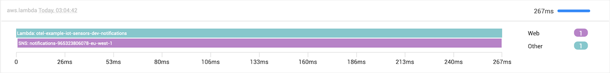
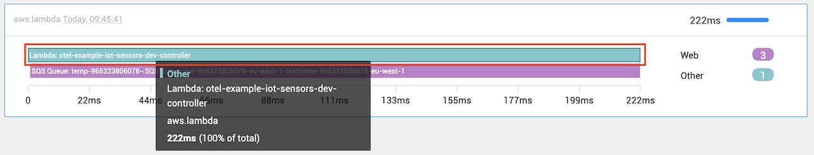
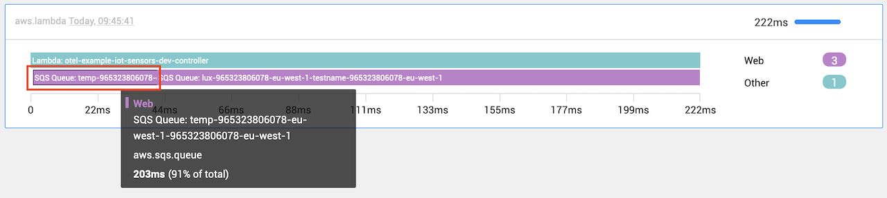
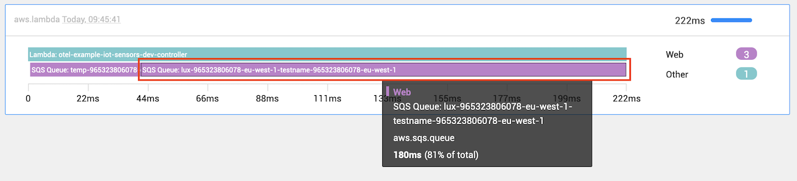

# About OpenTelemetry instrumentation

## Overview

To understand what OpenTelemetry instrumentation is, we first need to understand the concept of distributed tracing, how a trace looks and what the content of a trace contains. 
As a side note, If you are unfamiliar with OpenTelemetry you can visit their docs page [What is OpenTelemetry? \(opentelemetry.io\)](https://opentelemetry.io/docs/concepts/what-is-opentelemetry/) to get more information about OpenTelemetry.

## Distributed traces

Distributed tracing is a way of tracking code or application requests as it flows through the system as a whole.
Things like latency, errors, success statuses, and more can be tracked and monitored.
All the timed operations and data mentioned above will be captured and grouped within separate spans.
Below is an example of a Trace that contains two spans, one Lambda parent span, and one SNS child span.
(Parent and child span definitions will be explained a bit further down inside this documentation)



The above is a snippet of the [Traces Perspective](/use/stackstate-ui/perspectives/traces-perspective.md) within StackState.


## Spans

A span represents each unit of work that has been done within the lifespan of the trace.
A request's whole lifecycle, from creation to fulfillment, is represented by a trace.

For example, in the trace captured below, three time operations occurred.

The first was the Lambda that we monitored with OpenTelemetry, as seen in the screenshot below; this is the parent span.



The second interaction inside the Lambda script was with an SQS Queue



And the last interaction before the Trace is completed is another interaction with a second SQS Queue.



As you can see from the above, within this trace context, it had three span timed operations; thus, spans is a tree of timed operations that make up a trace.

A span can be one of two types, a `parent span` or a `child span.` It **can not be both**, and if it's a child span, then there should be a pre-existing parent span that it can be linked to.

A span works with the concept that you open a span and then close it when it reaches a certain point in your code.
This will then determine the duration of your span and, eventually, your trace.

### Parent span
- A parent span, also referred to as a root span, contains the end-to-end latency of an entire request.
- For example, if we execute a Lambda script, The script execution will be created as the parent span. All the other
  things monitored and executed inside this Lambda will be captured as children span.
- The parent span should be the last span you close. This is usually either at the end of your script execution or after you close your last child span
- A parent span doesn't require a child span; it can be standalone if it isn't a part of anything.

### Child span
- A child span is started by a parent span and might involve calling a function, the database, another service, etc. In the example mentioned above, a child span may be a function that determines if the item is accessible. Child spans offer insight into every element of a request.
- If we take the same example as above where the parent span is a Lambda script, then the children spans will be the SQS, SNS, etc. requests that happen inside the Lambda script.

If we combine the trace and span concept, you have a complete and working trace.

The above will look as follows:

```text
- Trace
  - Parent Span
    - Child Span
  - Parent Span
    - Child Span
    - Child Span
  - Parent Span
  - Parent Span
```

### The link between parent and child spans

A parent span will contain an ID, for example, `span-id: id-001`. When a child span's created, it can contain a key-value pair that states the following, `parent-span: id-001` and its own unique
span ID, for example, `span-id: id-002`.

One thing that makes the structure unique is that this can be a chain of infinite children; for example, the next child can have a parent-ID of a previous child, making it nested even deeper.

For example, below, we have a root parent that has a child, that child has a child, and then that child will have a final child:

```sass
Span =>
  spanId: 001 >--------|
                       |
Span =>                |
  spanId: 002 >--------|---|
  parentSpanId: 001 <--|   |
                           |
Span =>                    |
  spanId: 003 >--------|   |
  parentSpanId: 002 <--|---|
                       |
Span =>                |
  spanId: 004          |
  parentSpanId: 003 <--|
```

As you can see from the above, each following span parent ID has the ID from the previous span.


### Why create parent and children spans?
We want to create relations between different span timed operations, how they affect each other, and their relational flow.

You can head over to the [manual instrumentation component relations](/stackpacks/integrations/opentelemetry/manual-instrumentation/relations.md) page to get a full breakdown of how StackState relations work, how parent-child spans are shown on StackState, and how relations are created between components and how the health state uses these relations to propagate health.


### Span contents
Each span has a context that defines the request it's a part of.
Request, error, and duration information from Spans can be utilized to troubleshoot performance and availability problems.

To give your actions additional context, you may also include span characteristics.
Key-value pairs called span attributes can be used to give more context to a span about the particular action it records.


## OpenTelemetry instrumentation

When OpenTelemetry captures spans, it will fall under an instrumentation. This will be the library identifier that was used to capture the span information, for example `instrumentation-http` for
`HTTP status codes` and the `instrumentation-aws-sdk` for capturing `AWS calls`, will generate a span in two different instrumentations.


### In distributed traces
As we mentioned above, a trace contains multiple spans for example:

```shell
Trace [
    Span #1 - AWS-SDK Lambda Script Execution
    Span #2 - AWS-SDK S3
    Span #3 - HTTP S3 Request   <Parent Id: Span #2>
    Span #4 - HTTP S3 Response  <Parent Id: Span #2>
]
```

As you can see from the above, HTTP and AWS-SDK calls are mixed into one list.
With using OpenTelemetry it introduces the instrumentation layer, allowing users to use public
OpenTelemetry libraries to capture data and or create your instrumentations using the
OpenTelemetry API.

Below is an example of how the trace grouping looks after OpenTelemetry captures data:

```shell
Trace [
    AWS-SDK Instrumentation [
        Span #1 AWS-SDK Lambda Script Execution
        Span #2 AWS-SDK S3
    ]
    HTTP Instrumentation [
        Span #3 HTTP S3 Request   <Parent Id: Span #2>
        Span #4 HTTP S3 Response  <Parent Id: Span #2>
    ]
]
```

As you can see, the different types of spans have been grouped under what the library is called that was responsible for extracting the data.

This allows us to capture unique data for a specific type of instrumentation and look for it specifically under that instrumentation name.


### Support in StackState
StackState currently supports two types of instrumentations:

- An ***out-of-the-box*** solution specifically for AWS using a Lambda layer for all your ***NodeJS*** functions. 
  - This solution doesn't require you to write any code, but only supports certain services
  - Visit the [AWS OpenTelemetry integrations page](/stackpacks/integrations/opentelemetry/opentelemetry-nodejs.md) for more information regarding the [supported AWS services](/stackpacks/integrations/opentelemetry/opentelemetry-nodejs.md#supported-services) and how to install and use this Lambda layer.
- **Manual instrumentation** using the [OpenTelemetry API](https://opentelemetry.io/docs/instrumentation/)
  - This gives you the ability to create and display a custom component with a health state within StackState using the [OpenTelemetry API](https://opentelemetry.io/docs/instrumentation/).
  - To learn more about how to implement a manual instrumentation specifically for StackState, head over to the [manual instrumentation tracer and span mappings](/stackpacks/integrations/opentelemetry/manual-instrumentation/tracer-and-span-mappings.md) page


