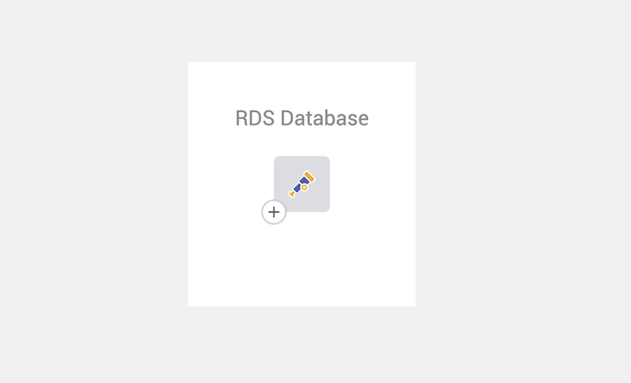
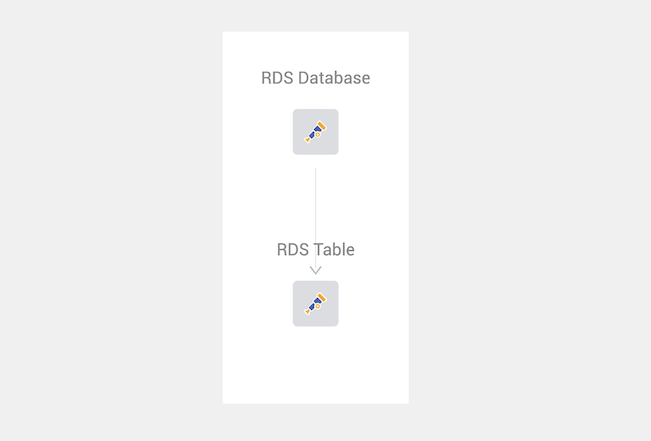

# Manual instrumentation mappings for StackState

## Overview

Below is a code snippet showing the basics required to send custom instrumentation to StackState.

We will create two components.

- RDS Database
- RDS Table

And we want a [relationship between the database and table](/stackpacks/integrations/opentelemetry/manual-instrumentation/relations.md) flowing down from the database to the table. This will allow
the [health state propagates](/stackpacks/integrations/opentelemetry/manual-instrumentation/span-health.md) up to the database if something is wrong with the table.

This is where your best judgment will come into play; best would be to play around with the parent spans, child spans, etc., and see
what result do you receive on StackState.

## Example: JavaScript and NodeJS

The following example implements a solution that crates the above-mentioned components.

### Prerequisites

To set up a OpenTelemetry manual instrumentations, you need to have:

* [StackState Agent](/setup/agent/about-stackstate-agent.md) v2.17 (or later)
* [Traces enabled](/setup/agent/advanced-agent-configuration.md#enable-traces) on StackState Agent. If traces aren't enabled on the Agent, OpenTelemetry won't generate any data.
* The [Agent StackPack](/stackpacks/integrations/agent.md) should be installed in StackState.

For NodeJS and Javascript, we aren't explaining the setup to get to this point but rather the code example and libraries that was used.

You should install the following npm libraries using npm or yarn

- [@opentelemetry/api](https://www.npmjs.com/package/@opentelemetry/api)
- [@opentelemetry/sdk-trace-base](https://www.npmjs.com/package/@opentelemetry/sdk-trace-base)
- [@opentelemetry/exporter-trace-otlp-proto](https://www.npmjs.com/package/@opentelemetry/exporter-trace-otlp-proto)

### What the StackState Agent expects

The StackState Agent expects you to send the [following keys in every single span](/stackpacks/integrations/opentelemetry/manual-instrumentation/tracer-and-span-mappings.md):
- `trace.perspective.name`
- `service.name`
- `service.type`
- `service.identifier`
- `resource.name`

***The most important part to remember is*** that the StackState Agent only accept the data in a [Protobuf Format](https://developers.google.com/protocol-buffers), Our examples below will
use this format but if you do attempt to write something from scratch remember that this is a requirement.

In this NodeJs / Javascript example, The protobuf module responsible for handling Protobuf is the following line:

`import { OTLPTraceExporter } from '@opentelemetry/exporter-trace-otlp-proto';`

### 1 - Import
The first step is to import the libraries that we will be using from OpenTelemetry. (Modules mentioned above)

```javascript
import * as openTelemetry from '@opentelemetry/api';
import { BasicTracerProvider, BatchSpanProcessor } from '@opentelemetry/sdk-trace-base';
import { OTLPTraceExporter as OTLPTraceProtoExporter } from '@opentelemetry/exporter-trace-otlp-proto';
```


### 2 - Core definitions
Now let's define a few values that we will use within the OpenTelemetry API code.

The first one will be where your StackState Trace Agent lives in the following format: `http://<host>:<trace port>/open-telemetry`

```javascript
// If you are using a env variable you can access the variable by using process.env.ENV_VARIABLE_NAME
const stsTraceAgentOpenTelemetryEndpoint = "http://localhost:8126/open-telemetry"
```

The second part is OpenTelemetry tracer definitions. StackState uses these to determine what type of interpretation will be used for
your trace. You need to specify the following:

```javascript
const tracerIdentifier = {
    name: "@opentelemetry/instrumentation-stackstate",
    version: "1.0.0"
}
```

---

### 3 - OpenTelemetry provider and span processor
The next step is to create the basics that OpenTelemetry requires to start a trace provider and something that can process spans

```javascript
const provider = new BasicTracerProvider();
const otlpTraceExporter = new OTLPTraceProtoExporter({ url: stsTraceAgentOpenTelemetryEndpoint })
const batchSpanProcessor = new BatchSpanProcessor(otlpTraceExporter)
provider.addSpanProcessor(batchSpanProcessor);
provider.register();

// Creating the tracer based on the identifier specified
const tracer = openTelemetry.trace.getTracer(
    tracerIdentifier.name,
    tracerIdentifier.version
);
```

---

### 4 - Root span / parent span
Now let's create the root span, For the root span we are creating a custom RDS Database entry (This database doesn't have to exist you control the span values).

Example Database
- Database Name: Hello World
- Database Type: AWS RDS

```javascript
// Creating a parent span. You need a identifier for this span inside the code
// we will use the value 'RDS Database' but this doesn't matter.
const rdsDatabase = tracer.startSpan('RDS Database', {
    root: true,
});

// Adding attributes to the rds database span
rdsDatabase.setAttribute('trace.perspective.name', 'RDS Database: Hello World');
rdsDatabase.setAttribute('service.name', 'RDS Database');
rdsDatabase.setAttribute('service.type', 'Database');
rdsDatabase.setAttribute('service.identifier', 'rds:database:hello-world');
rdsDatabase.setAttribute('resource.name', 'AWS RDS');
```

---

Example of how the parent component will look like if you create the with the above code



---

### 5 - Child span
Now let's create a span that will have a relation with the parent span. Thus meaning if anything is wrong with the child span then the error will propagate up into the parent.

Let's use a Table from the non exist Database as a child, this allows us to add a CRITICAL health state on the child if a write operation to this table failed.

Example Table
- Table Name: Users
- Database Type: AWS RDS

```javascript
// Creating a child span. You need a identifier for this span inside the code
// we will use the value 'RDS Table' but this doesn't matter.
const rdsDatabaseTable = tracer.startSpan(
    'RDS Table',
    undefined,
    openTelemetryAPI.trace.setSpan(openTelemetryAPI.context.active(), rdsDatabase)
);

// Adding attributes to the child span
rdsDatabaseTable.setAttribute('trace.perspective.name', 'RDS Table: Users');
rdsDatabaseTable.setAttribute('service.name', 'RDS Table');
rdsDatabaseTable.setAttribute('service.type', 'Database Tables');
rdsDatabaseTable.setAttribute('service.identifier', 'rds:database:table:users');
rdsDatabaseTable.setAttribute('resource.name', 'AWS RDS');
```

---

Example of how the child component will look like if you create the with the above code, and the relation to the parent




---

### 6 - Close the parent and child span
When you are done with a Span for example you have written into the database table, you need to close those spans.

You need to close the spans in the opposite order in which you opened them
For example we started with the database and then the database table, thus we need to close the database table span first then the database span.

***NB: If you don't close your spans in the correct order then Trace will still be sent to StackState but, there might be a missing span, thus showing the incomplete data in StackState.***

```javascript
// First we close the table span
rdsDatabaseTable.end();

// Then we close the database span
rdsDatabase.end();
```

---

### 7 - Flush the data
This step isn't always required, but good to know about. Sometimes a script might attempt to end before the actual span was sent away.

A good example of this will be a Lambda execution, StackState will never receive the data as the execution stopped the second the Lambda was done. To get past this
you can force flush the Trace Provider to definitely makes sure that StackState received the trace.

If you don't use the following code and don't see your value in StackState this might be the issue.

```javascript
// NB: Optional Flush
// For example, required in a Lambda environment to force the OLTP HTTP to post before the script ends.
provider.forceFlush().finally(() => {
    console.log('Successfully Force Flushed The OTEL Provider')
});
```

---

### The complete example

Below is the complete example for JavaScript and NodeJS, including all of the code snippets above.

```javascript
// Base Imports for OpenTelemetry
import * as openTelemetry from '@opentelemetry/api';
import { BasicTracerProvider, BatchSpanProcessor } from '@opentelemetry/sdk-trace-base';
import { OTLPTraceExporter as OTLPTraceProtoExporter } from '@opentelemetry/exporter-trace-otlp-proto';

// Change this variable to point to your StackState Trace Agent followed by the port and path
// If you are using an env variable you can access the variable by using process.env.ENV_VARIABLE_NAME
const stsTraceAgentOpenTelemetryEndpoint = process.env.OTEL_EXPORTER_OTLP_TRACES_ENDPOINT

// The tracer identifier to allow StackState to identify this instrumentation.
// The name and version below should not be changed
const tracerIdentifier = {
    name: "@opentelemetry/instrumentation-stackstate",
    version: "1.0.0"
}

// Creating a trace provider and exporter
const provider = new BasicTracerProvider();
const otlpTraceExporter = new OTLPTraceProtoExporter({ url: stsTraceAgentOpenTelemetryEndpoint })
const batchSpanProcessor = new BatchSpanProcessor(otlpTraceExporter)
provider.addSpanProcessor(batchSpanProcessor);
provider.register();

// Creating the tracer based on the identifier specified
const tracer = openTelemetry.trace.getTracer(
    tracerIdentifier.name,
    tracerIdentifier.version
);

// Creating a parent span. You need an identifier for this span inside the code
// we will use the value 'RDS Database' but this doesn't matter.
const rdsDatabase = tracer.startSpan('RDS Database', {
    root: true,
});

// Adding attributes to the rds database span
rdsDatabase.setAttribute('trace.perspective.name', 'RDS Database: Hello World');
rdsDatabase.setAttribute('service.name', 'RDS Database');
rdsDatabase.setAttribute('service.type', 'Database');
rdsDatabase.setAttribute('service.identifier', 'rds:database:hello-world');
rdsDatabase.setAttribute('resource.name', 'AWS RDS');


// Creating a child span. You need a identifier for this span inside the code
// we will use the value 'RDS Table' but this doesn't matter.
const rdsDatabaseTable = tracer.startSpan(
    'RDS Table',
    undefined,
    openTelemetry.trace.setSpan(openTelemetry.context.active(), rdsDatabase)
);

// Adding attributes to the child span
rdsDatabaseTable.setAttribute('trace.perspective.name', 'RDS Table: Users');
rdsDatabaseTable.setAttribute('service.name', 'RDS Table');
rdsDatabaseTable.setAttribute('service.type', 'Database Tables');
rdsDatabaseTable.setAttribute('service.identifier', 'rds:database:table:users');
rdsDatabaseTable.setAttribute('resource.name', 'AWS RDS');

// Closing the spans in order
// You need to close the spans in the opposite order in which you opended them
// For example we started with the parent and then the child, thus we need to close the child first
// and then the parent span

// NB: If you don't close your spans in the correct order then then Trace will still be sent to StackState but,
// there might be a missing span, thus showing the incomplete data in StackState.
rdsDatabaseTable.end();
rdsDatabase.end();

// NB: Optional Flush
// For example, required in a Lambda environment to force the OLTP HTTP to post before the script ends.
provider.forceFlush().finally(() => {
    console.log('Success')
});
```



