# Merging components

## Overview

StackState can merge components from a custom instrumentation with pre-existing components. You can use this to:
- Add extra attributes to pre-existing components.
- Create custom relations for pre-existing components. 
- Influence the propagation of health state. For details, see the page [Span health state](span-health.md).

StackState will merge components with the [same identifier](#component-identifier). After merging, the original component will [inherit all properties](#merging-inheritance) from the component that merged with it. The component that was merged will no longer be visible.


**Important to know when merging:**

When a custom instrumentation is merged with a pre-existing StackState component, it might seem that custom instrumentation component disappeared; it did not. All properties of the custom instrumentation component are inherited by the component with which it merges.


## Merging inheritance

When a custom instrumentation component is merged with a pre-existing component, the component with which it's merged will inherit all the properties, health, and relations from the custom instrumentation component. This means that, although the custom instrumentation component will no longer be visible, the component that it merged with now acts as both the original component and the custom instrumentation component. The resulting component will now contain, for example, all the labels, telemetry, and health from the custom instrumentation component.

The example below shows an unmerged child component; below are all the `labels` and `identifiers` for this child component.

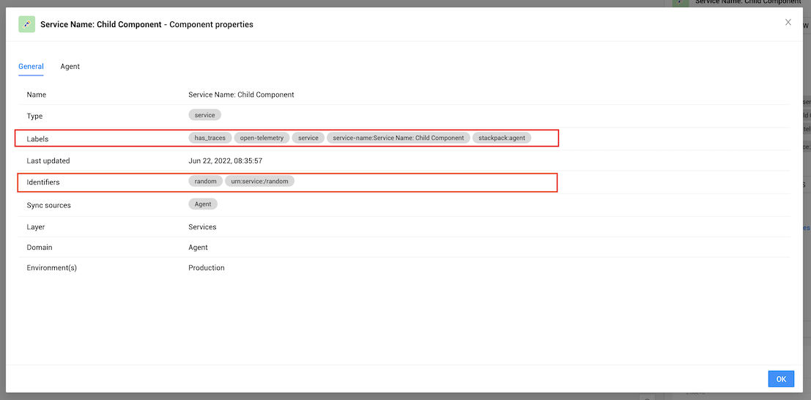

And on the right side, we included the list of health checks and telemetry also running on the child.

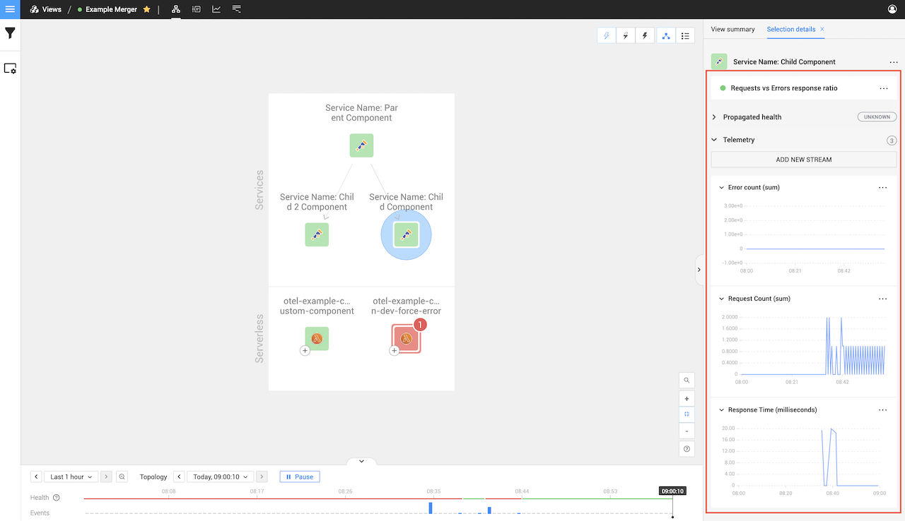

Now when we look at the component that we want to merge with, you will notice the `labels` and `identifiers` contain none of the same ones we looked at when viewing the child component.

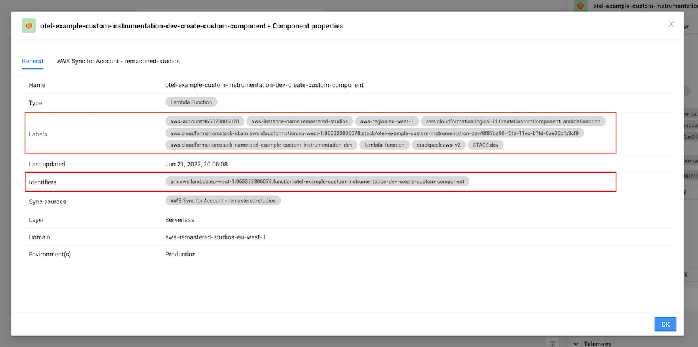

This is the same for the health checks and telemetry on the right side.

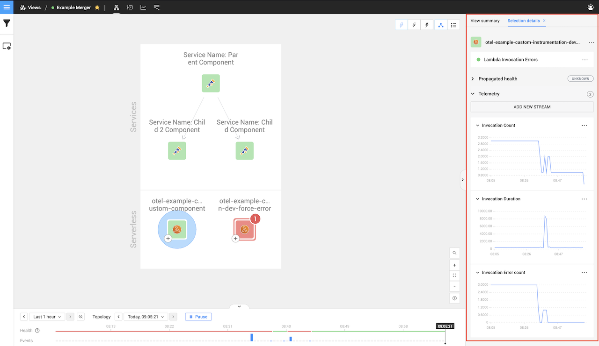

Now let's see the result after merging our child component with the pre-existing StackState component.

Let's look at the `identifiers` and `labels` again. As you can see in the image below the
`identifiers` stayed the same but the `labels` merged, This StackState merged component now contain the values from both.

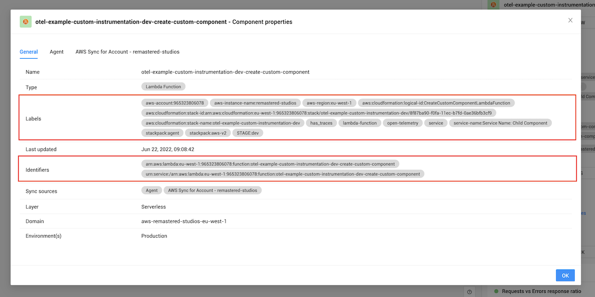

The same can be seen in the health checks and telemetry. You will notice that the health checks and telemetry streams are from both components.

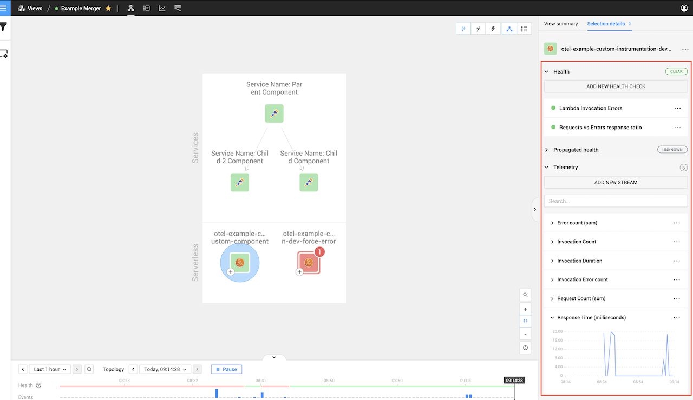

## Component identifier

If two components in StackState have the same `identifier`, StackState will merge those two components.

For example, if you select a component and click on the `SHOW ALL PROPERTIES` button on the right panel

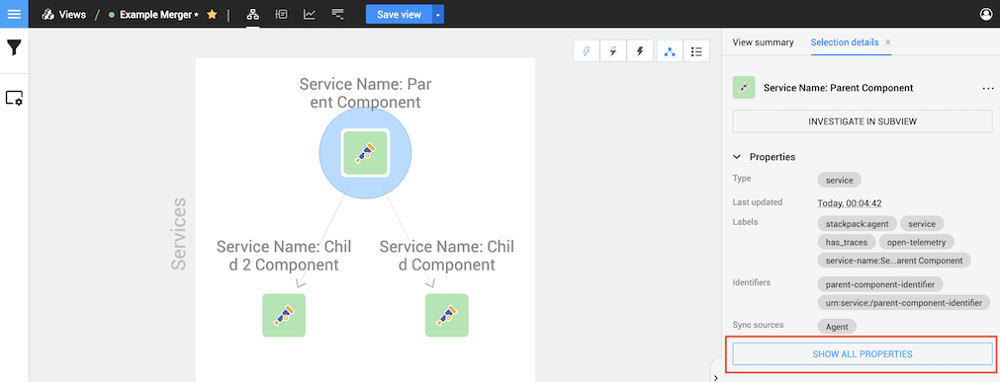

It will open a dialog; within this dialog, you can see the identifiers. If you reuse any of these within your span, it will merge with that component, We will have a few visual examples further down in the documentation.

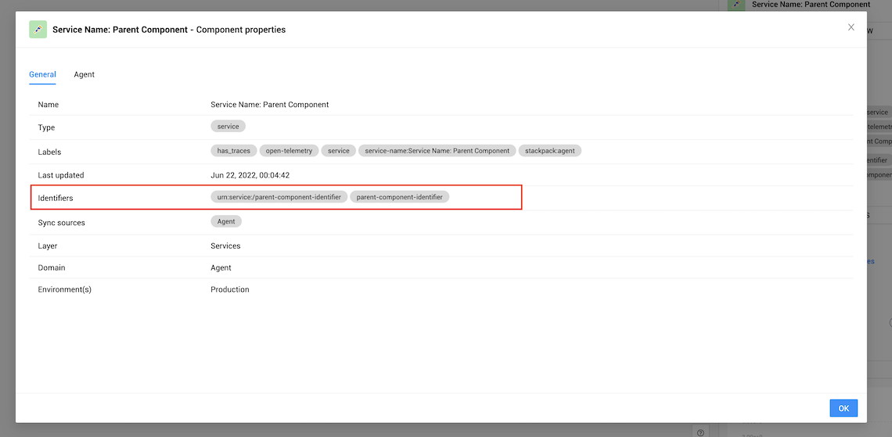


## Example: Merging a component

Let's take the following example; we have three components that we create, all having the previous one as their parent span.

```text
Service Name: Parent Component
|
---> Service Name: Child Component
     |
     ---> Service Name: Child 2 Component
```

That will create the following components with relations.


Now let's add a few pre-existing Lambda functions into the picture. We are focusing on the healthy Lambda function in the bottom right corner.

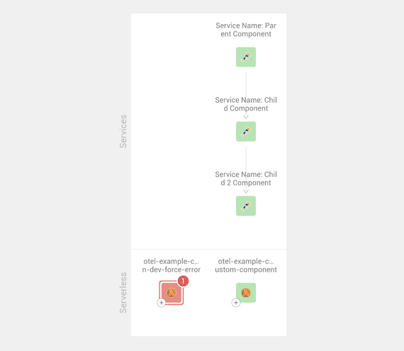

If we click on that Lambda function, we will be able to see what the identifier is by using
the same `service identifier` `arn:aws:lambda:eu-west-1:965323806078:function:otel-example-custom-instrumentation-dev-create-custom-component` in our second component it will merge with that pre-existing component.

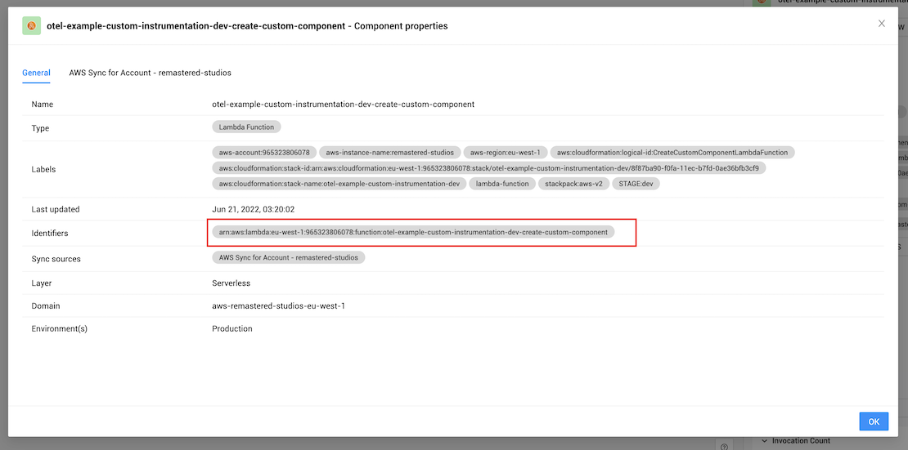

That will result in the following happening. As you can see, the component we merged now has new relations, and those relations
are the same ones our component had as the merged component inherited the same relations

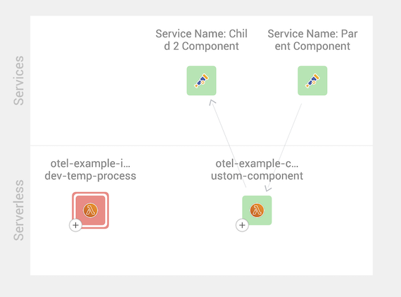
