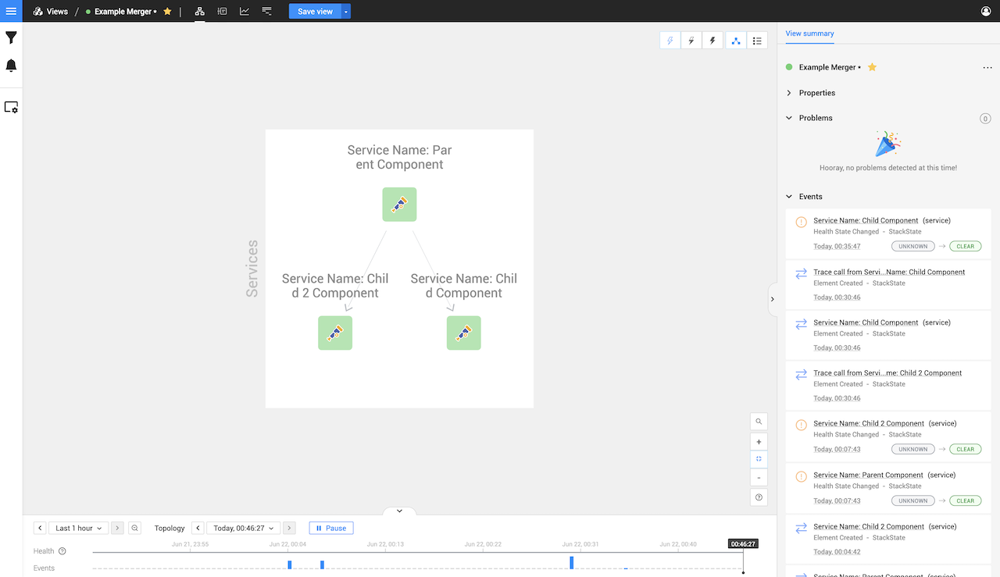

# Spans Relations

Component and Span relations shows the relationship between pre-existing components, for example, the image below shows an example of a relation running from a parent to a child component, that child also then has another component as another child:

```text
Service Name: Parent Component
|
---> Service Name: Child Component
     |
     ---> Service Name: Child 2 Component
```

An example of the above displayed in StackState will show up as follows:


These relations are based on the parent and child structure. A relationship is drawn from a parent component 
to a child component. 

This means that `Service Name: Child Component` has the parent id set as `Service Name: Parent Component`
and `Service Name: Child 2 Component` has the parent id set as `Service Name: Child Component`

## Health State Flow

Important to also remember that the health state only propagates up, so that means if we have the following

```text
Service Name: Parent Component
|
---> Service Name: Child Component [400 Status]
     |
     ---> Service Name: Child 2 Component
```

Then that will only result in the following components showing a propagated critical state.

```text
Service Name: Parent Component [Propagated 400 Status]
|
---> Service Name: Child Component [400 Status]
     |
     ---> Service Name: Child 2 Component
```

A visual example of this will be as follows:


So remember to create your parent and children spans in the correct order as it may affect the flow of the health state.

## Relations when merging

Relations are retained when merging components; this allows you to create a parent component, create a child component for this parent
and then merge that child component with an existing component. This will then create a relationship between the pre-existing component
and parent components. For example, here we have the three components as described above:


If we then merge our middle component `Service Name: Child Component` with the existing healthy Lambda component `otel-example-custom-instrumentation-dev-create-custom-component` in the bottom right corner.
You will then notice that the middle component disappeared as it merged with the Lambda component, and now the Lambda has relations with the first and third components as it
inherited the same relation mappings.


## Multiple children

It is also good to know that a single parent can have multiple children. This allows you to build a tree with branches of relations, for example

```text
Service Name: Parent Component
|
---> Service Name: Child Component
|
---> Service Name: Child 2 Component
```




