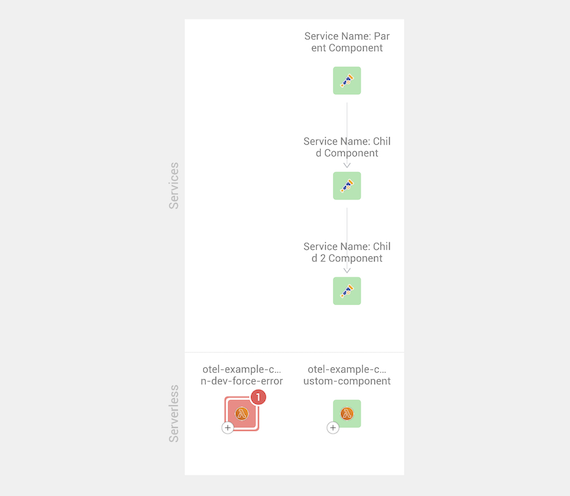
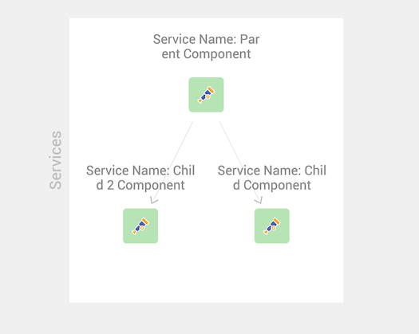

# Relations between components

## Overview

Component and span relations show the relationship between components in StackState. For example, the image below shows a relation running from a parent to a child component, that child also then has another component as a child component:

```text
Service Name: Parent Component
|
---> Service Name: Child Component
     |
     ---> Service Name: Child 2 Component
```

An example of the above displayed in StackState will show up as follows:


These relations are based on the parent and child structure. A relationship is drawn from a parent component to a child component. 

This means that:
* `Service Name: Child Component` has the parent ID set as `Service Name: Parent Component`
* `Service Name: Child 2 Component` has the parent ID set as `Service Name: Child Component`

## Health state propagation

In StackState, the health state of a component will propagate upwards through the dependency tree. This means that in the following situation:

```text
Service Name: Parent Component
|
---> Service Name: Child Component [400 Status]
     |
     ---> Service Name: Child 2 Component
```

The following components will have a propagated CRITICAL state:

```text
Service Name: Parent Component [Propagated 400 Status]
|
---> Service Name: Child Component [400 Status]
     |
     ---> Service Name: Child 2 Component
```

A visual example of this in the StackState UI will be as follows:


So remember to create your parent and children spans in the correct order as it may affect the propagation of health state.

➡️ [Learn more about health state propagation](/use/concepts/health-state.md#element-propagated-health-state)

## Relations when merging

Relations are retained when merging components; this allows you to create a parent component, create a child component for this parent
and then merge that child component with an existing component. This will then create a relationship between the pre-existing component that the child component merged with and the parent component. For example, here we have the three components as described above:



If we then merge our middle component `Service Name: Child Component` with the existing healthy Lambda component `otel-example-custom-instrumentation-dev-create-custom-component` in the bottom right corner:

* The middle component will disappear (merged with the Lambda component)
* The Lambda component will have relations to the first and third components (inherited relation mappings from the middle component).


## Multiple children

It's also good to know that a single parent can have multiple children. This allows you to build a tree with branches of relations, for example:

```text
Service Name: Parent Component
|
---> Service Name: Child Component
|
---> Service Name: Child 2 Component
```




