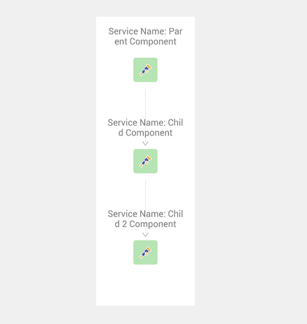
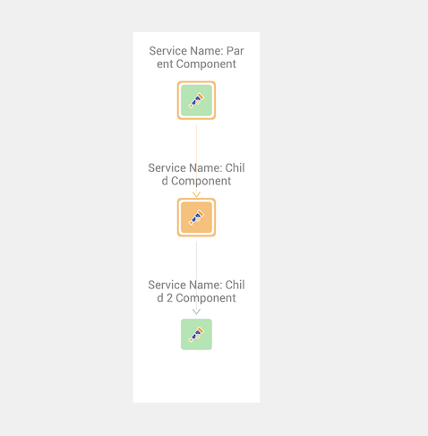
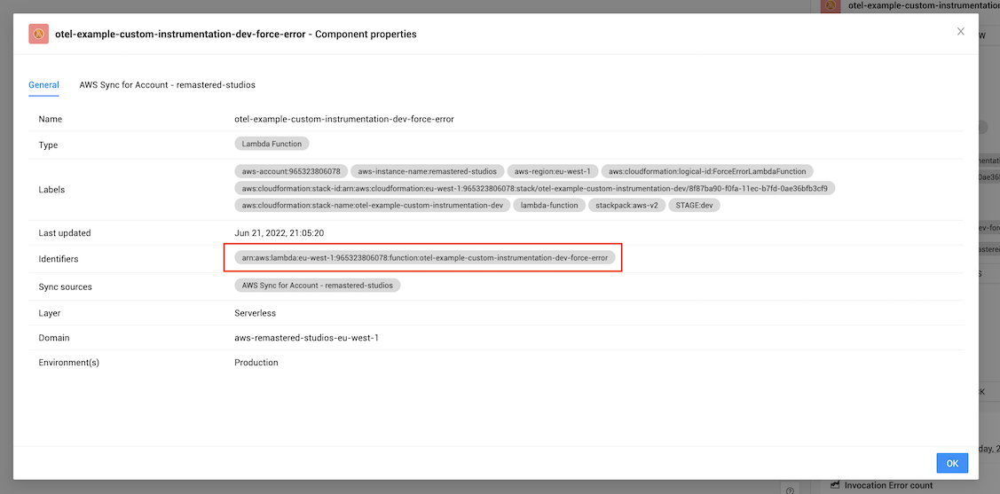
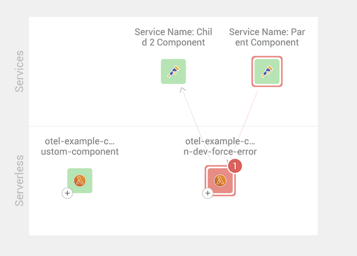

# Overview

The page explains how health state in StackState works with custom instrumentations in specific scenarios. Before reading further:

* If you haven't already read about the health state span mapping `http.status_code`, head over to the page [tracer and span mappings](/stackpacks/integrations/opentelemetry/manual-instrumentation/tracer-and-span-mappings.md) to understand how the health state is mapped to a span. 
* If you aren't familiar with how health state works in StackState, see the page [about health state](/use/concepts/health-state.md) to learn about the types of element health state available, what propagated health state is and how it works.
* To understand how StackState merges custom instrumentations with existing components, see the page [Merging components](merging.md).

# Health state without merging

In the following scenario, three components were created with the manual instrumentation:

1. **Parent Component** - the root span.
   - Added `http.status_code` of `200`
2. **Child Component** - the second span. Has the parent span ID of the first (root) span.
   - Added `http.status_code` of `200`
3. **Child 2 Component** - the third span. Has the parent span ID of the second span
   - Added `http.status_code` of `200`

As seen below, it works as expected and all three components are healthy - they have a CLEAR state.

Now, let's change the `http.status_code` of the second span to `400`

As you can see below, the **Child Component** turned into a DEVIATING and then a CRITICAL state and this unhealthy health state propagates upwards to the **Parent Component**.










# Health state with merging

## Scenario with pre-existing components

To test how health state works when merging with a pre-existing component, we can use the following scenario with a total of five components:

* Three components were created with the manual instrumentation:

  1. **Parent Component** - the root span.
     - Added `http.status_code` of `200`
  2. **Child Component** - the second span. Has the parent span ID of the first (root) span.
     - Added `http.status_code` of `200`
  3. **Child 2 Component** - the third span. Has the parent span ID of the second span.
     - Added `http.status_code` of `200`

* Two pre-existing AWS components are also visible:
  * One pre-existing component is in a CRITICAL state .
  * One pre-existing component is in a CLEAR (healthy) state. 

All five components can be seen in the screenshot below - no components have been merged here.

## Merge with a healthy component

Starting from the [scenario with pre-existing components](#scenario-with-pre-existing-components) described above, we can merge with a healthy component to see what happens with the health state and propagated health state. 

Let's get a `service.identifier` from the bottom right CLEAR (green) component called `otel-example-custom-instrumentation-dev-create-custom-component`.

As you can see in the image below, this component has an identifier of `arn:aws:lambda:eu-west-1:965323806078:function:otel-example-custom-instrumentation-dev-create-custom-component`

We can merge the **Child Component** with this healthy AWS Lambda component. To do this, we need to add the identifier for the AWS component into the manual instrumentation for the **Child Component**.

This produces the following result - all of the properties, health, and relations of the **Child Component** are inherited by the component named `otel-example-custom-instrumentation-dev-create-custom-component`:

As you can see, the relations have now successfully been drawn between the components and the merged one. The health state of the resulting component stayed as CLEAR, this is as expected seeing as both components had a `200` state to start with.

## Merge with an unhealthy component

Starting from the [scenario with pre-existing components](#scenario-with-pre-existing-components) described above, we can merge with an unhealthy component to see what happens with the health state and propagated health state. 

Let's get a `service.identifier` from the bottom left CRITICAL (red) component called `otel-example-custom-instrumentation-dev-force-error` and remove the current one that we are using on the right.

As you can see in the image below, this component has an identifier of `arn:aws:lambda:eu-west-1:965323806078:function:otel-example-custom-instrumentation-dev-force-error`

We can merge the **Child Component** with the unhealthy AWS Lambda component by adding the identifier into the manual instrumentation for the **Child Component**.

This produces the following result - all of the properties, health, and relations of the **Child Component** are inherited by the component named `otel-example-custom-instrumentation-dev-force-error`:

The original component has a `200` (CLEAR) status and the component that it merged with has a `400` status. As you can see, the DEVIATING or CRITICAL state will always take precedence. If one of the components that has been merged changes to have a CRITICAL or DEVIATING state, it will be indicated as shown above.

The unhealthy state will then propagate upwards to the parent relations.

➡️ [Learn more about health state propagation](/use/concepts/health-state.md#element-propagated-health-state)