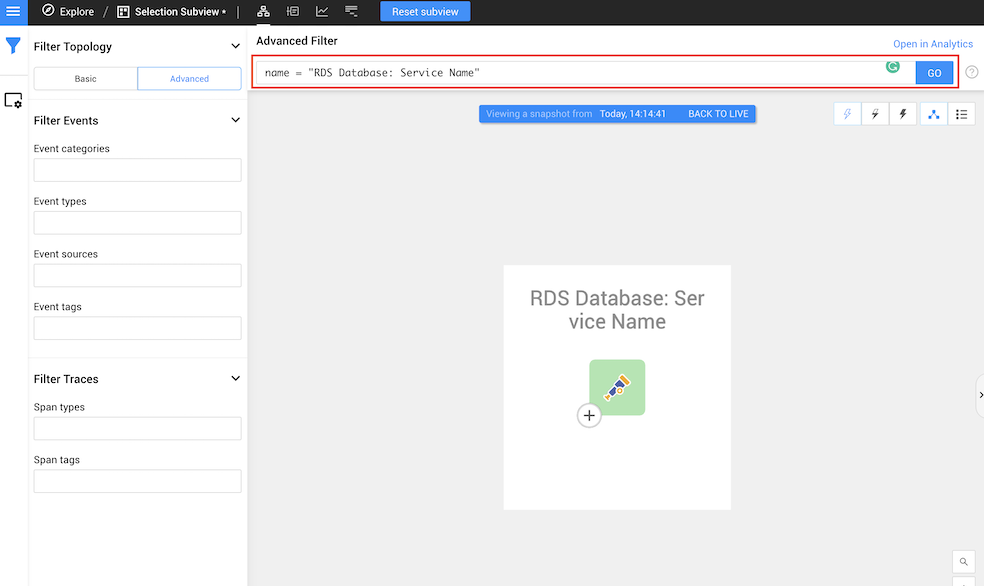
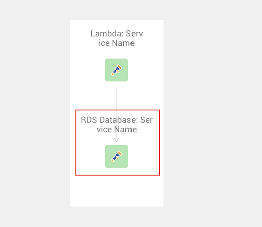
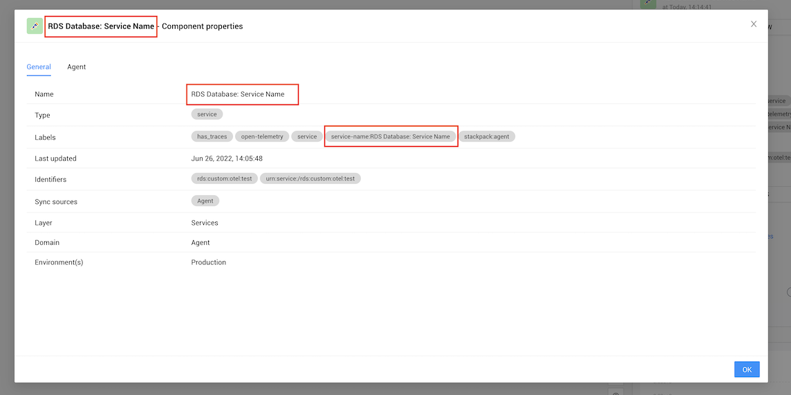
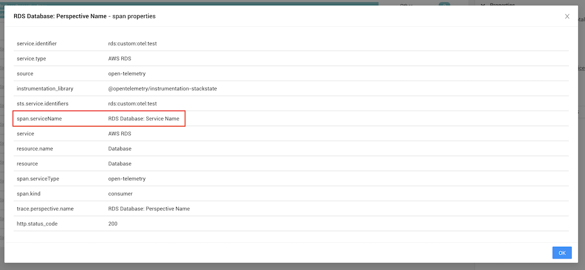
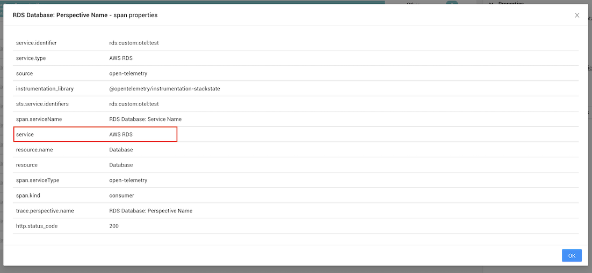
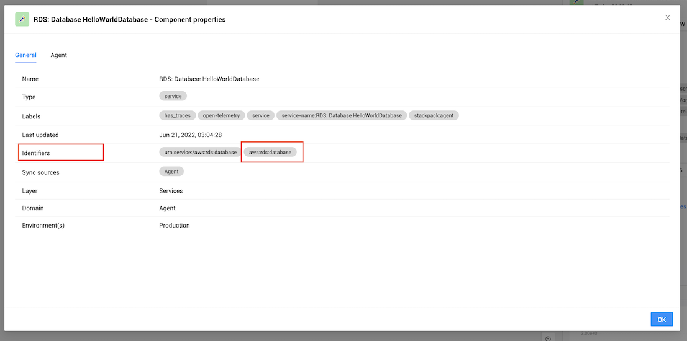
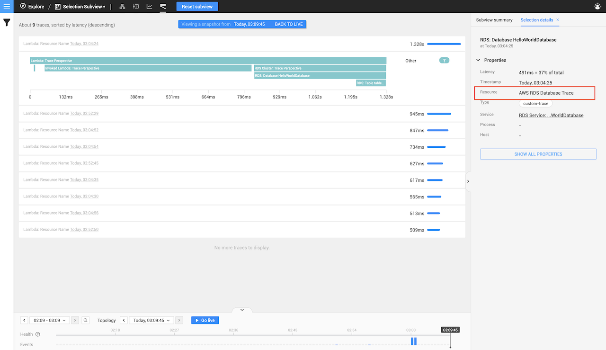
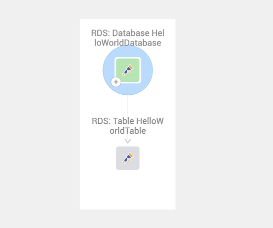
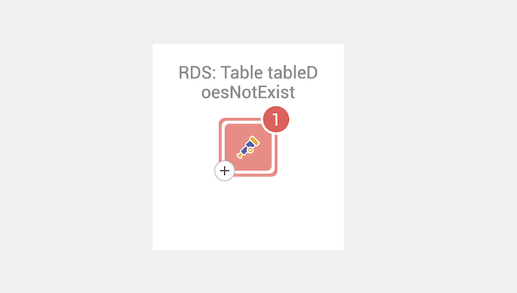
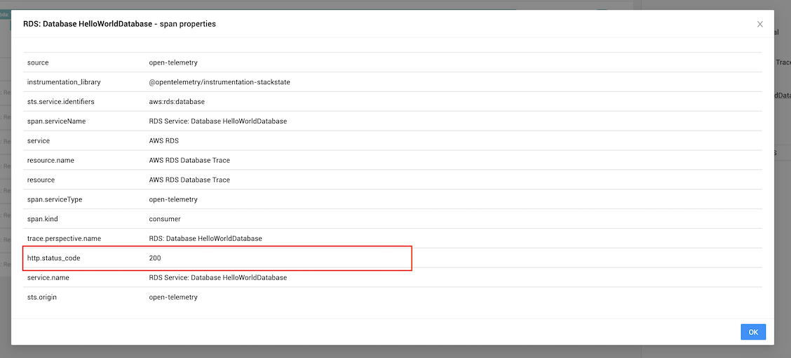

# Tracer and span mappings

## Overview

Before we jump into the nitty-gritty of the actual code we can write for a OpenTelemetry instrumentation, let's first look at the key-value pairs that are in spans and where this can be found in the StackState UI.

The span key values should be included when you create spans inside the manual OpenTelemetry instrumentation.

We will get to a few code examples later on in the documentation.

## Tracer name and version

For StackState to understand your data, a tracer **name** and **version** needs to be passed with your instrumentation.

StackState requires the following name and version to be set:

- **Tracer name:** `@opentelemetry/instrumentation-stackstate`
- **Version:** `1.0.0`


If the tracer name passed to StackState Agent doesn't exactly match the value specified above, received data won't be displayed in StackState.


➡️ [See how this is implemented in code examples](code-examples.md#2-core-definitions)

When the [log level in StackState Agent](/setup/agent/about-stackstate-agent.md#troubleshooting) is to `DEBUG`, a message will be returned if a wrong tracer name has been used. The message will warn about an unknown instrumentation and state the tracer name that was passed to it.

## Span mapping requirements 

### Summary

The table below provides a summary of all the span keys that can be provided and are required. Further details of each key can be found in the sections below.


Note that ALL the keys listed as required must be provided when creating a span. If any required keys are missing, the component won't appear in StackState.


| **Key**                                              |  **Type**  | **Required**  | **Allowed Value** | **Example**                         |
|:-----------------------------------------------------|:----------:|:-------------:|:-----------------:|:------------------------------------|
| [trace.perspective.name](#trace-perspective-name)    |  `string`  |    **yes**    |    Any string     | RDS Database: Perspective Name      |
| [service.name](tracer-and-span-mappings.md#service-name)             |  `string`  |    **yes**    |    Any string     | RDS Database: Service Name          |
| [service.type](tracer-and-span-mappings.md#service-type)             |  `string`  |    **yes**    |    Any string     | AWS RDS                             |
| [service.identifier](tracer-and-span-mappings.md#service-identifier) |  `string`  |    **yes**    |    Any string     | aws:rds:database:hello-world        |
| [resource.name](tracer-and-span-mappings.md#resource-name)           |  `string`  |    **yes**    |    Any string     | Database                            |
| [http.status_code](tracer-and-span-mappings.md#http-status-code)     |  `number`  |    **no**     |    HTTP status    | 200                                 |

### Traces Perspective name

The `trace.perspective.name` is used to find your span within a trace in the StackState UI [Traces Perspective](/use/stackstate-ui/perspectives/traces-perspective.md). The horizontal bar within a Trace will have a floating text value containing the specified `trace.perspective.name` key.

| |                          |
|:---|:-------------------------|
| **Key** | `trace.perspective.name` |
| **Type** | `string`                 |
| **Example** | `RDS Database: Perspective Name`  |

#### Examples




**Example of where the trace.perspective.name is displayed within the Traces Perspective**

1) In the navigation bar, click **Traces Perspective**
2) Find the trace in the list of traces and click on it to expand the trace (There might be multiple traces, make sure you select one that contains your span).
3) You will notice that a horizontal graph line will contain the name of your component as seen below.




### Service name

The value from `service.name` is used as a primary means to identify a component in the StackState Topology Perspective. A `spans.serviceName` key is also created in the Traces Perspective to identify if the trace in the Traces Perspective matches the component in the Topology Perspective.

| |                |
|:---|:---------------|
| **Key** | `service.name` |
| **Type** | `string`        |
| **Example** | `RDS Database: Service Name` |

#### Examples




**Example of how you can search for your `service.name` within the `Advanced Filter` section in the Topology view**

1) When on the Topology Perspective page click on the second icon on your left navigation bar called `View Filters`
2) This will bring up the `Filter Topology` view, Click on the second button called `Advanced`
3) In the top input field you can fill in the following
   1) `name = "<YOUR service.name VALUE>"`
   2) For example `name = "RDS Database: Service Name"`.
4) You will then see the component that was created with the trace.




**Example of where the service.name is displayed within the Topology Perspective**

1) When you view the Topology Perspective page your component should be visible with this as the primary identifier,
   as seen within the picture below.




**Example of where the service.name is displayed within the Topology Perspective within your component properties**

1) Click on your component in the StackState Topology Perspective
2) Click on the `SHOW ALL PROPERTIES` button on the right side, a popup will appear.
3) A row with the key `name` will contain the value you defined, as seen below in the image.
4) Your component will also contain a new label called service-name, this will also represent your component name.




**Example of where the service.name is displayed within the Traces Perspective**

1) In your top navigation bar click on the `trace perspective` menu item.
2) Find the trace in the list of traces and click on it to expand the trace (There might be multiple traces, make sure you select one that contains your trace).
3) Click on the `SHOW ALL PROPERTIES` button on the right side, a popup will appear.
4) A row with the key `span.serviceName` will contain the value you defined, as seen below in the image.




### Service type

The `service.type` is used to identify the type of service in the span in the StackState UI [Traces Perspective](/use/stackstate-ui/perspectives/traces-perspective.md).

| |                |
|:---|:---------------|
| **Key** | `service.type` |
| **Type** | `string`        |
| **Example** | `AWS RDS` |

#### Examples




**Example of where the `service.type` is displayed within the Traces Perspective Span properties view**

1) In the navigation bar, click **Traces Perspective**
2) Find the trace in the list of traces and click on it to expand the trace (There might be multiple traces, make sure you select one that contains your trace).
3) Click on the `SHOW ALL PROPERTIES` button on the right side, a popup will appear.
4) A row with the key `service` will contain the value you defined, as seen below in the image.




### Service identifier 

The service identifier is used for merging components. The provided value will be added to the identifier list on the component in StackState. 

Components with the same service identifiers will merge into one component. This allows multiple components to merge and create relations. Components can also bo merged with existing StackState components.

➡️ [Learn more about merging components](/stackpacks/integrations/opentelemetry/manual-instrumentation/merging.md)

| |                |
|:---|:---------------|
| **Key** | `service.identifier` |
| **Type** | `string`        |
| **Example** | `aws:rds:database:hello-world` |

#### Examples




**Example of where the `service.identifier` is displayed within the Topology Perspective Component properties view**

1) Click on your component in the StackState Topology Perspective
2) Click on the `SHOW ALL PROPERTIES` button on the right side, a popup will appear.
3) The row with the key `identifiers` will contain the value you defined, as seen below in the image.
4) ***NB. It's recommended to go and read the [merging with pre-existing components](/stackpacks/integrations/opentelemetry/manual-instrumentation/merging.md) page to know how this value can be leverage to create relations***




### Resource name

The resource name is displayed in the Traces Perspective for a specific trace, allowing you to quickly identify what resource each trace is a part of. Best practise would be to use this value to group similar resources, thus allowing you to easily identify a span.

| |                |
|:---|:---------------|
| **Key** | `resource.name` |
| **Type** | `string`        |
| **Example** | `Database` |

#### Examples




**Example of where the resource.name is displayed within the Traces Perspective**

1) In your top navigation bar click on the `trace perspective` menu item.
2) Find the trace in the list of traces and click on it to expand the trace (There might be multiple traces, make sure you select one that contains your trace).
3) The section on your right side will contain a row with the key `Resource`, the value displayed next to the key will be the one you defined.




### HTTP status code 

The HTTP status code controls the health state for the component in StackState. A `400` or higher will put the component into a CRITICAL state, while a `200` will result in a healthy component. This allows you to control the health state of the component in StackState.

➡️ [Learn how the span health state works](/stackpacks/integrations/opentelemetry/manual-instrumentation/span-health.md)

| |                    |
|:---|:-------------------|
| **Key** | `http.status_code` |
| **Type** | `number`           |
| **Example** | `200`              |

#### Examples



**You will see the following color on your component if you post a `http.status_code` of `200`**

This means that your component is in a CLEAR (healthy) state.




**You will see the following color on your component if you post a `http.status_code` of `400` or higher**

This means that your component is in a CRITICAL state.





**The HTTP status can be found in the following location regardless of what the HTTP status actually is**

1) In your top navigation bar click on the `trace perspective` menu item.
2) Find the trace in the list of traces and click on it to expand the trace (There might be multiple traces, make sure you select one that contains your trace).
3) Click on the `SHOW ALL PROPERTIES` button on the right side, a popup will appear.
4) The row with the value `http.status_code` will contain the value you defined, as seen below in the image.



