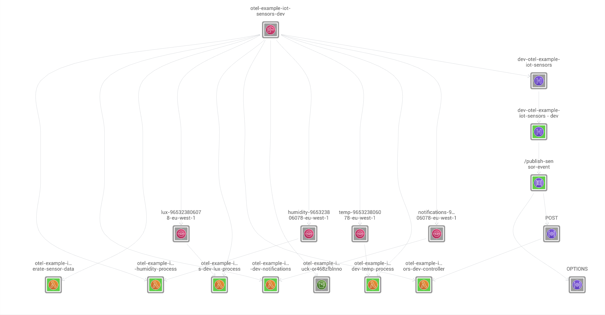
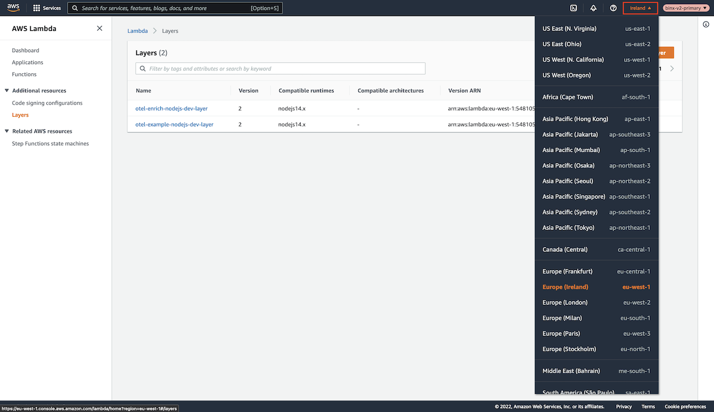
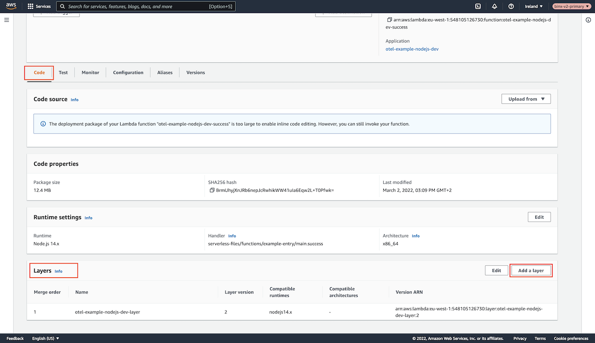
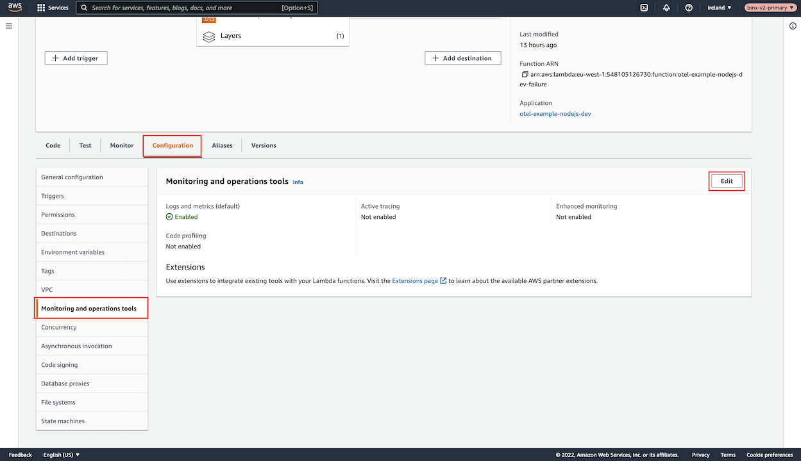
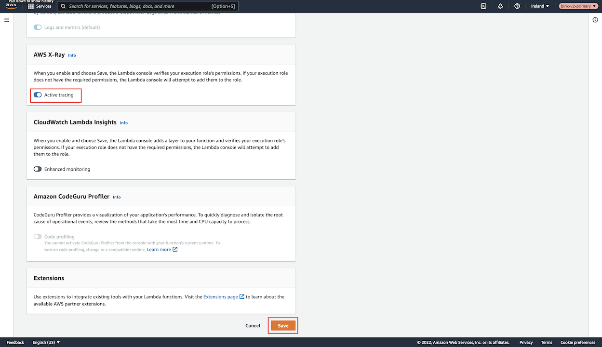
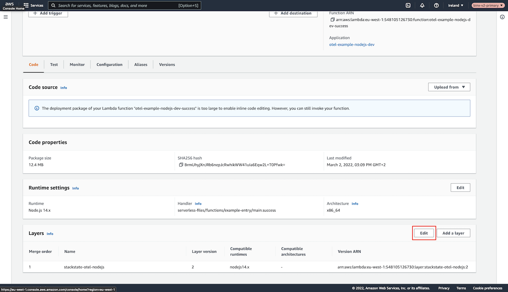

# OpenTelemetry - NodeJS

## Overview

StackState provides an out-of-the-box OpenTelemetry solution for serverless AWS Lambda applications built with NodeJS. A modified OpenTelemetry Lambda Layer, based on the officially released [AWS Distro for OpenTelemetry Lambda \(aws-otel.github.io\)](https://aws-otel.github.io/docs/getting-started/lambda), gives a plug-and-play user experience.

OpenTelemetry has the following benefits:

- Lambda functions can include the OpenTelemetry Lambda Layer solution to collect trace data without the need to change any code.
- The specific AWS Service that a Lambda communicates with is shown in StackState. 

The StackState OpenTelemetry Lambda Layer can be used with AWS Lambda scripts running NodeJS 14.x (or later) and will transform the Topology in StackState as follows: 











## Setup

### Prerequisites

To set up OpenTelemetry traces, you need to have:
* [StackState Agent](/setup/agent/about-stackstate-agent.md) v2.16 (or later)
* StackState Agent should have [traces enabled](/setup/agent/advanced-agent-configuration.md#enable-traces). If traces aren't enabled on the Agent, OpenTelemetry won't generate any data.
* AWS Lambda scripts running `NodeJS 14.x` (or later)
  * These will be the Lambda functions you wish to add OpenTelemetry support to.
  * They should be able to communicate with the StackState Agent.
* The [AWS StackPack](/stackpacks/integrations/aws/aws.md) should be installed and configured in StackState. The AWS StackPack CloudFormation template will deploy the latest supported OpenTelemetry Lambda Layer (required for AWS OpenTelemetry functionality).

### Supported Services


Communication from **AWS Lambda** to:
- AWS Lambda
- AWS SQS
- AWS SNS
- AWS S3
- AWS StepFunction
- HTTP Endpoints

### Installation

Follow the steps below to set up OpenTelemetry tracing for a NodeJS AWS Lambda script.


Note that the installation steps should be completed for every Lambda function that you wish to add OpenTelemetry tracing to.


1. [Verify that the Lambda Layer exists](#verify-that-the-lambda-layer-exists)
2. [Set up tracing](#set-up-tracing)
3. [Add the required environment variables](#add-environment-variables)

After these steps have been completed, you should be ready to send traces to your StackState Agent.

To test the configuration, execute the associated Lambda function. New Topology relations should be created and visible in the StackState UI within a minute or so. Relations will be created wherever your Lambda is communicating with any of the [supported services](#supported-services).

#### Verify that the Lambda Layer exists

Go to the [AWS Lambda Layers \(console.aws.amazon.com\)](https://console.aws.amazon.com/lambda/home#/layers) page listing all available **Lambda Layer** functions.


Change the region in the top-right corner to the region where the [AWS StackPack](/stackpacks/integrations/aws/aws.md) cloudformation template was deployed.



Verify that there is a Lambda Layer called `stackstate-otel-nodejs`.


**If the Lambda Layer isn't present:**

  - The AWS StackPack CloudFormation Template installed may not be the latest one containing the Lambda Layer. Follow the [AWS StackPack](/stackpacks/integrations/aws/aws.md) documentation to verify the installation of this StackPack.
  - Lambda Layers are **AWS REGION** based. This means that the AWS StackPack CloudFormation template should also be deployed inside the same region as the targeted Lambda. If the CloudFormation template is currently deployed in another region other than where the targeted Lambda lives.

  
Go to the [Lambda functions \(console.aws.amazon.com\)](https://console.aws.amazon.com/lambda/home#/functions) page and navigate to the Lambda that you wish to add OpenTelemetry support to.

Underneath the **Code** tab, scroll down to the **Layers** section and click **Add a layer** on the right.



Select the **Custom Layer** radio box under **Choose a layer**. This will show two dropdowns at the very bottom of the page.

* In the first dropdown, select the Lambda Layer `stackstate-otel-nodejs`
* In the second dropdown, select the latest version number

Click **Add** to create the custom layer.


#### Set up tracing

A requirement to allow tracing to work is something called X-Ray headers. To set this up, follow **ONE** of the steps below:

* [Enable Active Pass-through](#enable-active-pass-through) on your Lambda Function. 
  - X-Ray headers will be available, but X-Ray is still disabled; thus, no extra costs will be accumulated by using Pass-Through X-Ray.
  - Can only be set up using a CLI command.

**OR**

* [Enable X-Ray Active Tracing](#enable-x-ray-active-tracing) on the Lambda function. 
  - The more expensive option, as X-Ray will charge per Lambda execution.

##### Enable Active Pass-through

To enable Active Pass-through you need the AWS CLI installed. Follow the steps to [set up AWS CLI on your machine \(docs.aws.amazon.com\)](https://docs.aws.amazon.com/cli/latest/userguide/getting-started-install.html).

When the AWS CLI has been installed, run the following command in your terminal to set up your AWS Credentials:

```
aws configure
```

To verify if your Lambda function is running in Active Pass-Through, run the following AWS CLI commands. Unfortunately there is no way to verify this on the Console only through a CLI command:

```shell
aws lambda get-function-configuration \
--region <CHANGE TO THE REGION OF YOUR LAMBDA FUNCTION> \
--function-name <CHANGE TO THE NAME OF YOUR LAMBDA FUNCTION> \
--query 'TracingConfig.Mode'
```

You should be greeted with one of the following messages:
- `Active` - the Lambda function is running in Active Pass-Through.
- `PassThrough` - the Lambda function is running in Active Pass-Through.
- `Disabled` or `None` - the function configuration needs to be updated. Run the command below to change the Lambda to Pass-Through and then verify the updated configuration by running the `get-function-configuration` command again:

  ```shell
  aws lambda update-function-configuration \
  --region <CHANGE TO THE REGION OF YOUR LAMBDA FUNCTION> \
  --function-name <CHANGE TO THE NAME OF YOUR LAMBDA FUNCTION> \
  --tracing-config "Mode=PassThrough"
  ```

##### Enable X-Ray Active Tracing

To enable Active X-Ray Tracing, go to the **Configuration** tab inside the Lambda and click **Edit** under **Monitoring and operations tools**.



Set the radio box **Active tracing** to `true` and click **Save** in the bottom right corner.



You can verify if Tracing is enabled by looking at the **Active tracing** block.


#### Add environment variables

For OpenTelemetry to start capturing traces, certain environment variables are required.

Create all of the following environment variables in the **Configuration** tab under **Environment variables**. Click the **Edit** button to add more.


- StackState Agent OpenTelemetry Information
  - Trace Agent Port: `8126`
  - OpenTelemetry StackState Agent Path: `/open-telemetry`

#### Required Environment variables

| Key | Description | Value |
|:---|:---|:---|
| `AWS_LAMBDA_EXEC_WRAPPER` | Allows the Lambda to root execution through OpenTelemetry. This allows OpenTelemetry to set up everything required to capture traces when the Lambda function executes. | `/opt/otel-handler` |
| `OTEL_LOG_LEVEL` | The amount of logging showed in the Lambda post-execution window. | `info` |
| `OTEL_PROPAGATORS` | The OpenTelemetry propagator context. | `tracecontext` |
| `OTEL_TRACES_EXPORTER` | The type of export used with OpenTelemetry. | `otlp` |
| `OTEL_TRACES_SAMPLER` | When execution data should be sampled. | `always_on` |
| `OTEL_EXPORTER_OTLP_TRACES_ENDPOINT` | Routing information from the Lambda to the StackState Agent. This needs to point to the open telemetry endpoint of your StackState Agent. | `http://stackstate-agent-ip:8126/open-telemetry` |

#### Optional Environment variables

| Key | Description | Default |
|:---|:---|:---|
| `HTTP_MASK_SENSITIVE_INFORMATION` | If the HTTP URL traces path contains sensitive information, it can be masked by setting this environment variable to true. For example `http://www.url.com/user/USERID/edit#test?query=123` will be captured as `http://www.url.com` effectively removing everything except the hostname | `false` |
| `HTTP_REMOVE_HASH_DATA` | Remove hash information from the captured HTTP URL traces. For example `http://www.url.com#test?query=123` will be captured as `http://www.url.com?query=123` | `false` |
| `HTTP_REMOVE_QUERY_DATA` | Remove query information from the captured HTTP URL traces. For example `http://www.url.com#test?query=123` will be captured as `http://www.url.com#test` | `false` |

## Upgrade

To upgrade the OpenTelemetry Lambda Layer to the latest version, including the Lambda function using the Lambda Layer, follow the steps described below.

Make sure the latest [AWS StackPack](/stackpacks/integrations/aws/aws.md) is installed. The StackPack documentation contains the link to the latest OpenTelemetry Lambda Layer in the CloudFormation template.

After the latest StackPack CloudFormation template has been deployed, there should be a new version for the `stackstate-otel-nodejs` Lambda Layer. This can be confirmed on the page [AWS Lambda Layers \(console.aws.amazon.com\)](https://console.aws.amazon.com/lambda/home#/layers). 


Click on the layer `stackstate-otel-nodejs` to enter and view the details of the layer.

The **Created** box on the right should have a relative new time showing when it was created. Alternatively, go to any Lambda Function that's currently using the `stackstate-otel-nodejs` layer and compare the version it's using to the version displayed under the **Version** block for the layer.


Go to a Lambda function using the OpenTelemetry `stackstate-otel-nodejs` Lambda layer. Scroll down to the **Layers** section, and click the **Edit** button on the right.



Change the version for the `stackstate-otel-nodejs` layer to the latest version.


The Lambda will now use the latest OpenTelemetry Layer

## Disable OpenTelemetry Traces

To disable OpenTelemetry tracing, go to the Lambda's **configuration** tab. Under the **Environment variables** section, remove the environment variable `AWS_LAMBDA_EXEC_WRAPPER`. This will disable the code routing through the OpenTelemetry Lambda Layer and restore your Lambda to the original running state.


