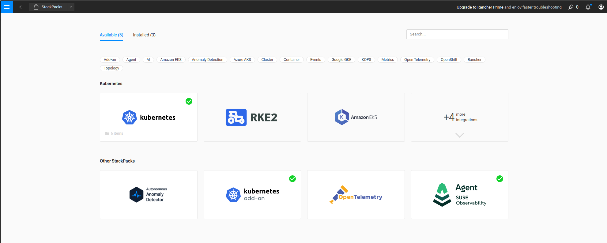
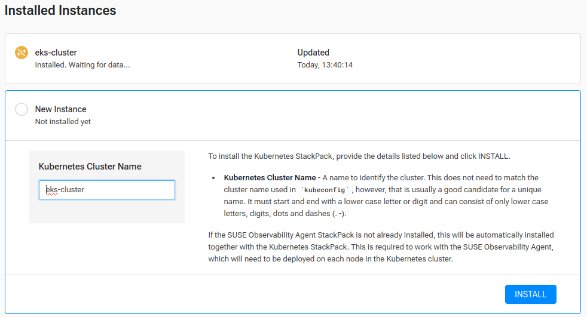
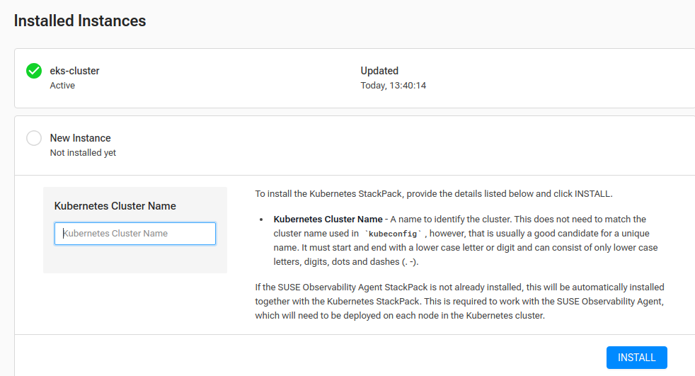
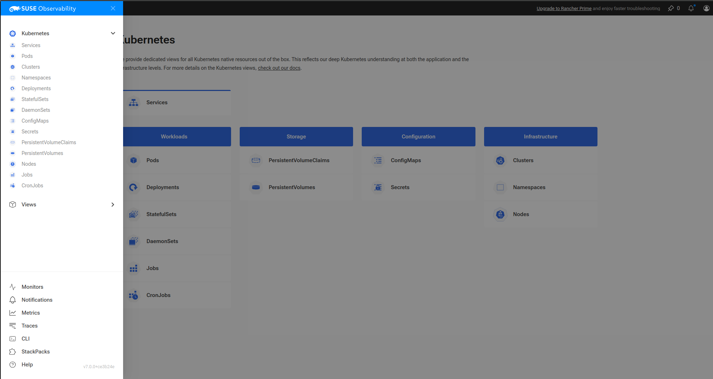
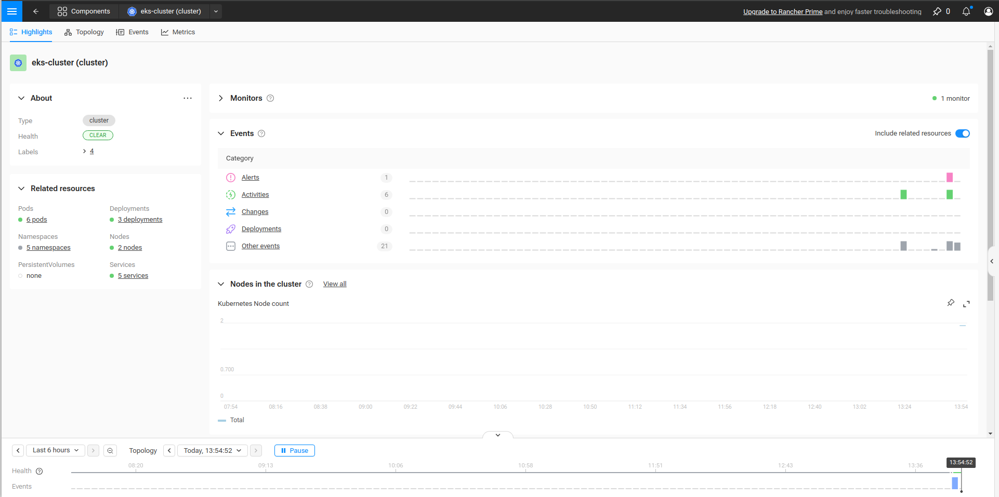

# SUSE Cloud Observability quick start guide

## Overview

After purchasing SUSE Cloud Observability from the Cloud Provider Marketplace, your SUSE Cloud Observability environment is provisioned.

You will receive an email from SUSE Cloud Observability with the required login details and links to your environment. This quick start guide will help you get started and get your own data into your SUSE Cloud Observability deployment.

## Getting Started - First Steps

1. Setup a password
2. Login to your SUSE Cloud Observability Instance
3. Install the SUSE Observability agent to your cluster
4. Change your personal account details

### Setup a password

The email from SUSE Cloud Observability contains a unique link which allows you to set your initial password on the account.  This must be performed before you can login and configure the observability environment.

### Accessing your SUSE Observability Environment

Login in to your SUSE Cloud Observability environment by clicking on the unique link in the email you received from SUSE Cloud Observability.  Entering your password will take you to the configuration screen in order to add clusters.

### Install the SUSE Observability agent to your cluster

SUSE Cloud Observability uses StackPacks in order to make it easier to configure your downstream clusters and get data into the observability environment.

Initially you should be taken to the following screen, to get here, in the SUSE Observability UI, open the main menu by clicking in the top left of the screen and go to `StackPacks` > `Kubernetes`.

Once you are in the Kubernetes StackPack screen, it is very simple to add a cluster to the observability environment.

Enter a name for the cluster you wish to observe, it does not have to match the cluster name used in 'kubeconfig'.

The Kubernetes cluster name must start and end with a lower case letter or digit and can consist of only lower case letters, digits, dots and dashes (. -)

Enter the name and click the `Install` button.  This should take you to the following screen with the cluster flagged as 'Waiting for data'

Click on the cluster name, this will expand this section and reveal a series of information including prerequisits and commands which can be used on your existing clusters to add them to your observability environment.

Review the information and ensure you have the correct permissions to your Kubernetes environment, ensure you are running a supported version of Kubernetes.

These commands are unique to your observability deployment and include the required API Keys and URLs.  Select the appropriate commands for your cluster, there are sections for EKS, RKE, generic Kubnernetes cluster and many more.

These commands will install the SUSE Cloud Obervability agents and connect the cluster to your SUSE Cloud Observability environment.

You can use the commands directly from the UI or you can deploy to your downstream clusters by following the commands provided in the 'Deploy the StackState Agent and Cluster Agent' section in the [quick-start guide](k8s-quick-start-guide.md)

After the the cluster has been connected, there should be a green tick in the SUSE Cloud Observability UI.

At this point you can begin exploring your data.

### Change your personal account details

Step 4 from your email is to update your personal information.  Click the unique link from the email and add your basic personal details as needed.  You can also setup 2FA authentication from this section if required.

### Explore your data

To start exploring your data, open the main menu by clicking in the top left of the screen and go to `Kubernetes` to reveal a list of observable items.

Select 'Clusters' from the infrastructure section which should show a list of monitored clusters, select your cluster to reveal one of the many built in views.

At this point you can start exploring the data for your cluster or add more clusters from which to gather data. 

For further information on how to use SUSE Cloud Observability, including creating custom views please see the standard documentation.

### SUSE Cloud Observability Limitations

Note that SUSE Cloud Observability does not provide out of the box RED signals (Rate, Errors and Duration), only the Rate signal is shown.  This feature is available with SUSE Rancher Prime.
Customers that need these signals to have a complete Observability solution should contact SUSE to discuss SUSE Rancher Prime, alternatively this data can be collected using the OpenTelemetry collectors.

## Additional Information

Below is some further detail around support versions and prerequsites for your observed clusters.

---

# Kubernetes

### Supported versions

| Supported Kubernetes Version |
|------------------------------|
| Kubernetes 1.30              |
| Kubernetes 1.29              |
| Kubernetes 1.28              |
| Kubernetes 1.27              |
| Kubernetes 1.26              |
| Kubernetes 1.25              |
| Kubernetes 1.24              |
| Kubernetes 1.23              |
| Kubernetes 1.22              |
| Kubernetes 1.21              |

### Supported runtime

| Supported runtime   |
|---------------------|
| Docker              |
| ContainerD          |
| CRI-O               |

### Prerequisites for Kubernetes

To set up a SUSE Observability Kubernetes integration you need to have:

* An up-and-running Kubernetes Cluster.
* Helm version 3.13.1 or higher.
* A user with the permission to `create privileged pods`, `ClusterRoles` and `ClusterRoleBindings`:
  * ClusterRole and ClusterRoleBinding are needed to grant SUSE Observability Agents permissions to access the Kubernetes API.
  * SUSE Observability Agents need to run in a privileged pod to be able to gather information on network connections and host information.

--- 

# OpenShift

Set up an OpenShift integration to collect topology, events, logs, change and metrics data from a OpenShift cluster and make this available in SUSE Observability.

### Supported versions
[comment]: <> (https://access.redhat.com/support/policy/updates/openshift)

| OpenShift Version | Supported Kubernetes Version | OpenShift End of Support |
|-------------------|------------------------------|--------------------------|
| OpenShift 4.12    | Kubernetes 1.25              | July 17, 2024            |
| OpenShift 4.11    | Kubernetes 1.24              | February 10, 2024        |
| OpenShift 4.10    | Kubernetes 1.23              | September 10, 2023       |
| OpenShift 4.9     | Kubernetes 1.22              | April 18, 2023           |

### Supported runtime

| Supported runtime   |
|---------------------|
| Docker              |
| ContainerD          |
| CRI-O               |

### Prerequisites for OpenShift

To set up a SUSE Observability OpenShift integration you need to have:

* An up-and-running OpenShift Cluster.
* Helm version 3.13.1 or higher.
* A user with the permission to `create privileged pods`, `ClusterRoles` and `ClusterRoleBindings`:
  * ClusterRole and ClusterRoleBinding are needed to grant SUSE Observability Agents permissions to access the Kubernetes API.
  * SUSE Observability Agents need to run in a privileged pod to be able to gather information on network connections and host information.

---

# Amazon EKS

Set up an Amazon EKS integration to collect topology, events, logs, change and metrics data from an Amazon EKS cluster and make this available in SUSE Observability.

### Supported versions
[comment]: <> (https://endoflife.date/amazon-eks)
[comment]: <> (https://docs.aws.amazon.com/eks/latest/userguide/kubernetes-versions.html#kubernetes-release-calendar)

| Kubernetes version | Amazon EKS release | Amazon EKS End of Support | Amazon EKS End of Extended Support |
|--------------------|--------------------|---------------------------|------------------------------------|
| 1.30               | May 23, 2024       | July 23, 2025             | July 23, 2026                      |
| 1.29               | January 23, 2024   | March 23, 2025            | March 23, 2026                     |
| 1.28               | September 26, 2023 | November 01, 2024         | November 26, 2025                  |
| 1.27               | May 24, 2023       | July 2024                 | July 24, 2025                      |
| 1.26               | April 11, 2023     | June 2024                 | June 11, 2025                      |
| 1.25               | February 21, 2023  | May 2024                  | May 1, 2025                        |
| 1.24               | November 15, 2022  | January 2024              | January 31, 2025                   |
| 1.23               | August 11, 2022    | October 11, 2023          | October 11, 2024                   |
| 1.22               | April 4, 2022      | June 4, 2023              | September 1, 2024                  |
| 1.21               | July 19, 2021      | February 15, 2023         | July 15, 2024                      |
| 1.20               | May 18, 2021       | November 1, 2022          | N/A                                |
| 1.19               | February 16, 2021  | August 1, 2022            | N/A                                |
| 1.18               | October 13, 2020   | August 15, 2022           | N/A                                |

### Supported runtime

| Supported runtime  |
|--------------------|
| Docker             |
| ContainerD         |
| CRI-O              |

### Prerequisites for Amazon EKS

To set up a SUSE Observability Amazon EKS integration you need to have:

* An up-and-running Amazon EKS Cluster.
* Helm version 3.13.1 or higher.
* A user with the permission to `create privileged pods`, `ClusterRoles` and `ClusterRoleBindings`:
    * ClusterRole and ClusterRoleBinding are needed to grant SUSE Observability Agents permissions to access the Kubernetes API.
    * SUSE Observability Agents need to run in a privileged pod to be able to gather information on network connections and host information.

---

# Google GKE

Set up a Google GKE integration to collect topology, events, logs, change and metrics data from an Google GKE cluster and make this available in SUSE Observability.

### Supported versions
[comment]: <> (https://endoflife.date/google-kubernetes-engine)
[comment]: <> (https://cloud.google.com/kubernetes-engine/docs/release-schedule)

| Kubernetes Version | Google GKE release | Google GKE End of Support |
|--------------------|--------------------|---------------------------|
| 1.30               | June, 2024         | August 15, 2025           |
| 1.29               | January 25, 2024   | March 21, 2025            |
| 1.28               | December 4, 2023   | February 4, 2025          |
| 1.27               | June 14, 2023      | August 31, 2024           |
| 1.26               | April 14, 2023     | June 30, 2024             |

### Supported runtime

| Supported runtime  |
|--------------------|
| Docker             |
| ContainerD         |
| CRI-O              |

### Prerequisites for Google GKE

To set up a SUSE Observability Google GKE integration you need to have:

* An up-and-running Google GKE Cluster.
* Helm version 3.13.1 or higher.
* A user with the permission to `create privileged pods`, `ClusterRoles` and `ClusterRoleBindings`:
    * ClusterRole and ClusterRoleBinding are needed to grant SUSE Observability Agents permissions to access the Kubernetes API.
    * SUSE Observability Agents need to run in a privileged pod to be able to gather information on network connections and host information.

---

# Azure AKS

Set up an Azure AKS integration to collect topology, events, logs, change and metrics data from an Azure AKS cluster and make this available in SUSE Observability.

### Supported versions
[comment]: <> (https://endoflife.date/azure-kubernetes-service)

| Kubernetes Version | Azure AKS release | Azure AKS End of Support |
|--------------------|-------------------|--------------------------|
| 1.30               | June 2024         | Not known when published |
| 1.29               | March 18, 2024    | Jan 31, 2025             |
| 1.28               | November 7, 2023  | November 30, 2024        |
| 1.27               | August 16, 2023   | July 31, 2024            |

### Supported runtime

| Supported runtime  |
|--------------------|
| Docker             |
| ContainerD         |
| CRI-O              |

### Prerequisites for Azure AKS

To set up a SUSE Observability Azure AKS integration you need to have:

* An up-and-running Azure AKS Cluster.
* Helm version 3.13.1 or higher.
* A user with the permission to `create privileged pods`, `ClusterRoles` and `ClusterRoleBindings`:
    * ClusterRole and ClusterRoleBinding are needed to grant SUSE Observability Agents permissions to access the Kubernetes API.
    * SUSE Observability Agents need to run in a privileged pod to be able to gather information on network connections and host information.

---

# KOPS

Set up a KOPS integration to collect topology, events, logs, change and metrics data from an KOPS cluster and make this available in SUSE Observability.

### Supported versions

| Supported Kubernetes Version |
|------------------------------|
| Kubernetes 1.30              |
| Kubernetes 1.29              |
| Kubernetes 1.28              |
| Kubernetes 1.27              |
| Kubernetes 1.26              |
| Kubernetes 1.25              |
| Kubernetes 1.24              |
| Kubernetes 1.23              |
| Kubernetes 1.22              |
| Kubernetes 1.21              |
| Kubernetes 1.20              |
| Kubernetes 1.19              |
| Kubernetes 1.18              |
| Kubernetes 1.17              |
| Kubernetes 1.16              |

### Supported runtime

| Supported runtime   |
|---------------------|
| Docker              |
| ContainerD          |
| CRI-O               |

### Prerequisites for KOPS

To set up a SUSE Observability KOPS integration you need to have:

* An up-and-running KOPS Cluster.
* Helm version 3.13.1 or higher.
* A user with the permission to `create privileged pods`, `ClusterRoles` and `ClusterRoleBindings`:
    * ClusterRole and ClusterRoleBinding are needed to grant SUSE Observability Agents permissions to access the Kubernetes API.
    * SUSE Observability Agents need to run in a privileged pod to be able to gather information on network connections and host information.

---

# Self-hosted

Set up a Self-hosted integration to collect topology, events, logs, change and metrics data from an Self-hosted cluster and make this available in SUSE Observability.

### Supported versions

| Supported Kubernetes Version |
|------------------------------|
| Kubernetes 1.30              |
| Kubernetes 1.29              |
| Kubernetes 1.28              |
| Kubernetes 1.27              |
| Kubernetes 1.26              |
| Kubernetes 1.25              |
| Kubernetes 1.24              |
| Kubernetes 1.23              |
| Kubernetes 1.22              |
| Kubernetes 1.21              |
| Kubernetes 1.20              |
| Kubernetes 1.19              |
| Kubernetes 1.18              |
| Kubernetes 1.17              |
| Kubernetes 1.16              |

### Supported runtime

| Supported runtime   |
|---------------------|
| Docker              |
| ContainerD          |
| CRI-O               |

### Prerequisites for Self-hosted

To set up a SUSE Observability Self-hosted integration you need to have:

* An up-and-running Self-hosted Cluster.
* Helm version 3.13.1 or higher.
* A user with the permission to `create privileged pods`, `ClusterRoles` and `ClusterRoleBindings`:
    * ClusterRole and ClusterRoleBinding are needed to:
      * Grant SUSE Observability Agents permissions to access the Kubernetes API
      * Generate a secret for the mutating validation webhook which is part of [request tracing](/setup/agent/k8sTs-agent-request-tracing.md)
    * SUSE Observability Agents need to run in a privileged pod to be able to gather information on network connections and host information.

---

## What's next?

- [SUSE Observability walk-through](k8s-getting-started.md)
