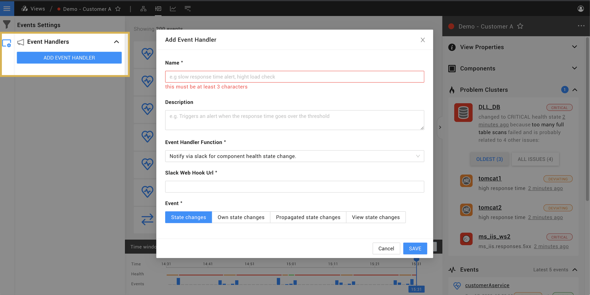

# Alerting

When something goes wrong within your IT environment StackState can alert you or your team mates with a message in the form of an email, private message, mobile ping or incident report. Additionally, StackState can trigger automation to take corrective measures. This guide will help you set this up.

## How events trigger alerts

Before configuring StackState to send out alerts it is helpful to have a general understanding of how an alert is triggered.

All telemetry in StackState flows through either metric or event streams that are part of to the components in the topology. Checks determine the health state of these components based on their telemetry streams. All health states, like the check health state, component health state and view health state are based on the health states determined by checks. All state changes generate events. The different types of events can trigger event handlers that can send out an alert or trigger some type of automation.

The entire flow of events that lead to an alert follow this path:

* A check changes health state \(e.g. becomes `critical`\).
* This causes the component to change state for which an event is shown in the event stream pane \(in a view click on the bell icon on the far right\).
* The health state propagates to other components that causes their propagated health state to change based on the propagation function of each component. This triggers an event for all affected components. These events are not visible in the event stream, but can be used for alerting.
* A view that contains these components can also change health state based on these changes. This triggers a `view state change` event to be created. These events are not shown in the event stream.
* Events that are triggered by components contained in a view or by the view changing state itself can trigger event handlers.
* Event handlers are configured on views and can send alerts or trigger some kind of automation.

## Creating health checks

Health checks generate events that can be alerted on. To create a health check:

1. Select a component or relation in the topology. Health checks require telemetry streams.
2. Optionally, if there are no telemetry streams available on the component or relation then you can create one.
3. Under the health section click on the `add` plus button. An `add check` dialog appears.
4. In the `add check` dialog provide a name for the health check.
5. Optionally, you can provide a description and remediation hint. The description can be used to explain the check in greater detail. The remediation hint is automatically displayed on the component or relation when this check goes to a non clear state \(e.g. `critical` or `deviating`\).
6. Select a check function. Check functions are scripts that take streaming telemetry as an input, check the data based on its logic and on the supplied arguments and outputs a health state. Some may check a metric stream for a threshold, some for spikes, others will a text contained in the event, etc. Each check function requires different arguments. If you want to know what a check function does exactly or want to create your own check function then you can find a full listing of all check functions under the `settings / check functions` page.
7. Each check function has different arguments that need to be supplied. These arguments determine the behavior of the check.
8. At least one of the arguments is a telemetry stream \(some checks may require multiple streams\). For metric streams a windowing method and window size need to be supplied that determine how often the check function runs based on the incoming metrics. If the windowing method is set to batching and window size is set to 60 seconds than the check runs every minute with a minute of metrics. If the windowing method is set to sliding and the window size to 60 seconds then check runs whenever the data flows in after 60 seconds of metrics have been collected.
9. Click `Create` to create the health check. The check is now active and visible under the health section. At first the check will appear gray, because its health state is not yet known. As soon as enough telemetry has been received the check will get a health state.

## Configuring view health

Often it is not desirable to react to each event, because that can cause a lot of noise. If one or multiple components cause some impact on a service than we do not want to report on each state change, but only on the changes to the problem itself. In StackState this is done through the health of the view. The health of a view is determined by the health of the components and relations in the view. Whenever a view changes its health state this triggers an view state state event that can be handled with an event handler on the view.

Each view in StackState has a health state, just like component and relations have a health state. The health of a view is determined by the view health configuration. To configure the health of a view:

1. Select a view.
2. On the top bread crumb next to the name of the view click on the drop down arrow.
3. In the drop down menu click on `Edit`.
4. Make sure `view health state` is enabled. A `edit query view` dialog appears.
5. Select an configuration function. Each configuration function determines the health of the view in its own way based on the components and relations that are visible within the view. Some may count the number of components that have a certain health state, others may lend some special status to a certain component, etc. If you want to know what an view health state configuration function does exactly or want to create your own view health state configuration function then you can find a full listing of all view health state configuration functions under the `settings / view health state configuration functions` page.
6. Each configuration function has different arguments that need to be supplied. These arguments determine the behavior of the view health state configuration function.
7. Click `Update` to save the new configuration to the view. The view health updates immediately.

## Alerting using event handlers

Health state changes of components and relations are events that can be handled by event handlers that send out alerts. To create an event handler:

1. Select a view.
2. Open the event stream pane on the right \(bell icon\).
3. Click on the `View Event Handlers` tab.
4. Click on the `add event handler` plus button. A `add event handler` dialog appears.
5. Give a name to identify the event handler, for example "email alert".
6. Select an event handler function. Each event handler function performs a different action based on the incoming event. There is the list of possible event handler functions: 1. Notify via HipChat for component health state change 1. Notify via HipChat for view health state change 1. Notify via Slack for component health state change 1. Notify via Slack for view health state change 1. Notify via Email for view health state change 1. Notify via SMS \(MessageBird\) for view health state change 1. Notify via Webhook for view health state change

   If you want to know what an event handler function does exactly or want to create your own event handler function then you can find a full listing of all check functions under the `settings / check functions` page.

7. Each event handler function has different arguments that need to be supplied. These arguments determine the behavior of the event handler.
8. One of the arguments is the event type to which the event handler will react. All state change events except the view state changes are caused by check functions. The view state changes are caused by the view health state configuration.
9. Click `Create` to create the event handler. The event handler is now active and visible under the "event handlers" section. It will alert on the next event it is configured to react to.

