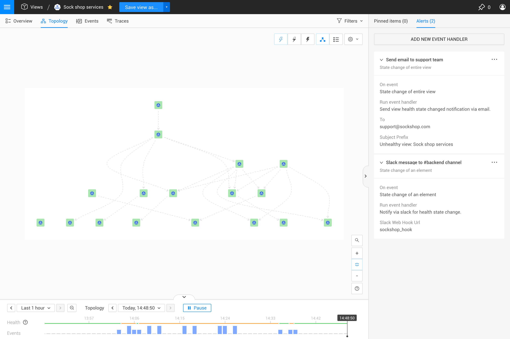
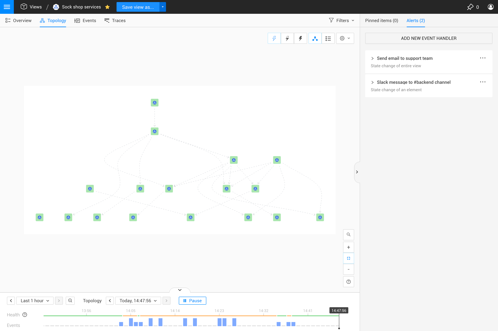
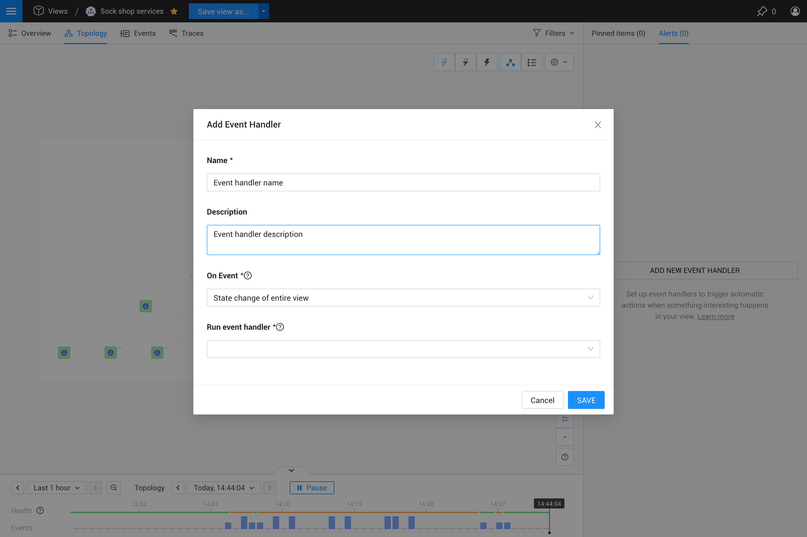

## Overview

When something goes wrong within your IT environment, Rancher Observability can use event handlers to notify you or your teammates. A message can be sent in the form of an email, Slack message, mobile ping or an HTTP POST request to any URL. Alerts can contain detailed content on the trigger event and possible root cause. 

## Event handlers

Event handlers added to a [custom view](../views/k8s-custom-views.md) can send event notifications or trigger actions in response to [health state change events](#state-change-events). The event handler will listen to events generated within the view and run a configured event handler function when the configured event type is generated.

You can check the configured event handlers for a [custom view](../views/k8s-custom-views.md) and add new event handlers from the Rancher Observability UI right panel **Alerts** tab. For details, see [manage event handlers](#manage-event-handlers).

### State change events

Rancher Observability's monitors generate health states which are mapped on components. A component will reflect the most severe health state mapped by a monitor as the component's health state. If a component changes its health state, a `HealthStateChangedEvent` for that component is generated. Event notifications or actions can be triggered whenever state changed events are generated for a component in the view.

The event types generated when an element state changes are described below.

* **State change of entire view** - a `ViewStateChangedEvent` event is generated only when the health state of a significant number of elements in a view changes. These events aren't visible in the Rancher Observability UI, but can be used to trigger event notifications. 
* **State change of an element** - a `HealthStateChangedEvent` event is generated when the health state of an element changes. These events will be listed in the Rancher Observability UI [Events Perspective](../views/k8s-events-perspective.md).


Note that there may be a slight delay between the generation of a `HealthStateChangedEvent` for an element and the resulting `ViewStateChangedEvent`. This can cause the reported state of a view to differ from the actual state of elements within it.


## Manage event handlers

Event handlers attached to a [custom view](../views/k8s-custom-views.md) listen to events that are generated in relation to components in the view. Event notifications can then be sent or actions can be triggered in response to health state change events or problem events.

### Configured event handlers

All event handlers configured for the view are listed in the Rancher Observability UI right panel **Alerts** tab. You can add, edit and remove event handlers from here. Expand an event handler to see its configured settings. 

### Add event handler

You can add an event handler to a view from the Rancher Observability UI right panel **Alerts** tab. 


Event handlers can only be added to a saved [custom view](../views/k8s-custom-views.md). It isn't possible to add event handlers to other view types (e.g. [kubernetes views](../views/k8s-views.md), [components views](../views/k8s-component-views.md) or [explore views](../views/k8s-explore-views.md)).


1. Open a saved [custom view](../views/k8s-custom-views.md).
2. Select the **Alerts** tab in the right panel. If you have any configured event handlers, they will be listed here.
3. To add a new event handler, click **ADD NEW EVENT HANDLER**. The **Add Event Handler** popup opens.
4. Give the event handler a **Name**. 
5. You can optionally add a **Description**. This will be displayed in the tooltip whenever a user hovers the mouse pointer over the event handler name in the right panel Event handlers list.
6. Select the trigger event and the event handler to run:
   * **On event** - the [event type](#state-change-events) that should trigger the event notification or automated action. Note that only events related to components are captured in event handlers, relation-related events will be ignored.
   * **Run event handler** - the event handler function that will run whenever the selected event type is generated.
7. Enter the required details, these will vary according to the event handler function you have selected.
8. Click **SAVE**.

### Event handler functions

Event handlers listen to events generated within a view. When the configured event type is generated, an event handler function is run to send an event notification or trigger an action in a system outside of Rancher Observability. For example, an event handler function could send a message to a Slack channel or make a POST to a webhook URL. A number of default event handler functions are included out of the box with Rancher Observability, these are described below.

#### Slack

The Slack event handler function sends a Slack message with detailed information about the trigger event, including the possible root cause, to the configured Slack webhook URL. See [how to create a Slack Webhook \(slack.com\)](https://api.slack.com/messaging/webhooks). 


Requires the [Slack StackPack](/stackpacks/integrations/slack.md) to be installed on your Rancher Observability instance.


#### OpsGenie

The OpsGenie event handler creates an alert in OpsGenie with detailed information on the triggered event.

#### Email

The email event handler function will send details of a health state change event.

#### HTTP webhook POST

The HTTP webhook POST event handler function sends a POST request to the specified URL. 

#### SMS

The SMS event handler function sends an SMS with details of a health state change event using MessageBird.

