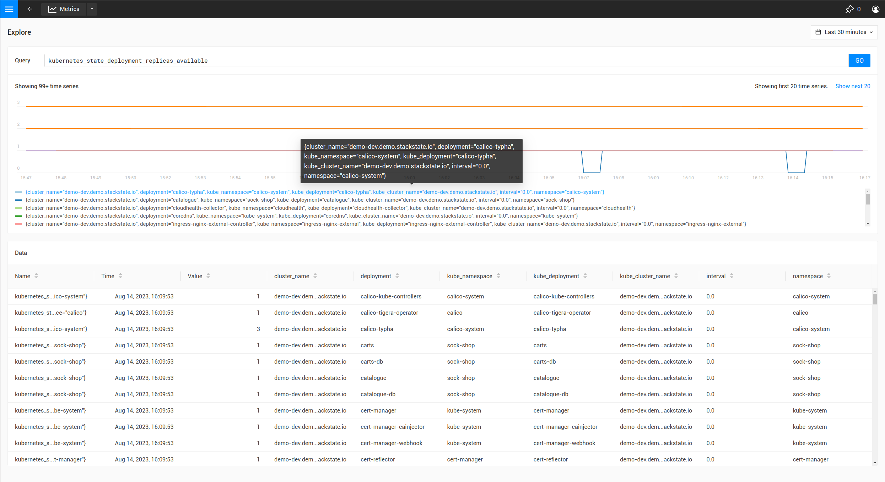
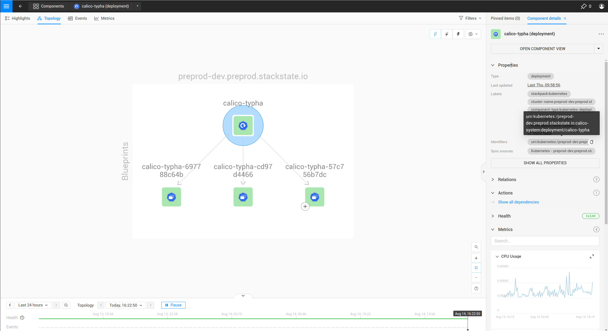

# Add a threshold monitor to components using the CLI

## Overview 

StackState provides [monitors out of the box](/use/alerting/k8s-monitors.md), which provide monitoring on common issues that can occur in a Kubernetes cluster. It is also possible to configure custom monitors for the metrics collected by StackState or application metrics ingested [from prometheus](/use/metrics/k8s-prometheus-remote-write.md).

## Steps

Steps to create a monitor:

1. [Write the outline of the monitor](#write-the-outline-of-the-monitor)
1. [Bind the results of the monitor to the correct component](#bind-the-results-of-the-monitor-to-the-correct-components)
1. [Write the remediation hint](#write-the-remediation-hint)
1. [Create or update the metric binding in StackState](#create-or-update-the-monitor-in-stackstate)
1. [Verify the monitor produces the expected result](#verifying-the-results-of-a-monitor)
1. [Common issues](#common-issues)

As an example the steps will add a monitor for the `Replica counts`  of Kubernetes deployments.

## Write the outline of the monitor

Create a new YAML file called `monitor.yaml` and add this YAML template to it to create your own metric binding. Open it in your favorite code editor to change it throughout this guide. At the end the StackState CLI will be used to create and update the monitor in StackState.

```
nodes:
- _type: Monitor
  arguments:
    metric:
      query: 
      unit:
      aliasTemplate: 
    comparator: 
    threshold: 
    failureState: 
    urnTemplate: "urn:kubernetes:/${kube_cluster_name}:${namespace}:service/${endpoint}"
    titleTemplate: 
  description: 
  function: {{ get "urn:stackpack:kubernetes-v2:shared:monitor-function:threshold"  }}
  identifier: urn:custom:monitor:...
  intervalSeconds: 30
  name: 
  remediationHint: 
  status: 
  tags: {}
```

The fields in this template are:

* `_type`: StackState needs to know this is a monitor so, value always needs to be `Monitor`
* `query`: A PromQL query. Use the [metric explorer](/use/metrics/k8sTs-explore-metrics.md) of your StackState instance, http://your-stackstate-instance/#/metrics, and use it to construct query for the metric of interest.
* `unit`: The unit of the values in the time series returned by the query or queries, used to render the Y-axis of the chart. See the [supported units](/develop/reference/k8sTs-chart-units.md) reference for all units.
* `aliasTemplate`: An alias for time series in the metric chart. This is a template that can substitute labels from the time series using the `${my_label}` placeholder. 
* `comparator`: Choose one of LTE/LT/GTE/GT to compare the threshold against the metric. Time series for which `<metric> <comparator> <threshold>` holds true will produce the failure state.   
* `threshold`: A numeric threshold to compare against.
* `failureState`: Either "CRITICAL" or "DEVIATING". "CRITICAL" will show as read in StackState and "DEVIATING" as orange, to denote different severity.
* `urnTemplate`: A template to construct the urn of the component a result of the monitor will be [bound to](#bind-the-results-of-the-monitor-to-the-correct-components).  
* `titleTemplate`: A title for the result of a monitor. Because multiple monitor results can bind to the same component, it is possible to substitute time series labels using the `${my_label}` placeholder.
* `description`: A description of the monitor.
* `function`: A reference to the monitor function that will execute the monitor. Currently only `{{ get "urn:stackpack:kubernetes-v2:shared:monitor-function:threshold"  }}` is supported.
* `identifier`: An identifier of the form `urn:custom:monitor:....` which uniquely identifies the monitor when updating its configuration.
* `intervalSeconds`: The interval at which the monitor executes. For regular real-time metric 30 seconds is advised. For longer-running analytical metric queries a bigger interval wis recommended.
* `name`: The name of the monitor
* `remediationHint`: A description of what the user can do when the monitor fails. The format is markdown, with optionally use of handlebars variables to customize the hint based on time series or other data ([more explanation below](#write-the-remediation-hint)). 
* `status`: Either "DISABLED" or "ENABLED". Determines whether the monitor will run or not.
* `tags`: Add tags to the monitor to help organize them in the monitors overview of your StackState instance, http://your-stackstate-instance/#/monitors

For example, this could be the start for a monitor which monitors the available replicas of a deployment:

```
nodes:
- _type: Monitor
  arguments:
    metric:
      query: "kubernetes_state_deployment_replicas_available" 
      unit: "short"
      aliasTemplate: "Deployment replicas" 
    comparator: "LTE"
    threshold: 0.0
    failureState: "DEVIATING"
    urnTemplate: 
  description: "Monitor whether a deployment has replicas.  
  function: {{ get "urn:stackpack:kubernetes-v2:shared:monitor-function:threshold"  }}
  identifier: urn:custom:monitor:deployment-has-replicas
  intervalSeconds: 30
  name: Deployment has replicas
  remediationHint: 
  status: "ENABLED"
  tags:
  - "deployments"
```

The `urnTemplate` and `remediationHint` will be filled in the next steps.

## Bind the results of the monitor to the correct components

The results of a monitor need to be bound to components in StackState, in order to be visible and usable. The result of a monitor is bound to a component using the component `identifiers`. Each component in StackState has one or more identifiers that uniquely identify the component. To bind a result of a monitor to a component, it is required to provide the `urnTemplate`, which substitutes the labels in the time series of the monitor result into the template, producing an identifier matching a component. This is best illustrated with the example:

In this example we make a monitor for the `kubernetes_state_deployment_replicas_available` metric. Run the metric in the metric explorer to observe what labels are available on the time series:



In the above table it is shown the metric has labels like `cluster_name`, `namespace` and `deployment`.

Because the metric is observed on deployments, it is most logical to bind the monitor results to deployment components. To do this, it is required to understand how the identifiers for deployments are constructed:

1. In the UI, navigate to the `deployments` view and select a single deployment.
1. Open the `Topology` view, and click the deployment component.
1. When expanding the `Properties` fold to the right of the screen, the identifiers will show after hoovering as shown below:



The identifier is shown as `urn:kubernetes:/preprod-dev.preprod.stackstate.io:calico-system:deployment/calico-typha`. This shows that the identifier is constructed based on the cluster name, namespace and deployment name. Knowing this, it is now possible to construct the `urnTemplate`:

```
  ...
  urnTemplate: "urn:kubernetes:/${cluster_name}:${namespace}:deployment/${deployment}" 
  ...
```

[To verify](#verifying-the-results-of-a-monitor)) whether the `urnTemplate` is correct, is explained further below.

## Write the remediation hint

The remediation hint is there to help users find the cause of an issue when a monitor fires. The remediation hint is written in [markdown](https://en.wikipedia.org/wiki/Markdown). It is also possible to use the labels that were on the time series of the monitor result using a handlebars template, as in the following example:

```
  ...
  remediationHint: |-
    To remedy this issue with the deployment {{ labels.deployment }}, consider taking the following steps:
    
    1. Look at the logs of the pods created by the deployment
  ...
```

## Create or update the monitor in StackState

After completing the `monitor.yaml`, use the [StackState CLI](/setup/cli/k8sTs-cli-sts.md) to create or update the monitor:

```bash
sts monitor apply -f monitor.yaml
```

Verify whether the monitor produces the expected results, using the steps [below](#verifying-the-results-of-a-monitor).


The identifier is used as the unique key of a monitor. Changing the identifier will create a new monitor instead of updating the existing one.


The `sts monitor` command has more options, for example it can list all monitors:

```bash
sts monitor list
```

To delete a monitor use

```bash
sts monitor delete --id <id>
```

To edit a monitor use, edit the original of the monitor that was applied, and apply again. Alternatively there is a `sts monitor edit` command to edit the configured monitor in the StackState instance directly:

```bash
sts monitor edit --id <id>
```

The `<id>` in this command isn't the identifier but the number in the `Id` column of the `sts monitor list` output.

## Enable or disable the monitor

A monitor can be enabled or disabled. Enabled means the monitor will run as normal, disabled means it will suppress all output. Use the following commands to enable/disable:

```bash
sts monitor enable/disable --id <id>
```

## Verifying the results of a monitor

It is good practice to, after a monitor is made, validate whether it produces the expected result. The following steps can be taken:

### Verify the execution of the monitor

Go to the monitor overview page (http://your-stackstate-instance/#/monitors) and find your monitor.

1. Verify the `Status` column is in `Enabled` state. If the monitor is in `Disabled` state, [enable it](#enable-or-disable-the-monitor). If the status is in `Error` state, follow the steps below [to debug](#the-monitor-is-showing-an-error-in-the-monitor-status-overview).
1. Verify you see the expected amount of states in the `Clear`/`Deviating`/`Critical` column. If the number of states is significantly lower or higher than the amount of components you meant to monitor, the promql query might be giving too many results.

### Verify the binding of the monitor

Observe whether the monitor is producing a result on one of the components that it is meant to monitor for. If the monitor does not show up, follow [these steps](#the-result-of-the-monitor-is-not-showing-on-a-component) to remedy.

## Common issues

### The result of the monitor is not showing on a component

First check if the monitor is actually [producing results](#verify-the-execution-of-the-monitor). If this is the case but the monitor results do not show up on the components, there might be a problem with the binding. First use the following command to verify:

```bash
sts monitor status --id <id>
```

If the output contains `Monitor health states with identifier which has no matching topology element (<nr>): ....`, this shows that the `urnTemplate` may not generate an identifier matching the topology. To remedy this [revisit your urnTemplate](#bind-the-results-of-the-monitor-to-the-correct-components).  

### The monitor is showing an error in the monitor status overview

Get the status of the monitor through the CLI

```bash
sts monitor status --id <id>
```

The section `Monitor Stream errors:` will show the errors happening on the monitor and provide further help. 
