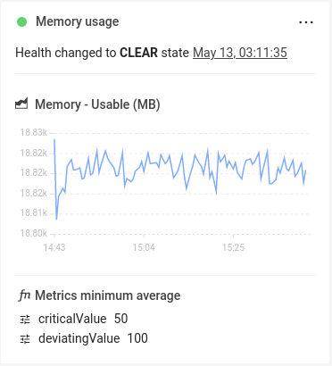
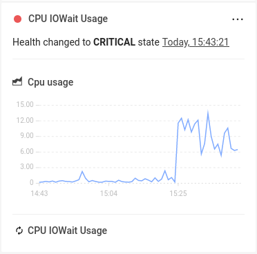

# About checks and monitors

## Overview

StackState reports a health state for elements in the topology based on the health state reported by checks and monitors attached to the element. Checks and monitors have a similar function in StackState, but work very differently under the hood.

## Checks

**Checks** are a feature of StackState that provides health state information bound to the topology elements based on the telemetry and log streams and a set of customizable validation rules expressed in the form of **Check Functions**.

StackState can calculate health checks based on telemetry or log streams defined for a topology element. When telemetry or events data is available in StackState, this approach opens up the possibility to use the Autonomous Anomaly Detector \(AAD\) for anomaly health checks.

See how to [add a health check](./add-a-health-check.md) and how to [set up anomaly health checks](./anomaly-health-checks.md).

Checks are defined on a per-topology element basis and rely on the telemetry streams present on said topology elements. In this sense, each instance of a Check is directly connected to the specific topology element for which it will produce health state information. This means that in order to provide health state information for a large swath of the available topology, multiple instances of Checks, one per each topology element to be covered by monitoring, need to be created.

This can be conveniently done by extending the [component templates](../../develop/developer-guides/custom-functions/template-functions.md) in a StackPack definition. See how to [develop a StackPack](../../develop/developer-guides/stackpack/README.md).

### Check results

Check results are available in the right panel **Selection details** tab under the **Health** section when information about an element is displayed:



The result panel displays among other information:

- a **health state** produced by this Check, along with the time it has been updated,
- a **metric chart** of the data that resulted in this health state being generated,
- the Check function configuration utilized by this Check.

The context menu of a Check result (...) contains several useful shortcuts:

- **Edit** - change the configuration of a specific check.
- **Delete** - remove the Check associated with this result panel.

Both of the options above are disabled when in time-travelling mode - topology elements cannot be modified in the past.

## Monitors
**Monitors** are a new feature of StackState, introduced in version 5.0, that allows definition of complex validation rules within StackState. Monitors allow novel ways of combining 4T data to improve rule expressiveness and monitoring coverage.

Monitors, similarily to Checks, use the 4T data collected by StackState to compute health state information and attach it to the topology elements observed by the system. Unlike Checks, Monitors do not directly relate to the topology and do not require any changes to the topology synchronization templates in order to operate. Monitors inform the topology by leveraging the Health Synchronization and can be managed independantly via a dedicated set of CLI commands.

Monitors are a flexible way to define a custom set of monitoring rules. They can created manually, packaged as part of a StackPack, or integrated into any modern software development practice that leverages automation (for instance, GitOps).

See how to [manage monitors](manage-monitors.md) in StackState.

### Monitor execution

Monitors are run by a dedicated subsystem of StackState called the monitor runner. The main task of the monitor runner is to schedule the execution of all existing monitors in such a way as to ensure that all of them produce viable results in a timely manner.
For that purpose, the monitor runner uses an interval parameter configured on a per-monitor basis - the `intervalSeconds`. The runner will attempt to schedule a monitor execution every `intervalSeconds`, counting from the end of the previous execution cycle, in parallel to the other existing Monitors (subject to resource limits). For example, setting `intervalSeconds` of a monitor definition to the value `600` will cause the monitor runner to attempt to schedule the execution of this monitor every ten minutes, assuming that the execution time itself is negligible.

The runner is maintenance free - it starts whenever StackState starts and picks up any newly applied monitor definitions automatically whenever they are created, changed or removed. Any changes to the Monitors are reflected with the next execution cycle and any execution issues are logged to the global StackState log file. Any such error logs are obtainable (in addition to being stored in the StackState log file) via a dedicated CLI command:



```
# By ID
sts monitor status --id <id-of-a-monitor>
# By Identifier
sts monitor status --identifier <identifier-of-a-monitor>
```

➡️ [Which version of the `sts` CLI am I running?](/setup/cli/cli-comparison.md#which-version-of-the-cli-am-i-running)


```
stac monitor status <id-or-identifier-of-a-monitor>
```

**Not running the `stac` CLI yet?**

➡️ [Upgrade the old `sts` CLI to `stac`](/setup/cli/cli-stac.md#upgrade)



The output of this command indicates the specific errors that occured along with the counts of how many times they happend in addition to health stream statistics associated with this monitor.


The monitor runner subsystem can be disabled via the configuration file by appending the following line at the end of the `etc/application_stackstate.conf` file:

`stackstate.featureSwitches.monitorRunner = false`



### Monitor results

The same as for checks, monitor results are in the right panel **Selection details** tab under the **Health** section when information about an element is displayed:



The result panel displays among other information:

- a **health state** produced by the associated monitor, along with the time it has been updated,
- **optional metric charts** of the data that resulted in this health state being generated,
- the name of the monitor associated with this result.

The context menu of a monitor result panel (...) allows for inspecting of the monitor definition:

- **Show monitor definition** - opens a modal window containing the full monitor definition associated with this result.

## See also
* [Health Synchronization](../../configure/health/health-synchronization)
* [StackState Template JSON \(STJ\)](../../develop/reference/stj/README.md)
* [StackState Query Language \(STQL\)](../../develop/reference/stql_reference.md)
* [StackState CLI](../../setup/cli-install.md)
* [StackPacks](../../stackpacks/about-stackpacks.md)
* [Identifiers](../../configure/topology/identifiers.md)
