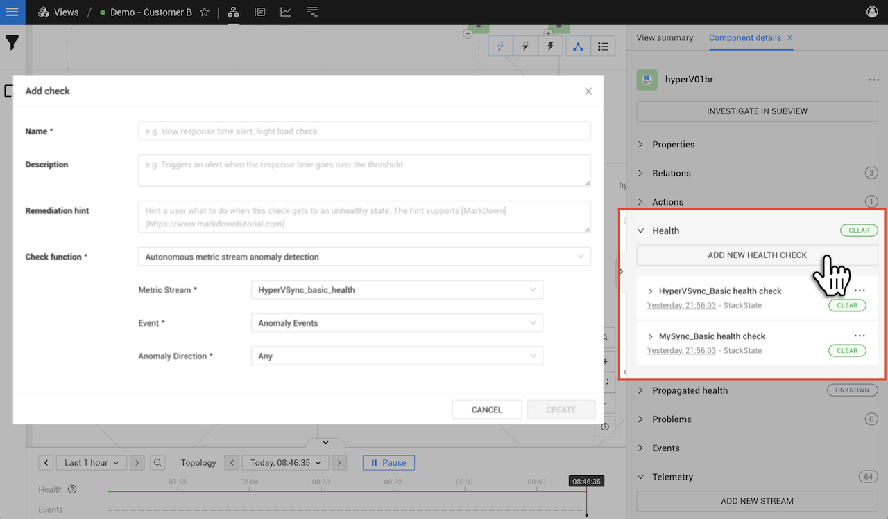

# Add a health check

## Overview

Health checks report a health state for elements \(components and relations\). The health state can either be calculated internally by StackState based on data from telemetry streams or synchronized with an external monitoring system.

The combined check states attached to an element are used to calculate its overall health status. When the status of an element changes, a state change event is generated. These events can be used to [trigger event notifications and actions](../events/event-notifications.md).

## Add a health check

Most elements in the StackState topology will have a relevant health check added when they're created. If required, you can also add custom health checks that calculate a health state in StackState based on available telemetry streams or [synchronize health data from an external monitoring system](add-a-health-check.md#synchronize-external-health-data).

To add a health check calculated in StackState:

1. Select the element that you want to assign a health check to.
   * Detailed information about the element will be displayed in the right panel details tab - **Component details** or **Direct relation details** depending on the element type that you selected.
   * If no telemetry stream is available on the selected element, you will need to [add a telemetry stream](../metrics/add-telemetry-to-element.md) first before you can add a health check.
2. Click **ADD NEW HEALTH CHECK** under **Health** in the right panel details tab.
3. In the **Add check** dialog box, enter the following details:
   * **Name** - The health check name. Will be displayed in the StackState UI right panel details tab **Health** section.
   * **Description** - Optional, can be used to explain the check in greater detail.
   * **Remediation hint** - Optional, will be automatically displayed on the element when this check goes to a non-clear state, for example `critical` or `deviating`.
   * **Check function** - The check function to use to monitor the element's telemetry stream\(s\). See [Check functions](add-a-health-check.md#check-functions) below.
4. Provide the required check function arguments, these will vary according to the check function selected, but will include:
   * At least one telemetry stream. Some checks will require multiple streams.
   * For metrics check functions, a [windowing method and window size](#metric-stream-configuration).
5. Click **CREATE** to create the health check.
   * The check is now active and visible under the **Health** section on the right.
   * The check will remain gray until enough telemetry data has been received to determine a health state.

## Metric stream configuration

### Windowing method

For metrics check functions, a windowing method and window size must be provided. This determines how often the check function will run based on the incoming metrics. There are two possible windowing methods, batching and sliding.

| Method | Description |
| :--- | :--- |
| **Batching** | The batching windowing method groups metric data into strictly separate windows of the configured window time, with consistent start and end times. For example, with window size set to 60 seconds, a batching check will run every minute with metrics from the previous minute. |
| **Sliding** | The sliding windowing method groups metric data into overlapping windows. For example, with `window size` set to 60 seconds, a sliding check will run whenever the data flows in after 60 seconds of metrics have been collected. Note that runs of the check will adhere to the `Minimum live stream polling interval` configured for the data source. |

### Time window (or window size)

By default, the time window is 300000 milliseconds (or 5 minutes). The time window will directly influence the number of positive or false negative alerts. The longer you configure the time window, the less sensitive it will be. However, if it's too short this may lead to a sudden spike in unwanted alerts, which might not help you meet your SLO. You should balance the time window based on the metric and how early you want to be alerted on spikes.

## Check functions

Each health check calculated in StackState uses a check function to monitor the telemetry stream attached to the element.

Check functions are scripts that take streaming telemetry as an input, check the data based on its logic and on the supplied arguments and output a health state. The telemetry changes a check function responds to determine the way in which the health check reports element health state, for example by monitoring a metric stream for thresholds and spikes, or checking the generated events. A number of check functions are included out of the box with StackState.



**StackState Self-Hosted**

Extra information for the [StackState Self-Hosted product](https://docs.stackstate.com/):

    
* You can create a custom check function to customize how StackState assigns a health state to a metric stream.
* Details of the available check functions can be found in the StackState UI, go to **Settings** &gt; **Check functions**.


### Check function: Autonomous metric stream anomaly detection

The `Autonomous metric stream anomaly detection` health check reacts to anomaly events and sets the component health state to the `DEVIATING` \(orange\).

➡️ [Learn more about anomaly health checks](anomaly-health-checks.md)

## Synchronize external health data



**StackState Self-Hosted**

Extra information for the [StackState Self-Hosted product](https://docs.stackstate.com/):

    
You can synchronize existing health checks from an external monitoring system and add them to StackState topology elements.



## See also

* [Anomaly health checks](anomaly-health-checks.md)
* [Add a telemetry stream to an element](../metrics/add-telemetry-to-element.md)
* [Add an event notification](/use/events/manage-event-handlers.md#add-event-handler)
