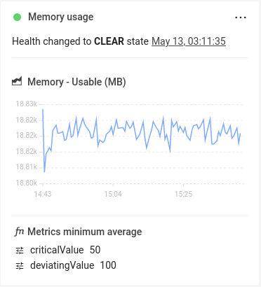

# Checks

## Overview

StackState reports a health state for elements in the topology based on the health state reported by checks and monitors attached to the element. Checks and monitors have a similar function in StackState, but work very differently under the hood.

This page describes what StackState checks are and how they work.

## What are StackState checks?

**Checks** are a feature of StackState that provides health state information bound to the topology elements. StackState calculates the health state of a check based on the telemetry and log streams attached to an element and a set of customizable validation rules expressed in the form of **Check Functions**. It's also possible to use anomaly events generated by the Autonomous Anomaly Detector \(AAD\) for anomaly health checks.

Unlike monitors, checks are defined on a per-topology element basis and rely on the telemetry streams present on the topology element to which they're attached. In this sense, each instance of a check is directly connected to the specific topology element for which it will produce health state information. This means that multiple instances of checks need to be created to serve the whole topology - one for each topology element to be covered by monitoring.

* [How to add a health check to an element](add-a-health-check.md) 
* [How to set up anomaly health checks](anomaly-health-checks.md)

## Check results

Check results are displayed under **Health** in the StackState UI right panel details tab when information about a topology element is displayed - [Component details](/use/concepts/components.md#component-details) or [Direct relation details](/use/concepts/relations.md#relation-details) depending on the element type that you selected. :

Each check result displays among other information:

- A **health state** produced by this check, along with the time it was updated
- A **metric chart** of the data that resulted in this health state being generated
- The check function configuration utilized by this check

The context menu of each check result **(...)** has useful shortcuts:

- **Edit** - change the configuration of a specific check.
- **Delete** - remove the Check associated with this result panel.

Note that both of the options above are disabled when in time-travelling mode - topology elements can't be modified in the past.

## See also

* [Add a check to an element](add-a-health-check.md)
* [Anomaly health checks](anomaly-health-checks.md)
* [Monitors](monitors.md)
* [StackPacks](../../stackpacks/about-stackpacks.md)