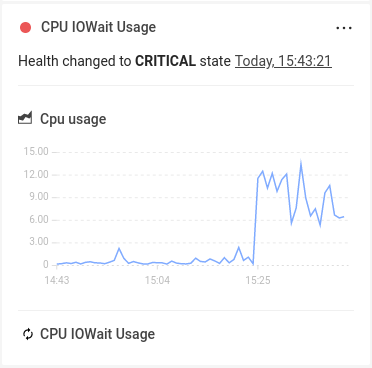

# Monitors

## Overview

StackState reports a health state for elements in the topology based on the health state reported by checks and monitors attached to the element. Checks and monitors have a similar function in StackState, but work very differently under the hood.

This page describes what StackState monitors are and how they work.

## What are StackState monitors?

**Monitors** are a new feature of StackState, introduced in version 5.0. Monitors allow novel ways of combining 4T data and complex validation rules to improve rule expressiveness and monitoring coverage. Health state information is computed using 4T data collected by StackState and attached to topology elements using health synchronization.

Unlike checks, monitors don't directly relate to elements in the topology and don't require any changes to the topology synchronization templates to operate. In this sense, each monitor can be used by any number of topology elements to calculate health state information. This means that only a single instance of a monitor needs to be created to serve the whole topology.

Monitors are a flexible way to define a custom set of monitoring rules. They can be created manually, packaged as part of a StackPack, or integrated into any modern software development practice that leverages automation (for instance, GitOps).

Monitors can be managed independently to topology elements via a dedicated set of CLI commands.

➡️ [Learn how to manage monitors in StackState](manage-monitors.md)

## Monitor results

Monitor results are displayed under **Health** in the StackState UI right panel details tab when information about a topology element is displayed - [Component details](/use/concepts/components.md#component-details) or [Direct relation details](/use/concepts/relations.md#relation-details) depending on the element type that you selected. :

The result panel displays among other information:

- A **health state** produced by the associated monitor, along with the time it has been updated,
- **Optional metric charts** of the data that resulted in this health state being generated,
- The name of the monitor associated with this result.

The context menu of each monitor result (...) allows for inspecting of the monitor definition:

- **Show monitor definition** - opens a modal window containing the full monitor definition associated with this result.

## Monitor functions

Each monitor configured in StackState uses a monitor function to compute the health state results attached to the elements.

Monitor functions are scripts that accept 4T data as input, check the data based on some internal logic and output health state mappings for the affected topology elements. The function is run periodically by the monitor runner and it's responsible for detecting any changes in the data that can be considered to change an element's health state.

Details of the monitor functions provided by StackPacks can be found in [the StackPack documentation](../../stackpacks/integrations/README.md). 



**StackState Self-Hosted**

Extra information for the [StackState Self-Hosted product](https://docs.stackstate.com/):

    
You can create a custom monitor function to customize how StackState processes the 4T data.



## See also

* [Manage monitors](manage-monitors.md)
* [StackState Template YAML \(STyY\)](../../develop/reference/stackstate-templating/)
* [StackState `sts` CLI](../../setup/cli/cli-sts.md)
* [Checks](checks.md)
