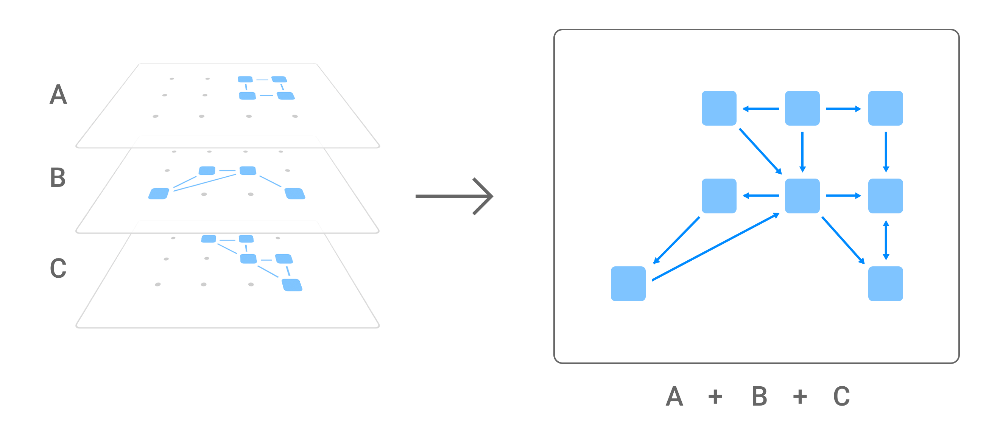
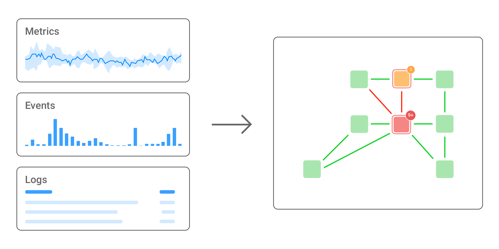
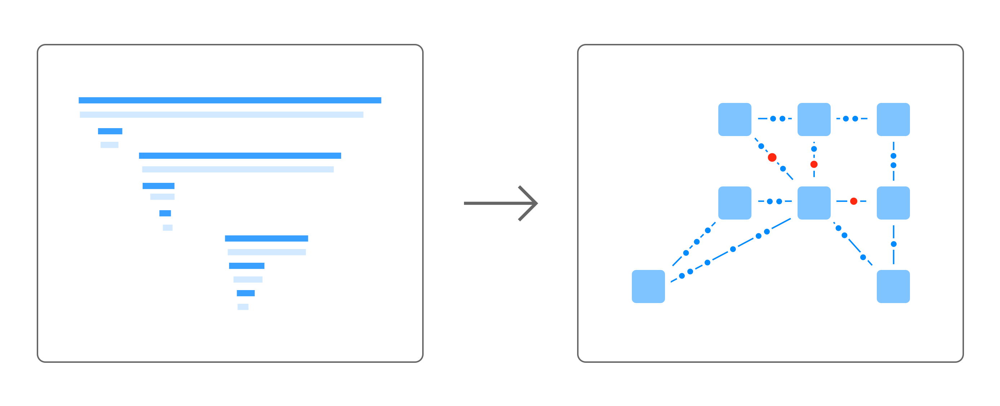

# The 4T data model

StackState’s capabilities are driven by its unique 4T Data Model®. Merging Topology, Telemetry, Tracing, and Time is the way to model the configuration of what is going on in any IT system; large or small, based on microservices, containers, web services, monoliths, serverless, cloud or on-premise. It doesn’t matter. StackState’s 4T Data Model® delivers insight into the entire IT landscape by capturing every millisecond of change, from any source in real-time to solve or prevent IT issues faster, with the right team.

## Topology

For the data to be relevant and actionable, a context must be placed around the data ingested. That context is topology. Topologies in StackState are automatically updated by topology data coming from many various sources. Topology data is sourced from different platforms that provision or deploy networks, virtual machines, containers, and services or can be discovered via discovery agents.

Each of these sources defines one or multiple subgraphs of the stack’s topology. These topological subgraphs are automatically merged and mapped to StackState’s stack by the script engine.

## Telemetry

StackState can ingest telemetry data \(metrics, events, and logs\) from external IT systems such as monitoring, provisioning, deployment, and configuration management tools, or the StackState Agent. The telemetry is combined with the topology data to create a comprehensive picture of your IT environment and how it's functioning in real-time.

StackState relies on plugins to receive and convert the incoming data streams. Plugins can be implemented in easy-to-use scripting languages and support both a push and a pull interaction model.

## Tracing

Tracing provides an end-to-end insight into your entire IT landscape at the code level. With an easy to understand and navigate overview centered around the topology. Tracing is also fully integrated with our unique time travel capabilities, which captures all changes over time.

StackState Tracing capability supports all major languages and has full support for distributed traces. StackState Tracing even integrates cloud tracing technologies such as Amazon X-Ray.

## Time

Issues within IT stacks can usually be traced back to changes. Having a change log of everything that happens in your IT landscape is vital. To record these changes, we have built StackGraph, the world's only versioned graph database. With StackGraph, StackState can go back to any particular point on the timescale and to see exactly what your landscape looked like at that moment.

The web-based user interface of StackState is equipped with a WebGL based rendering engine. Hardware accelerated graphics allow for visualizing massive topologies. You can use the 3D visualization to visualize not only the present topology, but also the past and the future - all in one view.

