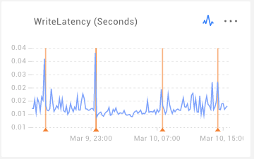
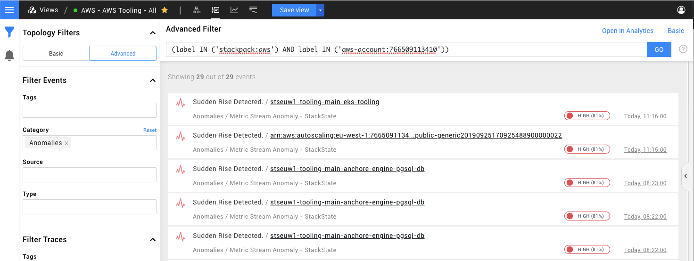

# Anomaly detection


**This page describes StackState version 4.5.**

Go to the [documentation for the latest StackState release](https://docs.stackstate.com/use/concepts/anomaly-detection).


## Overview

StackState can detect anomalies in your IT infrastructure by monitoring the metric streams attached to elements.

## Autonomous anomaly detection

The StackState Autonomous Anomaly Detector \(AAD\) StackPack works fully autonomously to identify anomalies in your IT environment. When installed and enabled, it will determine for itself the best configuration of its machine learning models and the metric streams that should be prioritized for anomaly detection. No configuration is required although you can influence the selection of telemetry streams by giving a them higher priority.

Once the anomalies are identified, they are displayed in the MetricStream charts as in the example below:

Additionally, identified anomalies are available as StackState Events and can be viewed in the [Events Perspective](../stackstate-ui/perspectives/events_perspective.md) when event category `Anomalies` is selected in the filter.

Finally, [anomaly health checks](../health-state/anomaly-health-checks.md) can be configured for the most important metric streams to alert on problems before they occur.

➡️ [Learn more about the Autonomous Anomaly Detector](../../stackpacks/add-ons/aad.md).

