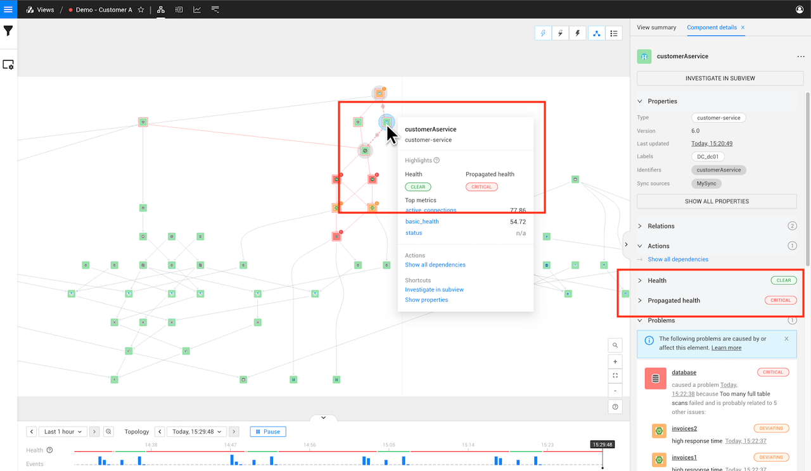

# Health state

## Overview

StackState calculates and reports the health state for elements (components and relations) and views. The following health state types are reported:

* [Element own health state](#element-own-health-state) - indicates the current health state of an element based on configured health sources.
* [Element propagated health state](#element-propagated-health-state) - highlights potential impact resulting from other unhealthy elements in the topology.
* [View health state](#view-health-state) - summarizes the health states and propagated health states of all elements in a view.

Changes to a health state will generate [events](/use/events/about_events.md) that can be used to trigger [event notifications](/use/events/event-notifications.md).

## Health sources

Health data in StackState can be derived from a number of health sources.

### StackState health checks

StackState health checks calculate a health state based on the telemetry or log streams that are defined for a topology element. This approach opens up the possibility to use the Autonomous Anomaly Detector \(AAD\) for anomaly health checks.

Existing StackPacks offer StackState health checks out of the box.

* [How to add a health check](../checks-and-monitors/add-a-health-check.md)
* [How to set up anomaly health checks](../checks-and-monitors/anomaly-health-checks.md)
* [About StackState checks](../checks-and-monitors/checks.md)

### StackState monitors

StackState monitors compute a health state based on a configured algorithm that combines and processes the 4T data collected by StackState. Health states computed this way are bound to topology elements using health synchronization.

Existing StackPacks will offer StackState monitors out of the box.

* [How to manage monitors](/use/checks-and-monitors/manage-monitors.md)
* [About StackState monitors](../checks-and-monitors/monitors.md)

### External monitoring systems

Health data from external monitoring systems can be sent to StackState using health synchronization. In this case, the health state is calculated by an external system based on its own rules. The calculated health state is then sent to StackState as a health stream and bound to the associated topology element. This approach is useful if you have existing health calculations defined externally, or if it isn't viable to send telemetry or events data to StackState and translate the health calculation rules.

Existing StackPacks offer health synchronization out of the box.



**StackState Self-Hosted**

Extra information for the [StackState Self-Hosted product](https://docs.stackstate.com/):

    
You can set up a custom health synchronization to integrate with external monitoring systems that aren't supported out of the box.


## Health state types

### Element own health state

StackState tracks a single own health state for each topology element (components, component groups and relations) based on information available from all of the [health sources](#health-sources) attached to it. The own health state is calculated as the most severe state reported by all health sources configured the element. If no health sources are present, an `UNKNOWN` health state will be reported.

In the StackState UI, the color of an element represents its own health state. A topology element can have any of the following health states:

* Green - `CLEAR` - There is nothing to worry about.
* Orange - `DEVIATING` - Something may require your attention. A badge on the component shows the number of health checks that are currently failing.
* Red - `CRITICAL` - Attention is needed right now, because something is broken. A badge on the component shows the number of health checks that are currently failing.
* Gray - `UNKNOWN` - No health state available.

The element will also have an outer color if it has an unhealthy [propagated health state](#element-propagated-health-state).

You can find details of the calculated element own health state and all configured monitors and health checks in the StackState UI right panel details tab when information about a topology element is displayed - [Component details](/use/concepts/components.md#component-details) or [Direct relation details](/use/concepts/relations.md#relation-details) depending on the element type that you selected. 

### Element propagated health state

In addition to the own health state, StackState calculates a propagated health state for each topology element (components, component groups and relations). The propagated health state is derived from the own health state of components and relations that the element depends upon.

➡️ [Learn how health state propagates in StackState](#propagation)

A topology element can have any of the propagated health states listed below:

* Orange - `DEVIATING` - Potential impact from another `DEVIATING` topology element. May require your attention.
* Red - `CRITICAL` - Potential impact from another `CRITICAL` topology element. May require your attention.
* `UNKNOWN` - No propagated health state. There is nothing to worry about.

In the StackState UI, an outer color will be shown when an element's propagated health state is calculated as unhealthy - orange for `DEVIATING` or red for `CRITICAL`. 

The color of the element itself (the inner color) represents the [element own health state](#element-own-health-state).

The propagated health state of an element can also be found in the following places:

* In the right panel details tab when information about a topology element is displayed - [Component details](/use/concepts/components.md#component-details) or [Direct relation details](/use/concepts/relations.md#relation-details) depending on the element type that you selected. 
* In the [component context menu](/use/stackstate-ui/perspectives/topology-perspective.md#component-context-menu) when you hover the mouse pointer over a component in the topology visualization.

### View health state

When **view health state** is enabled for a view, it will report a health state. The view health state is calculated based on the health of components and relations within in the view. 

In the StackState UI, the view health state is reported as a one of four colors:

* Green - `CLEAR` - There is nothing to worry about.
* Orange - `DEVIATING` - Something may require your attention.
* Red - `CRITICAL` - Attention is needed right now, because something is broken.
* Gray - `UNKNOWN` - View health state reporting is disabled.

➡️ [Learn how to configure view health state reporting](/use/stackstate-ui/views/configure-view-health.md)

You can check the view health state in the following places in the StackState UI:

* **Current view** - The health state of the current view is visible in the top bar of the StackState UI and also next to the view name in the right panel **View summary** tab. Historical health state information for a view can be seen in the [timeline Health](../stackstate-ui/timeline-time-travel.md#health) line at the bottom of the screen.
* **Starred views** - Starred views are listed in the StackState main menu together with their health state.
* **All views** - The health state of all views is visible on the view overview screen. Click **Views** from the StackState main menu.

## Run state

Some components in StackState will report a **Run state**, for example, AWS EC2 instances. This is different to the [health state](/use/concepts/health-state.md) and indicates the component’s operational state. The run state can be `DEPLOYING`, `DEPLOYED`, `STARTING`, `STARTED`, `STOPPING`, `STOPPED` or `UNKNOWN`. It isn't used in the calculation of a component's health state.

For every change in run state, a `Run state changed` event is generated. These events are visible in the [Events Perspective](/use/stackstate-ui/perspectives/events_perspective.md) and can help to correlate changes in the deployment state of components with problems in an environment.

## Propagation

The propagated health state of an element is calculated using a propagation function. Health state will propagate from one element to the next, from dependencies to dependent elements. Note that this is the opposite direction to the arrows shown on relations in the topology visualization. A `CLEAR` \(green\) or `UNKNOWN` \(gray\) health state won't propagate.

| Dependency and propagated state                        | Description |
|:-------------------------------------------------------| :--- |
|   | Component A depends on component B. Health state will propagate from B to A. |
|   | Component B depends on component A. Health state will propagate from A to B. |
|  | Dependency in both directions. Health state will propagate from A to B and from B to A. In other words, it's a circular dependency. |
|       | No dependency. Health state doesn't propagate. |



**StackState Self-Hosted**

Extra information for the [StackState Self-Hosted product](https://docs.stackstate.com/):

    
You can configure custom propagation functions to customize how health state affects the overall health of your systems.


## See also

* [Add a health check based on telemetry streams available in StackState](/use/checks-and-monitors/add-a-health-check.md)
* [Manage monitors](/use/checks-and-monitors/manage-monitors.md)
* [Configure the view health](../stackstate-ui/views/configure-view-health.md)
