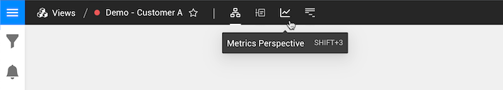

# Perspectives

## Overview

StackState and its [4T data model](4t_data_model.md) collect real-time data about your IT landscape. **Perspectives** allow you to look at this data from various angles and to relate different types of data to each other.

All data in StackState is organized around [topology](4t_data_model.md#topology), a representation of the components and their relations that make up your IT landscape. A subset of that topology, called a [view](../stackstate-ui/views/about_views.md), can be used to focus on a specific application, layer or set of components that you care about. The components and relations included in the topology provide the context for data displayed in the other perspectives.

There are four perspectives in the StackState UI. You can switch between them using the buttons at the top of the screen:

* The [Topology Perspective](../stackstate-ui/perspectives/topology-perspective.md) - the components and relations.
* The [Events Perspective](../stackstate-ui/perspectives/events_perspective.md) - all events and changes relating to the topology.
* The [Metrics Perspective](../stackstate-ui/perspectives/metrics-perspective.md) - telemetry streams for a selection of components in the topology.
* The [Traces Perspective](../stackstate-ui/perspectives/traces-perspective.md) - all traces and spans relating to the topology.

## Time travel

All perspectives allow for [time travel](../stackstate-ui/timeline-time-travel.md#time-travel) using the timeline control located at the bottom of the StackState UI. The timeline shows the currently selected telemetry interval and topology time. The active perspective uses the telemetry to show information relating to the topology that existed at the selected topology time. Switching to another perspective keeps the current telemetry interval in place, so you can easily correlate different types of information.

Inside the timeline, blue bars show the number of recorded events at a particular point in time. This makes it possible to identify moments of interest that will help when troubleshooting.

By default, the timeline is in **live mode**. This means that it tracks changes as they happen and updates the perspective and timeline accordingly. You can click on the timeline to time travel to a topology time in the past. Click **Go live** or **BACK TO LIVE** to stop time travelling and switch back to live updates again.

To the left of the telemetry interval time and topology time boxes there are two arrows, one pointing left and one pointing right. These **time jumpers** they move the telemetry interval forwards or backwards in time or shift the topology time to the next point for which StackState has recorded events.

➡️ [Learn more about the timeline and time travel](../stackstate-ui/timeline-time-travel.md)

