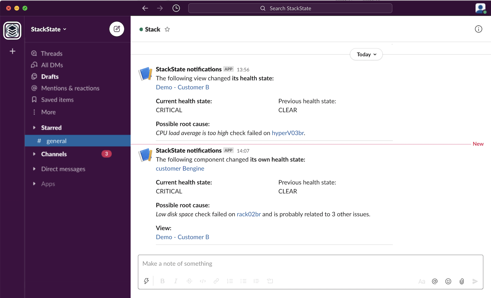

# Send event notifications

## Overview

When something goes wrong within your IT environment, StackState can use event handlers to send event notifications to alert you or your teammates. A message can be sent in the form of an email, Slack message, mobile ping or an HTTP POST request to any URL. Event notifications can contain detailed content on the trigger event and possible root cause. 

## Event handlers

Event handlers added to a StackState view can send event notifications or trigger actions in response to health state change events or problem events. The event handler will listen to events generated within the view and run a configured event handler function when the configured [event type](#event-types-for-notifications) is generated.

You can check the configured event handlers for a view and add new event handlers from the StackState UI right panel **View summary** tab. For details, see [manage Event Handlers](/use/events/manage-event-handlers.md).

## Event types for notifications

Event handlers can be configured to respond to [state change events](event-notifications.md#state-change-events) and [problem events](event-notifications.md#problem-events).


Only events related to components are captured in event handlers, relation-related events will be ignored.


### State change events

Metrics and events data flow through StackState topology elements in telemetry streams. These telemetry streams are used by [health checks](../checks-and-monitors/add-a-health-check.md) to determine the health state of an element. For every change in health state, at least one state change event is generated. Event notifications or actions can be triggered whenever state changed events are generated for a component in the view.

The event types generated when an element state changes are described below.

* **State change of an element** - a `HealthStateChangedEvent` event is generated when the health state of an element changes. These events will be listed in the StackState UI [Events Perspective](../stackstate-ui/perspectives/events_perspective.md).
* **Propagated state change of an element** - a `PropagatedStateChangedEvent` event is generated whenever the health state of one of an element’s dependencies changes. These events aren't visible in the StackState UI, but can be used to trigger an event notification.
* **State change of entire view** - a `ViewStateChangedEvent` event is generated only when the health state of a significant number of elements in a view changes. These events aren't visible in the StackState UI, but can be used to trigger event notifications. 


Note that there may be a slight delay between the generation of a `HealthStateChangedEvent` for an element and the resulting `ViewStateChangedEvent`. This can cause the reported state of a view to differ from the actual state of elements within it.


### Problem events

StackState groups unhealthy components in a view into problems, each with a common root cause. For every change to a problem, at least one problem event is generated.

Changes to a problem result in the following **Problem changed events** event types being generated:

* A `ProblemCreatedEvent` event is generated when a new problem has been created.
* A `ProblemUpdatedEvent` event is generated when new information is available for a problem. For example, a new root cause or contributing cause being added to the problem, or an update to a check on an existing unhealthy component.
* A `ProblemSubsumedEvent` event is generated when a change in root cause or the topology as a whole has caused an existing problem to be joined with another problem. For example, a new relation has been created.
* A `ProblemResolvedEvent` event is generated when the root cause component and all contributing cause components have reported a CLEAR \(green\) health state. No unhealthy components remain in the problem.


Note that there may be a slight delay between the generation of a health state change event for an element and the resulting Problem event.


➡️ [Learn more about the problem lifecycle](/use/problem-analysis/problem-lifecycle.md)

## See also

* [Add a health check](../checks-and-monitors/add-a-health-check.md)
