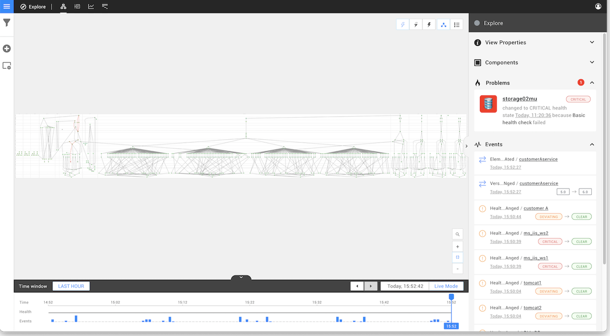
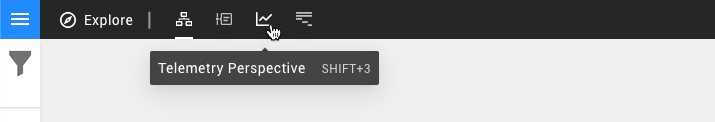
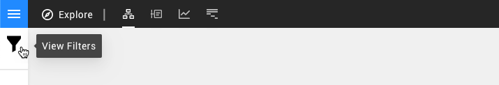
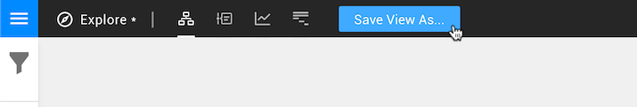

# Explore mode


**This page describes StackState version 4.3.**

The StackState 4.3 version range is End of Life (EOL) and no longer supported. We encourage customers still running the 4.3 version range to upgrade to a more recent release.

Go to the [documentation for the latest StackState release](https://docs.stackstate.com/).


## Overview

The StackState explore mode provides an unfiltered view of your topology with. This is most likely a much larger overview that you would like to see at any given time, but it's a good place to start when creating a [customized view](/use/views.md) and get familiar with the StackState UI.

Up to 10,000 components can be displayed at any time, if there are already more items than this in your topology, you will need to [add a filter](explore_mode.md#add-a-filter) before any data will be displayed.

## Perspectives

As in any StackState view, explore mode gives you access to data from your IT landscape in all available [StackState perspectives](introduction-to-stackstate/perspectives.md). Each perspective shows different data from the filtered \(or unfiltered\) components. Use the perspective buttons across the top of the screen to switch between them:

* [Topology Perspective](perspectives/topology-perspective.md)
* [Telemetry Perspective](perspectives/telemetry-perspective.md)
* [Events Perspective](perspectives/events_perspective.md)
* [Traces Perspective](perspectives/traces-perspective.md)

## Add a filter

You can zoom in on a specific area of your IT landscape using basic filters by writing an advanced filter query. Click the **View Filters** icon on the left of the screen to open the [View Filters pane](view_filters.md).

## Save filters as a view

When you change the displayed components using a filter, the **Save view** button will appear at the top of the screen. This allows you to save the applied filters and access them directly from the [Views](views.md) menu.

## See also

* [Filtering data](/use/view_filters.md)
* [StackState perspectives](introduction-to-stackstate/perspectives.md)
* [Working with StackState Views](/use/views.md)

