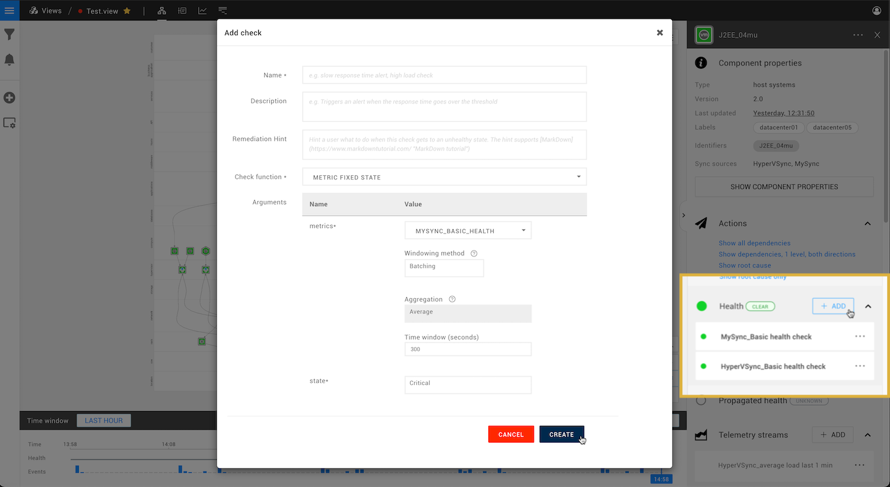

# Add a health check


**This page describes StackState version 4.2.**

The StackState 4.2 version range is End of Life (EOL) and no longer supported. We encourage customers still running the 4.2 version range to upgrade to a more recent release.

Go to the [documentation for the latest StackState release](https://docs.stackstate.com/).


## Overview

Health checks use check functions to report the status of elements \(components and relations\) in StackState based on the data from telemetry streams. Any element in a StackState topology view with a telemetry stream attached can be monitored by a health check. When the status of an element changes, a state change event is generated. These events can be used to [trigger event notifications and actions](send-event-notifications.md).

## Add a health check to an element

Most elements in the StackState topology will have a relevant health check added when the are created. If required, you can assign additional custom health checks to an element in the StackState Topology Perspective.


Health checks require [telemetry streams](add-telemetry-to-element.md).


1. Select the element that you want to assign a health check to.
   * If no telemetry stream is available on the selected element, you will need to [add a telemetry stream](add-telemetry-to-element.md).
2. Click **+ ADD** next to **Health** on the right of the screen. 
   * An **Add check** dialog box appears.
3. Provide the following details:
   * **Name** - The health check name. Will be displayed in the StackState UI **Health** pane.
   * **Description** - Optional, can be used to explain the check in greater detail.
   * **Remediation hint** - Optional, will be automatically displayed on the element when this check goes to a non clear state, for example `critical` or `deviating`.
   * **Check function** - The check function to use to monitor the element's telemetry stream\(s\). See [Check functions](add-a-health-check.md#check-functions) below.
4. Provide the required check function arguments, these will vary according to the check function selected, but will include:
   * At least one telemetry stream. Some checks will require multiple streams. 
   * For metrics check functions, a [windowing method](add-a-health-check.md#windowing-method) and window size.
5. Click **CREATE** to create the health check. 
   * The check is now active and visible under the **Health** section on the right side of the screen. 
   * The check will remain gray until enough telemetry data has been received to determine a health state.

## Check functions

Each health check uses a check function to monitor the telemetry stream attached to the element.

Check functions are scripts that take streaming telemetry as an input, check the data based on its logic and on the supplied arguments and output a health state. The telemetry changes a check function responds to determine the way in which the health check reports element health state, for example by monitoring a metric stream for thresholds and spikes, or checking the generated events. A number of check functions are included out of the box with StackState, or you could [create your own](../../configure/telemetry/checks_and_streams.md#check-functions).

Details of the available check functions check the StackState UI **Settings** &gt; **Check functions**.

### Windowing method

For metrics check functions, a windowing method and window size must be provided. This determines how often the check function will run based on the incoming metrics. There are two possible windowing methods, batching and sliding.

#### Batching

The batching windowing method groups metric data into strictly separate windows of the configured window time, with consistent start and end times. For example, with window size set to 60 seconds, a batching check will run every minute with metrics from the previous minute.

#### Sliding

The sliding windowing method groups metric data into overlapping windows. For example, with `window size` set to 60 seconds, a sliding check will run whenever the data flows in after 60 seconds of metrics have been collected. Note that runs of the check will adhere to the `Minimum live stream polling interval` configured for the data source.

## See also

* [Check functions](../../configure/telemetry/checks_and_streams.md#check-functions)
* [Add a telemetry stream to an element](add-telemetry-to-element.md)
* [Add an event notification](send-event-notifications.md)

