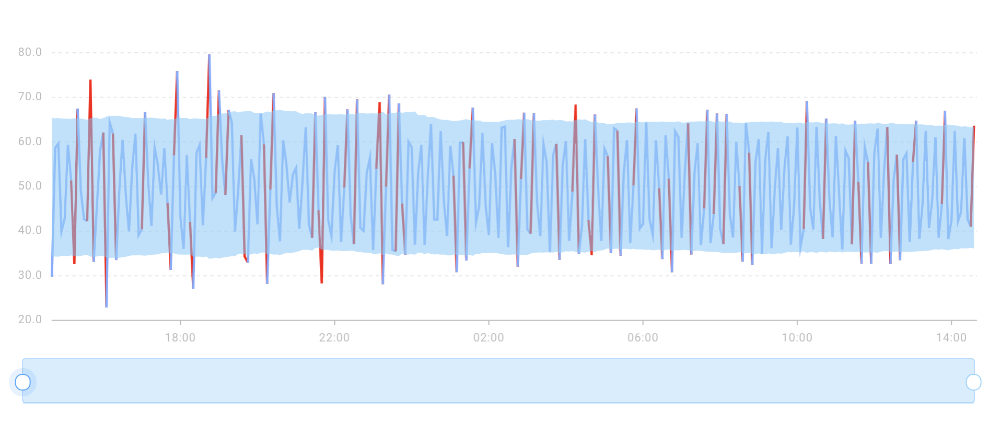

# Anomaly detection with baselines \(Deprecated\)


**This page describes StackState version 4.3.**

The StackState 4.3 version range is End of Life (EOL) and no longer supported. We encourage customers still running the 4.3 version range to upgrade to a more recent release.

Go to the [documentation for the latest StackState release](https://docs.stackstate.com/).



Baseline anomaly detection is **deprecated** and will be removed in the StackState v4.4 release. Please use the [Autonomous Anomaly Detector\)](../../stackpacks/add-ons/aad.md).


## Overview

Baselines are a way to detect anomalies in metric streams. Generally speaking, an anomaly is detected when a metric stream exceeds its baseline boundaries. A baseline consists of a lower and upper boundary. It forms a band that the metric, under normal conditions, is expected to remain inside of. Baselines are initially derived from historical data, but continuously update as new data flows in. Thus when an anomaly occurs, the baseline gradually updates to take the anomaly into account.

## How baseline anomaly detection works

The process for detecting anomalies using baselines consists out of two steps:

1. A `baseline` enriches a metric stream with a baseline. The metric stream is transformed into a `baseline metric stream`. Baselines are continuously calculated by baseline functions based on given the batch size.
2. A `check` determines the health state of a component or relation based on the metrics in the metric stream and its baseline. Once a metric stream is a baseline metric stream, check functions that support such baseline metric streams are available for selection.

## Add a baseline to a metric stream


Metric streams configured with a baseline will not be picked up for anomaly detection by the [Autonomous Anomaly detector](../../stackpacks/add-ons/aad.md).


To configure a baseline for a metric stream:

1. Go to the metric stream on a component or relation and select **Add baseline** from the metric stream context menu \(accessed through the triple dots next to the name of the metric stream\).
2. In the baseline dialog, fill in the following values:
   * **Name** - A name for later reference to the baseline.
   * **Description** -  \(Optional\) A description for the baseline.
   * **Aggregation** - The way metrics are aggregated before being fed to the baseline function for determining the baseline. This can only be modified by modifying the metric stream itself.
   * **Batch size** - How often the metrics are aggregated before being fed to the baseline function.
   * **Baseline function** - The type of baseline calculation to apply. See [baseline functions](anomaly-detection-with-baselines.md#baseline-functions) below for details of the pros and cons of each type.
   * **Arguments** - Vary according to the baseline function selected.
3. You can run a preview of the configured baseline, to help tune the settings to your liking.
   * Select a time range for the preview.
   * Click **PREVIEW**.
4. When you are happy with the configured baseline, click **CREATE**.
   * The baseline will be saved and its boundaries shown on the metric stream visualization.
   * You can edit or delete the baseline from the metric stream context menu \(the same menu you used to add it\).
5. You can now [add a check](anomaly-detection-with-baselines.md#check-for-anomalies-on-a-baseline-metric-stream) to the metric stream to check for anomalies and set up event notifications.

## Baseline functions

Baseline functions are configurable in StackState and can be coded in the [StackState Scripting Language](../../develop/reference/scripting/). By default the following baseline functions are supplied:

* [Stationary Auto-Tuned Baseline](anomaly-detection-with-baselines.md#stationary-auto-tuned-baseline)
* [Median Absolute Deviation](anomaly-detection-with-baselines.md#median-absolute-deviation)
* [Stationary Customizable Baseline based on EWMA](anomaly-detection-with-baselines.md#stationary-customizable-baseline-based-on-ewma)
* you can also [create your own custom baseline function](../../develop/developer-guides/custom-functions/baseline-functions.md)

### Stationary Auto-Tuned Baseline


This is always a good default choice; it works well for stationary as well as seasonal metrics.


This baseline function works well for stationary metrics \(e.g. data center temperature, average response time, error count\). Under the hood it uses the Exponential Weighted Moving Average \(EWMA\) algorithm, but auto-tunes that algorithm itself.

**Pros:**

* Works reasonably well for stationary as well as seasonal metrics given any distribution of the metric stream.
* Requires no knowledge of the underlying algorithm.

**Cons:**

* Does not assume seasonality. It does not assume yesterday looks similar to today or that any such seasonal patterns should occur.
* Very little control.

**Arguments**:

| Argument Name | Type | Description |
| :--- | :--- | :--- |
| sensitivity | Integer between 0 and 100 | Sensitivity controls the smoothing of the EWMA algorithm. High sensitivity \(max 100\) means the baseline will quickly change shape when new metrics flow in, thus resulting in fewer anomalies. Low sensitivity means the baseline will be slower in changing shape, thus resulting in more anomalies. |
| history | Duration | The amount of time needed for the baseline function to learn an initial baseline. 1 day typically is enough. The choice for a different fundamental period does not affect the algorithm, only the amount of initial data needed for calculating the baseline. |

### Median Absolute Deviation

This baseline functions work well for seasonal metrics \(e.g. logged in user count, online orders placed per minute\). It assumes that the metrics of the last days or last weeks \(fundamental period\) are similar to those of today or this week.

**When to choose?**

When dealing with metric streams which are seasonal either by day or week. It also works reasonably well for stationary metrics, but it is not the recommended baseline function for stationary metrics.

**Pros:**

* Works reasonably well for seasonal as well as stationary metric streams.

**Cons:**

* Assumes daily or weekly patterns. If such patterns are not there this algorithm will not produce good results.
* Assumes the data is normally distributed.
* You have to specify the fundamental period yourself instead of that being auto detected.
* For weekly patterns requires a lot of data.

**Arguments**:

| Argument Name | Type | Description |
| :--- | :--- | :--- |
| Fundamental period | Day / Week | Whether the baseline function should assume self-similarity in terms of days or weeks. Set to days if each day looks similar to every other day. Set to weeks if every weekday looks similar to the every other weekday \(every Monday looks similar to next Monday, every Tuesday looks similar to next Tuesday, etc.\) |
| Training window | Duration | The amount of fundamental periods to learn from. Four or more is recommended. |

### Stationary Customizable Baseline based on EWMA

This baseline functions works well for stationary metrics, for example data center temperature, average response time and error count. It uses the Exponential Weighted Moving Average \(EWMA\) algorithm. It is the same as the `Stationary Auto-Tuned Baseline`, but leaves the tuning up to you.

**Pros:**

* Works well for seasonal as well as stationary metric streams given any distribution of the metric stream.
* Provide a lot of controls for tuning.

**Cons:**

* Tuning requires knowledge of both the algorithm as well as domain knowledge about the metrics stream.
* Does not assume seasonality. It does not assume yesterday looks similar to today or that any such seasonal patterns should occur.

**Arguments**:

| Argument Name | Type | Description |
| :--- | :--- | :--- |
| history | Duration | The amount of time needed for the baseline function to learn an initial baseline. 1 day typically is enough. The choice for a different fundamental period does not affect the algorithm, only the amount of initial data needed for calculating the baseline. |
| historyLimit | Integer | \(Optional\) The size of the moving history. Default is `64`. |
| lowerControlLimit | Float | \(Optional\) a multiple of the standard deviation that establishes the lower boundary. Default is `3.0`. |
| upperControlLimit | Float | \(Optional\) a multiple of the standard deviation that establishes the upper boundary. Default is `3.0`. |
| lowerSlack | Float | \(Optional\) a value that is always subtracted from the lower boundary. Default is `0.0`. |
| upperSlack | Float | \(Optional\) a value that is always added to the upper boundary. Default is `0.0`. |
| smoothing | Float - value between 0.0 and 1.0 | \(Optional\) Discount rate of ewma. Determines how fast the baseline reacts to changes in the metrics. Default is `0.3`. |

## Check for anomalies on a baseline metric stream

Once you have [added a baseline](anomaly-detection-with-baselines.md#add-a-baseline-to-a-metric-stream) to a metric stream and you see the baseline bounds drawn on top the metric stream chart you can now configure a check to change health states and optionally send event notifications on anomalies.

1. Select the component/relation to open the Component/Relation properties pane with the baseline metric stream on it
2. Click **+ ADD** next to **Health**.
3. Select the **BASELINE ANOMALY DETECTION** check function.
4. Enter the following arguments:
   * **criticalValue** - how far the metric stream may exceed the baseline before a `CRITICAL` health state is returned. For example, if `criticalValue = 1.25` then a CRITICAL health state will be returned when the metric exceeds the baseline by more than 25%.
   * **deviatingValue** - how far the metric stream may exceed the baseline before a `DEVITAING` health state is returned. For example, if `deviatingValue = 1` then a DEVIATING health state will be returned when the metric exceeds the baseline.
   * **metrics** - the metric stream with a configured baseline that should be monitored for anomalies.
5. Click `CREATE` to add the check.


Once you have added the check function, it may take 5 or more minutes \(dependent on the baseline batch size\) before the check changes health state.


Event notifications for baseline checks work exactly the same as with other health checks. Find out how to [set up event notifications](send-event-notifications.md).

## See also

* [Anomaly detection](../introduction-to-stackstate/anomaly-detection.md)
* [Autonomous Anomaly detector add-on StackPack](../../stackpacks/add-ons/aad.md)
* [Send event notifications with event handlers](send-event-notifications.md)
* [Create custom baseline functions](../../develop/developer-guides/custom-functions/baseline-functions.md)

