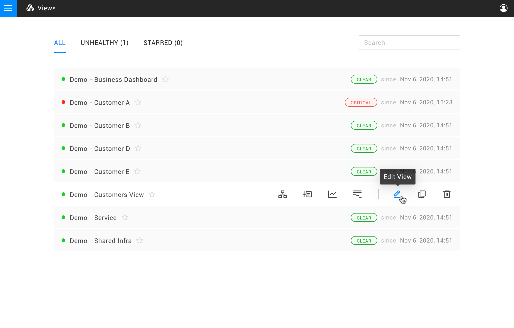
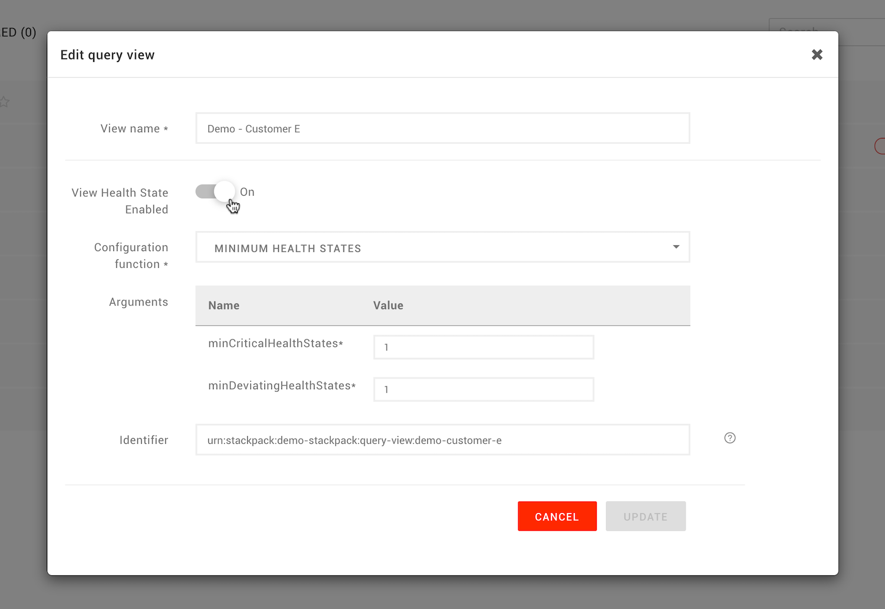

# Configure the view health


**This page describes StackState version 4.2.**

The StackState 4.2 version range is End of Life (EOL) and no longer supported. We encourage customers still running the 4.2 version range to upgrade to a more recent release.

Go to the [documentation for the latest StackState release](https://docs.stackstate.com/).


## Overview

Reacting to each event in an environment can cause a lot of noise. This may be both undesirable and unnecessary. For example, if one or multiple components have an impact on a service, it can be sufficient to report on changes to the problem itself and not each related state change.

StackState can reduce this noise by looking at the overall health state of a **view** rather than that of individual elements. The view health state is determined by the combined health of its elements. When a view changes its health state, a view state change event is triggered and that can in turn trigger an event notification or automated action.

## Configure a view health state

View health state is calculated by a **view state configuration function**. To configure a view to report its health state:

1. In the StackState UI, click **Views** from the main menu.
2. Click on the pencil icon next to a view name to edit the view.
3. Set **View Health State Enabled** to **On**.
4. Select a **Configuration function** to use to calculate the view health. 
   * You can use the standard view state configuration function or [create your own](../../configure/topology/view_state_configuration.md).
   * For details of the available configuration functions, go to **Settings** &gt; **Functions** &gt; **View Health State Configuration Functions**.
5. Provide any required arguments. These will vary according to the view health state configuration function selected. For example, for the standard [MINIMUM HEALTH STATES](configure-view-health.md#view-health-state-configuration-function-minimum-health-states) configuration function.
6. Click **UPDATE** to save the new configuration to the view. 
   * The view health will update immediately.

## React to view state changes

You can [set up event handlers](send-event-notifications.md) to trigger event notifications and actions whenever a view state changes.

## View health state configuration functions

### MINIMUM HEALTH STATES

The **MINIMUM HEALTH STATES** view health state configuration function calculates the health state of the view as follows:

* The view has a `CRITICAL` health state when more than the **minCriticalHealthStates** components inside the view have a `CRITICAL` health state. This does not count propagated health states.
* The view has a `DEVIATING` health state When more than the **minDeviatingHealthStates** components inside the view have a `DEVIATING` health state. This does not count propagated health states.
* In all other situations, the view has a `CLEAR` health state.

The **MINIMUM HEALTH STATES** view health state configuration function should be seen as an example and a good starting point to \[create a custom view health state configuration function\](/configure/topology/view_state_configuration.md#write-a-custom-view-health-state-configuration-function).

## See also

* [Customize the view state configuration](../../configure/topology/view_state_configuration.md)
* [Add a health check](add-a-health-check.md)
* [Send event notifications when a health state changes](send-event-notifications.md)

