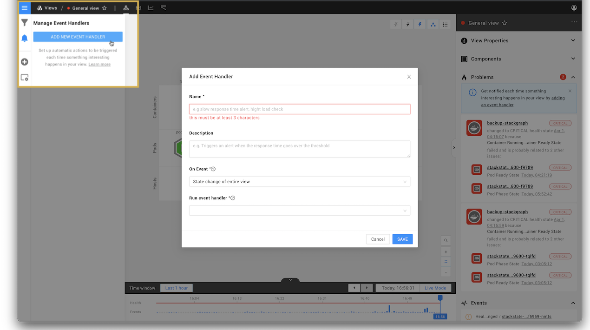

# Send event notifications


**This page describes StackState version 4.3.**

The StackState 4.3 version range is End of Life (EOL) and no longer supported. We encourage customers still running the 4.3 version range to upgrade to a more recent release.

Go to the [documentation for the latest StackState release](https://docs.stackstate.com/).


## Overview

When something goes wrong within your IT environment, StackState can send event notifications to alert you or your team mates. A message can be sent in the form of an email, Slack message, mobile ping or an HTTP POST request to any URL. Event notifications can contain detailed content on the trigger event and possible root cause. This guide will help you set this up.

## How an event notification is triggered

Event notifications are triggered in response to health state change events or problem events generated in a view.

### Health state changed event notifications

The health state of an element is derived from metrics and events data in the telemetry streams assigned to it, whereas the health state of a view is calculated based on the combined health state of elements within it. Propagated state changes can also be used to trigger event notifications, however, this can result in a lot of noise. The process to trigger a health state changed event notification is as follows:

1. [Telemetry streams](add-telemetry-to-element.md) attached to an element provide metrics and events data.
2. A [health check](add-a-health-check.md) attached to the element listens to the available telemetry streams and reports a health state based on its configured parameters.
3. When the reported health state of an element changes, a chain of [state change events](send-event-notifications.md#state-change-events) are generated:
   * `HealthStateChangedEvent` for the element itself.
   * `PropagatedStateChangedEvent` for all other elements that have been impacted by the element's state change.
   * `ViewStateChangedEvent` for each view containing the element. Note that this event type is only generated when a view's [view state configuration criteria](configure-view-health.md) are met.
4. Event handlers associated with each view listen to the generated state change events and trigger the configured event notifications and actions.

### Problem event notifications

StackState will group unhealthy components together into [problems](../problems/problems.md) and generate [problem events](send-event-notifications.md#problem-events) that track changes to them. Event handlers associated with a view can listen to the generated problem events and trigger a configured event notification or action.

## Add an event handler to a view

Event handlers can be added to a StackState view to send event notifications and trigger actions in response to health state change events or problem events generated within the view. 

You can add an event handler to a view from the StackState UI.

1. Select **Events Settings** on the left.
2. Click **ADD NEW EVENT HANDLER**.
3. Select the trigger event and event handler to run: 
   * **On event** - the [events](send-event-notifications.md#events) that should trigger the event notification or automated action.
   * **Run event handler** - the [event handler function](#event-handler-functions) that will run whenever the selected event is generated. 
     * For health state changed events, StackState ships with event handler functions that can send an event notification via email, Slack or SMS, or POST to an HTTP webhook. 
     * For problem events, you will need to [create a custom event handler function](/develop/developer-guides/custom-functions/event-handler-functions.md).
4. Enter the required details, these will vary according to the event handler function you have selected.
5. Click **SAVE**.

## Events

Event handlers can be configured to respond to [state change events](send-event-notifications.md#state-changed-events) and [problem events](send-event-notifications.md#problem-events).

### State change events

Metrics and events data flow through StackState topology elements in telemetry streams. These telemetry streams are used by [health checks](add-a-health-check.md) to determine the health state of the element. For every change in health state, at least one state change event is generated. Event handlers can be added to a view to listen to state change events generated within the view and trigger an event notification or action when a configured threshold is passed.

The event types generated when an element state changes are described in the table below.

| Event type | Description |
| :--- | :--- |
| `HealthStateChangedEvent` | **State change of an element** Generated when the health state of an element changes. These events will be listed in the StackState UI [Events Perspective](../perspectives/events_perspective.md). |
| `PropagatedStateChangedEvent` | **Propagated state change of an element** Generated whenever the health state of one of an element’s dependencies changes. These events are not visible in the StackState UI, but can be used for trigger an event notification. |
| `ViewStateChangedEvent` | **State change of entire view** Generated only when the health state of a significant number of elements in a view changes. These events are not visible in the StackState UI, but can be used to trigger event notifications. **Note** that there may be a slight delay between the generation of a `HealthStateChangedEvent` for an element and the resulting `ViewStateChangedEvent`. This can cause the reported state of a view to differ from the actual state of elements within it. |

You can [add an event handler to a view](send-event-notifications.md#add-an-event-handler-to-a-view) to trigger event notifications or automated actions on specific state change events.

### Problem events

StackState groups the unhealthy components in a view into problems with a common root cause. For every change to a problem, at least one problem event is generated. Event handlers can listen to generated problem events and trigger an event notification or actions. StackState v4.3 does not include StackPacks that support notifications for problem events out of the box, however, the functionality to do this is available. You can [create your own custom event handler function](/develop/developer-guides/custom-functions/event-handler-functions.md) that will listen and react to the events generated by problems.

Changes to a problem result in the following event types being generated:

| Event type | Description |
| :--- | :--- |
| `ProblemCreated` | A new problem has been created. |
| `ProblemUpdated` | New information is available for a problem. For example, a new root cause or contributing cause being added to the problem, or an update to a check on an existing unhealthy component. |
| `ProblemSubsumed` | A change in root cause has caused an existing problem to be [joined with another problem](../problems/problems.md#two-problems-one-root-cause). |
| `ProblemResolved` | The root cause component and all contributing cause components have reported a CLEAR \(green\) health state. No unhealthy components remain in the problem. |

## Event handler functions

Event handlers listen to events generated within a view. When the configured event type is generated, the event handler function is run to send an event notification or trigger an action in a system outside of StackState. For example, an event handler function could send an email or make a POST to a webhook URL. A number of default event handler functions are included out of the box with StackState, or you can [create your own custom event handler functions](/develop/developer-guides/custom-functions/event-handler-functions.md).

### Functions for health state change events

StackState ships with the following event handler functions that track health state change events in a view:

| Event handler function | Description |
| :--- | :--- |
| **Slack** | Sends a message with detailed content on the trigger event and possible root cause to the configured Slack webhook URL. See [how to create a Slack webhook \(slack.com\)](https://api.slack.com/messaging/webhooks). |
| **Email** | Sends details of a health state change event using the [configured SMTP server](/configure/topology/configure-email-event-notifications.md). |
| **HTTP webhook POST** | Sends an HTTP webhook POST request to the specified URL. |
| **SMS** | Sends details of a health state change event using MessageBird. |


Some of the event handler functions above will be installed as part of a StackPack. A full list of the event handler functions available in your StackState instance can be found in the StackState UI, go to **Settings** &gt; **Functions** &gt; **Event Handler Functions**


### Functions for problem events

To run an event handler in response to problem events generated in a view, you will need to [create a custom event handler function](/develop/developer-guides/custom-functions/event-handler-functions.md).

## See also

* [Add a health check](add-a-health-check.md)
* [Configure an SMTP server to send email event notifications](../../configure/topology/configure-email-event-notifications.md)
* [Custom event handlers](/develop/developer-guides/custom-functions/event-handler-functions.md)
* [Create a custom event handler function](/develop/developer-guides/custom-functions/event-handler-functions.md)

