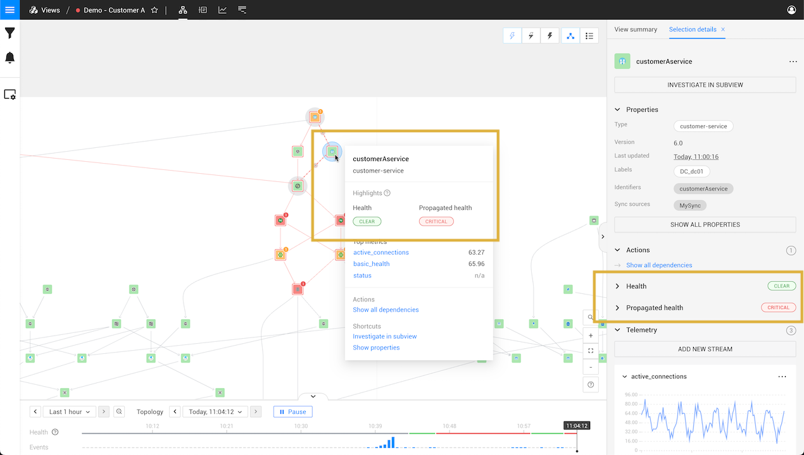

# About health state

## Overview

StackState calculates and reports the health state for elements (components and relations) and views. Health states are displayed in the topology visualization. Changes to health state will generate events that can be used to trigger [event notifications](/use/metrics-and-events/event-notifications.md).

* Health checks assigned to an element use data from telemetry and health streams to calculate the [own health state](#element-own-health-state).
* Potential impact of unhealthy components and relations on an element is reported as its [propagated health state](#propagated-health-state).
* The [view health state](#view-health-state) summarises the health states and/or propagated health state of elements it contains.

## Element own health state

StackState will track a single own health state for each topology element (components, component groups and relations) based on information available from [health checks](#health-checks) attached to it. The own health state is calculated as the most severe state reported by a health check attached to the element. If no health checks are present, an `UNKNOWN` health state will be reported.

In the StackState UI, the color of an element represents its own health state. A topology element can have any of the health states listed below:

* Green - `CLEAR` - There is nothing to worry about.
* Orange - `DEVIATING` - Something may require your attention.
* Red - `CRITICAL` - Attention is needed right now, because something is broken.
* Gray - `UNKNOWN` - No health state available.

An outer color will be displayed if the element has an unhealthy [propagated health state](#propagated-health-state).

### Health checks

Health checks attached to an element can be calculated internally by StackState or by an external monitoring system. The health state of an element is calculated as the most severe state reported by a health check attached to it.

#### StackState health checks

StackState can calculate health checks based on telemetry or log streams defined for a topology element. When telemetry or events data is available in StackState, this approach opens up the possibility to use the Autonomous Anomaly Detector \(AAD\) for anomaly health checks.

* [How to add a health check](add-a-health-check.md)
* [How to set up anomaly health checks](anomaly-health-checks.md)

#### External monitoring system

Health data from external monitoring systems can be synchronized to StackState as health checks. In this case, health checks are calculated by the external systems based on their own rules and then synchronized with StackState and bound to associated topology elements. This approach is useful if you have existing health checks defined externally, or if it is not viable to send telemetry or events data to StackState and translate the check rules.

Existing StackPacks will provide health synchronization out of the box.



You can set up a [custom health synchronization](../../configure/health/health-synchronization.md) to integrate with external monitoring systems that are not supported out of the box.


## Propagated health state

In addition to the own health state, StackState calculates a propagated health state for each topology element (components, component groups and relations). The propagated health state is derived from the own health state of components and relations that the element depends upon.

A topology element can have any of the propagated health states listed below:

* Orange - `DEVIATING` - Potential impact from another `DEVIATING` topology element. May require your attention.
* Red - `CRITICAL` - Potential impact from another `CRITICAL` topology element. May require your attention.
* `UNKNOWN` - No propagated health state. There is nothing to worry about.

In the StackState UI, an outer color will be shown when the element's propagated health state is calculated as unhealthy (`DEVIATING` or `CRITICAL`). The color of the element (inner color) represents the [element own health state](#element-own-health-state).

TODO - remove the section below ???
The propagated health state of an element can be found:

* In the right panel **Selection details** tab when information about a component or relation is displayed. 
* In the [component context menu](/use/stackstate-ui/perspectives/topology-perspective.md#component-context-menu) when you hover over a component in the topology visualization.

### Propagation

The propagated health state of a component is calculated using a propagation function. Health state will propagate from one component to the next, from dependencies to dependent components. Note that this is the opposite direction to the arrows shown on [relations](/use/concepts/relations.md) in the topology visualization.


A `CLEAR` \(green\) or `UNKNOWN` \(gray\) health state will not propagate.


| Dependency and propagated state | Description |
| :--- | :--- |
|  | Component A depends on component B. Health state will propagate from B to A. |
|  | Component B depends on component A. Health state will propagate from A to B. |
|  | Dependency in both directions. Health state will propagate from A to B and from B to A. In other words, it is a circular dependency. |
|  | No dependency. Health state does not propagate. |



You can configure [custom propagation functions](../../develop/developer-guides/custom-functions/propagation-functions.md) to customize how health state affects the overall health of your systems.


## View health state

When **view health state** is enabled for a view, it will report a health state as one of four colors:

* 🟩 Green - `CLEAR` - There is nothing to worry about.
* 🟧 Orange - `DEVIATING` - Something may require your attention.
* 🟥 Red - `CRITICAL` - Attention is needed right now, because something is broken.
*   Gray - `UNKNOWN` - View health state reporting is disabled.

The view health state is calculated based on the health of components and relations within in the view. Find out how to [configure view health state reporting](configure-view-health.md).

You can check the view health state in the following places in the StackState UI:

* **Current view** - The health state of the current view is visible in the top bar of the StackState UI and also next to the view name in the right panel **View Summary** tab. Historical health state information for a view can be seen in the [timeline Health](../stackstate-ui/timeline-time-travel.md#health) line at the bottom of the screen.
* **Starred views** - Starred views are listed in the StackState main menu together with their health state.
* **All views** - The health state of all views is visible on the view overview screen. Click **Views** from the StackState main menu.

## See also

* [Add a health check based on telemetry streams available in StackState](add-a-health-check.md)
* [Add Static Health from a CSV file](../../stackpacks/integrations/static_health.md "StackState Self-Hosted only")
* [Set up a health synchronization](../../configure/health/health-synchronization.md "StackState Self-Hosted only")
* [Configure the view health](configure-view-health.md)
