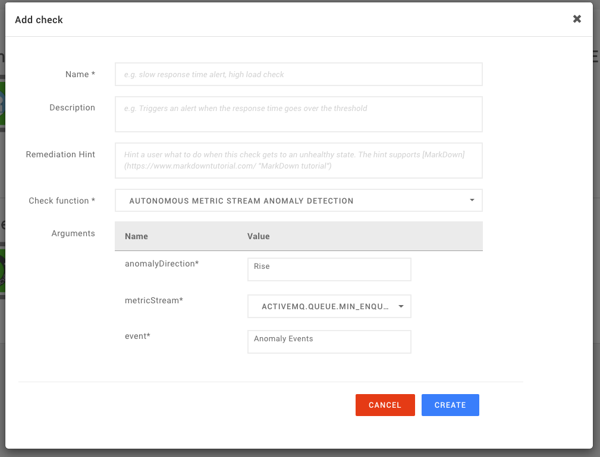

# Anomaly health checks


To use anomaly health checks, the [Autonomous Anomaly Detector](../../stackpacks/add-ons/aad.md) StackPack must be installed.


## Overview

The [Autonomous Anomaly Detector \(AAD\)](../../stackpacks/add-ons/aad.md) looks for deviations in metric streams. It annotates the metric streams with anomalies and generates corresponding anomaly events. The anomaly events can be viewed in the [event perspective](../stackstate-ui/perspectives/events_perspective.md) and also serve as an input for health checks. Health checks can react to anomaly events and set the component health state to the `DEVIATING` \(orange\). Without a health check responding to generated anomaly events, a component would not change its health state based on found anomalies.

Anomaly health checks are automatically placed on components by the StackPacks but you can also manually create an anomaly health check.

## Manually add an anomaly health check to a component

Follow the instructions below to add an anomaly health check to a component.

1. In the StackState UI Topology Perspective, select the component that you want to add an anomaly health check to.
2. Click on the the **+ ADD** button under the **Health** section in the component details pane on the right of the screen.
3. Select the **Check function** [Autonomous metric stream anomaly detection](anomaly-health-checks.md#check-function-autonomous-metric-stream-anomaly-detection).
4. Add the following arguments:
   * **anomalyDirection** - the direction the found anomaly must have for the check to go to a `DEVIATING` \(orange\) health state. You can choose from:
     * `Rise` - to detect peaks, for example in a latency metric stream.
     * `Drop` - to detect sudden drops, for example in the number of threads free in a thread pool.
     * `Any` - to detect both rises and drops, for example when detecting both hot and cold deviations in data center temperature.
   * **metricStream** - a metric stream that is available on the component to detect the anomalies on.
   * **event** - leave unchanged. This is an instance of an anomaly event that the check will react to.
5. Click **CREATE** to activate the check.



You can automate the creation of such checks, like any other checks, using the [component templates](../../configure/telemetry/telemetry_synchronized_topology.md).


## Check function: Autonomous metric stream anomaly detection

When enabled, the autonomous metric stream anomaly detection check function will behave as follows:

* The `Autonomous metric stream anomaly detection` check will remain in an `UNKNOWN` \(gray\) health state unless an anomaly is found.
* When an anomaly is found, the check will go to a `DEVIATING` \(orange\) health state.
* Only `HIGH` severity anomalies change the health status of the check to `DEVIATING`.
* It can take between 5 to 25 minutes before an anomaly is detected, depending on the granularity of the metric stream and the size of the anomaly. Only anomalies lasting for several minutes are considered to be `HIGH` severity anomalies.
* Once an anomaly is found, the `DEVIATING` health state will remain for at least 8 minutes.



Advanced users of StackState can create [custom anomaly check functions](../../develop/developer-guides/custom-functions/check-functions.md).


## See also

* [Autonomous Anomaly Detector StackPack](../../stackpacks/add-ons/aad.md)
* [Add a health check](add-a-health-check.md)
* [Anomaly check functions](../../develop/developer-guides/custom-functions/check-functions.md#anomaly-check-functions "StackState Self-Hosted only")
