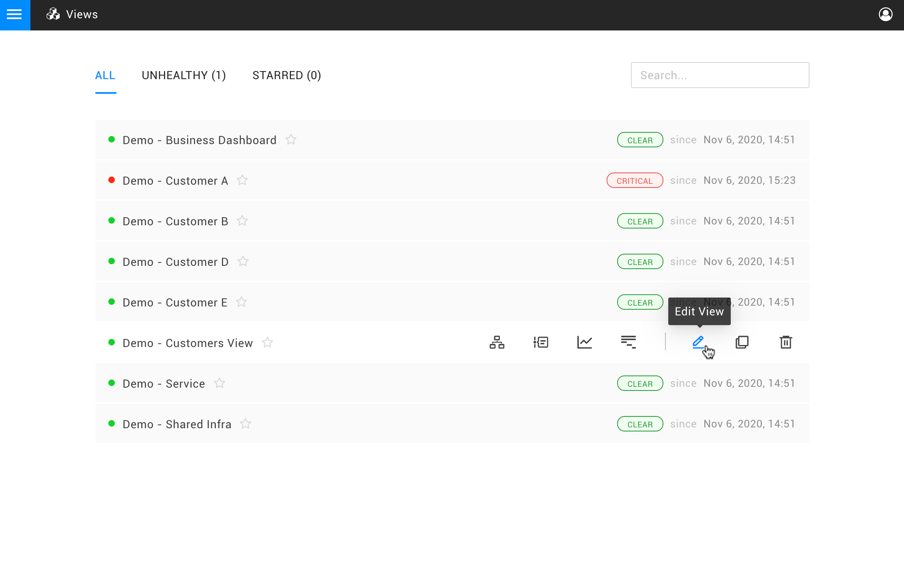
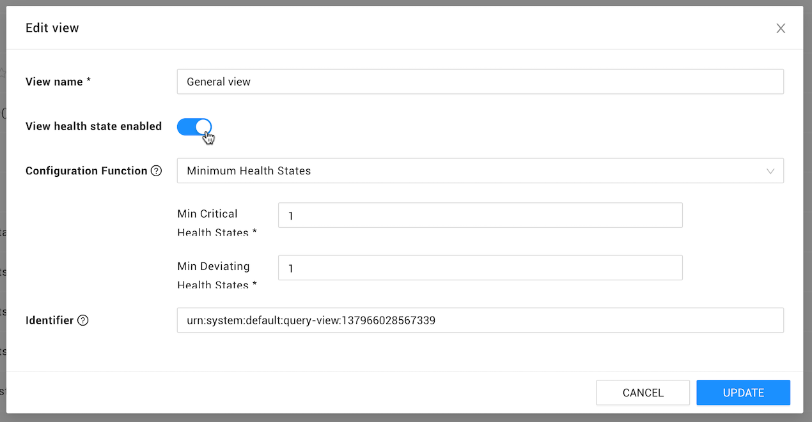

# Configure the view health


**This page describes StackState version 4.5.**

Go to the [documentation for the latest StackState release](https://docs.stackstate.com/use/health-state/configure-view-health).


## Overview

Reacting to each event in an environment can cause a lot of noise. This may be both undesirable and unnecessary. For example, if one or multiple components have an impact on a service, it can be sufficient to report on changes to the problem itself and not each related state change.

StackState can reduce this noise by looking at the overall health state of a **view** rather than that of individual elements. The view health state is determined by the combined health of its elements. When a view changes its health state, a view state change event is triggered and that can in turn trigger an event notification or automated action.

## Configure view health state

View health state is calculated by a **view state configuration function**. To configure a view to report its health state:

1. In the StackState UI, click **Views** from the main menu.
2. Click on the pencil icon next to a view name to edit the view.
3. Set **View Health State Enabled** to **On**.
4. Select a **Configuration function** to use to calculate the view health.
5. Provide any required arguments. These will vary according to the view health state configuration function selected. For example, for the default [MINIMUM HEALTH STATES](configure-view-health.md#minimum-health-states) configuration function:
   * **minCriticalHealthStates** - Set to at least **1**. This is the number of CRITICAL \(red\) health states required for the view to report a CRITICAL health state.
   * **minDeviatingHealthStates** - Set to at least **1**. This is the number of DEVIATING \(orange\) health states required for the view to report a DEVIATING health state.
6. Click **UPDATE** to save the new configuration to the view.
   * The view health will update immediately.



* Create your own [custom View Health State Configuration functions](../../develop/developer-guides/custom-functions/view-health-state-configuration-functions.md).
* Details of the available configuration functions are available in the StackState UI, go to **Settings** &gt; **Functions** &gt; **View Health State Configuration Functions**.


## React to view state changes

When the View health state changes, a `ViewHealthStateChangedEvent` is generated. This event can be used to trigger an [event notification](../metrics-and-events/event-notifications.md), such as an e-mail or Slack message.

## View health state configuration functions

### MINIMUM HEALTH STATES


**minCriticalHealthStates** and **minDeviatingHealthStates** must be set to **1** or higher.

When set to 0, the view will always report a CRITICAL or DEVIATING health state.


The **MINIMUM HEALTH STATES** view health state configuration function calculates the health state of the view as follows:

* The view has a `CRITICAL` health state when more than the **minCriticalHealthStates** components inside the view have a `CRITICAL` health state. This does not count propagated health states.
* The view has a `DEVIATING` health state When more than the **minDeviatingHealthStates** components inside the view have a `DEVIATING` health state. This does not count propagated health states.
* In all other situations, the view has a `CLEAR` health state.



Use the **MINIMUM HEALTH STATES** view health state configuration as a starting point to [create a custom view health state configuration function](../../develop/developer-guides/custom-functions/view-health-state-configuration-functions.md#create-a-custom-view-health-state-configuration-function).


## See also

* [Add a health check](add-a-health-check.md)
* [Send event notifications when a health state changes](/use/stackstate-ui/views/manage-event-handlers.md)
* [Customize the view state configuration](../../develop/developer-guides/custom-functions/view-health-state-configuration-functions.md "StackState Self-Hosted only")
* [Create a custom view health state configuration function](../../develop/developer-guides/custom-functions/view-health-state-configuration-functions.md#create-a-custom-view-health-state-configuration-function "StackState Self-Hosted only")
