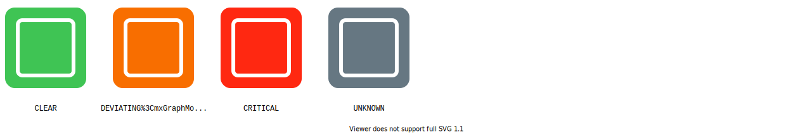
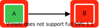
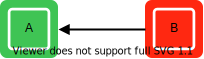
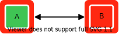
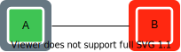
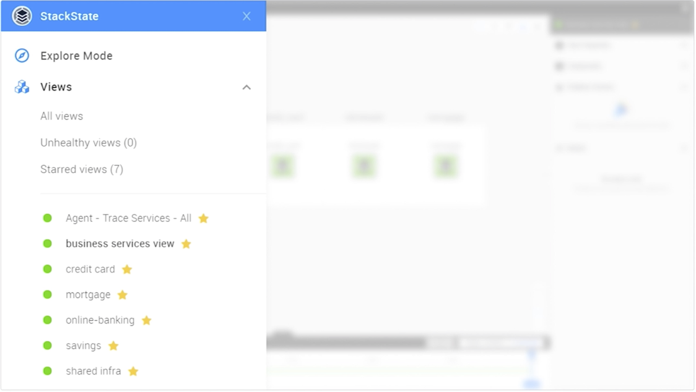

# Health state in StackState

## Overview

StackState will track a single health state for a given topology element \(components and relations\) based on information available from the different health checks attached to it. Health checks can be calculated by either [StackState](health-state-in-stackstate.md#stackstate-health-checks) or an [external monitoring system](health-state-in-stackstate.md#external-monitoring-system).

## Element health state

A topology element \(component, component group or relation\) in StackState can have any of the health states listed below. :

* Green - `CLEAR` - There is nothing to worry about.
* Orange - `DEVIATING` - Something may require your attention.
* Red - `CRITICAL` - Attention is needed right now, because something is broken.
* Gray - `UNKNOWN` - No health state available.

The own health state of an element is calculated as the most severe state reported by a [health check](health-state-in-stackstate.md#health-checks) attached to it. If no health checks are attached to the element, if will report health state UNKNOWN. A second health state - the [propagated health state](health-state-in-stackstate.md#propagated-health-state) - is derived from the health state of elements that a component depends upon. This is shown as a line around the outside of the component.

### Health checks

Health checks attached to an element can be calculated internally by StackState or by an external monitoring system. The health state of an element is calculated as the most severe state reported by a health check attached to it.

#### StackState health checks

StackState can calculate health checks based on telemetry or log streams defined for a topology element. When telemetry or events data is available in StackState, this approach opens up the possibility to use the Autonomous Anomaly Detector \(AAD\) for anomaly health checks.

See how to [add a health check](add-a-health-check.md) and how to [set up anomaly health checks](anomaly-health-checks.md).

#### External monitoring system

Health data from external monitoring systems can be synchronized to StackState as health checks. In this case, health checks are calculated by the external systems based on their own rules and then synchronized with StackState and bound to associated topology elements. This approach is useful if you have existing health checks defined externally, or if it is not viable to send telemetry or events data to StackState and translate the check rules.

Existing StackPacks will provide health synchronization out of the box.


**StackState Self-Hosted**

You can set up a [custom health synchronization](../../configure/health/health-synchronization.md) to integrate with external monitoring systems that are not supported out of the box.


### Propagated health state

Each element in StackState reports two health states:

* The inner color shows the own health state of the element. This is derived from the state reported by health checks attached to the element itself.
* The outer color shows the element's propagated health state. This is derived from the health state of the components and relations that the element depends upon.

The propagated health state of a component is calculated using a propagation function. Health state will propagate from one component to the next, from dependencies to dependent components. Note that this is the opposite direction to the arrows shown on [relations](../introduction-to-stackstate/components_and_relations.md#relations) in the topology graph.


**StackState Self-Hosted**

You can configure custom [propagation functions](../../develop/developer-guides/custom-functions/propagation-functions.md) to customize how health state affects the overall health of your systems.



A CLEAR \(green\) health state does not propagate.


| Dependency and propagated state | Description |
| :--- | :--- |
|  | Component A depends on component B. Health state will propagate from B to A. |
|  | Component B depends on component A. Health state will propagate from A to B. |
|  | Dependency in both directions. Health state will propagate from A to B and from B to A. In other words, it is a circular dependency. |
|  | No dependency. Health state does not propagate. |

## View health state

When **view health state** is enabled for a view, it will report a health state as one of four colours:

* Green - `CLEAR` - There is nothing to worry about.
* Orange - `DEVIATING` - Something may require your attention.
* Red - `CRITICAL` - Attention is needed right now, because something is broken.
* Gray - `UNKNOWN` - View health state reporting is disabled.

The view health state is calculated based on the health of components and relations within in the view. Find out how to [configure view health state reporting](configure-view-health.md).

You can check the view health state in the following places in the StackState UI:

* **Current view** - The health state of the current view is visible in the top bar of the StackState UI and also next to the view name in the View Details pane on the right of the screen. Historical health state information for a view can be seen in the [timeline Health](../stackstate-ui/timeline-time-travel.md#health) line at the bottom of the screen.
* **Starred views** - Starred views are listed in the StackState main menu together with their health state.
* **All views** - The health state of all views is visible on the view overview screen. Click **Views** from the StackState main menu.

## See also

* [Add a health check based on telemetry streams available in StackState](add-a-health-check.md)
* Add [Static Health from CSV](../../stackpacks/integrations/static_health.md)
* [Set up a health synchronization](../../configure/health/health-synchronization.md)
* [Configure the view health](configure-view-health.md)
