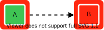

# Components and Relations


**This page describes StackState version 4.4.**

Go to the [documentation for the latest StackState release](https://docs.stackstate.com/).


## Components

A component is anything that has a run-time state and some relation with other components. Some component examples are a load balancer, a database server, a network switch, or a business service. It is possible to define custom components, and they can be anything - the granularity and range can be defined according to the needs. Each component is of a specific type. Types can be configured.

A component consists of:

1. The name of the component.
2. An icon in the middle that represents either the component itself or the component type.
3. An inner color is representing the health state.
4. An outer color is representing the propagated health state. This state depends on other components or relations.

## Relations

A relation connects two components or groups of components. Relations have some similarities with components. Just like a component, they can have a state and a propagated state. In the StackState topology perspective, relations are shown as lines connecting components or component groups.

Relations in StackState can be either [direct or indirect](../stackstate-ui/perspectives/topology-perspective.md#direct-and-indirect-relations). Indirect relations are shown as a dashed line.

If a relation indicates a dependency, the line will have an arrowhead showing the direction of the dependency. A dependency could be in one direction or in both directions, indicating that two components depend on each other, for example a network device talking to another networking device that has a bi-directional connection.

[Health state will propagate](../health-state/health-state-in-stackstate.md#propagated-health-state) from one component to the next upwards along a chain of dependencies. If the relation does not show a dependency between the components it connects \(no arrowhead\), it can be considered as merely a line in the visualizer or a connection in the stack topology.

| Relation type | Description |
| :--- | :--- |
|  | Component A depends directly on component B. Health state will propagate from B to A. |
|  | Component A depends indirectly on component B - a path of invisible components sits between the two components. Health state will propagate from B to A. |
|  | Dependency in both directions. Health state will propagate from A to B and from B to A. In other words, it is a circular dependency. |
|  | No dependency. Health state does not propagate. |


Relations to or from a component group are always represented by a solid line. It should be noted that in this case, the connection could be a direct or indirect relation to one or more components in the group.


