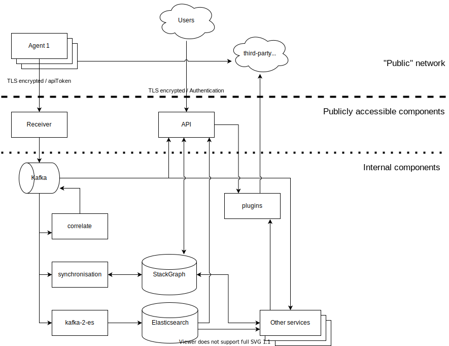

# Data flow architecture

StackState process incoming data. Mainly via the agents, but instead of the agent it can also be other tools that send data to the receiver. StackState processes this data and makes it available via an API/UI to its users. All components involved in processing and storing the data are depicted in the below diagram.

Next to data flowing in and out of the data storing components \(Kafka, StackGraph and Elasticsearch\) all those components are distributed systems themselves, meaning that there is also data in-flight between the different parts \(sub-components\) of those components. See the next chapter for a detailed discussion of the components and data flowing between them.

StackState authentication can use external systems for authenticating like LDAP and OIDC. For a standard installation however StackState has standard users configured in its configuration file.

Finally, not in the diagram, are plugins of StackState. They are used to pull \(instead of push\) metrics and/or events from external data sources for which configuration is stored in StackGraph. This includes credentials and authentication tokens.

## See also

* [Data per component](data-per-component.md)
* [Data protection features for SaaS](saas.md)
* [Data protection features for self-hosted StackState](self-hosted.md)

