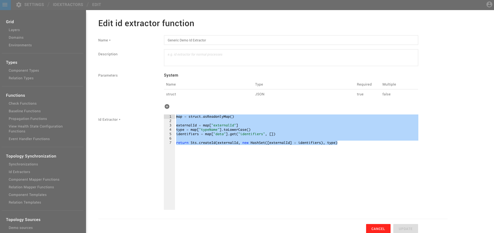

# ID extraction


**This page describes StackState version 4.2.**

The StackState 4.2 version range is End of Life (EOL) and no longer supported. We encourage customers still running the 4.2 version range to upgrade to a more recent release.

Go to the [documentation for the latest StackState release](https://docs.stackstate.com/).


Id extraction is used in the synchronization process to turn external data into External Topology. It extracts the unique identity and identifiers for components. With the external data being send, the Id Extractor can produce the following information:

* a `type` - for the component/relation for differentiation in later steps
* an `externalId` - is the identifier with which the element is easily identifiable in the external source
* `identifiers` \(multiple\) - a set of identifiers that identify the object internally in StackState.



Below you can find an Id Extractor function:

```text
map = struct.asReadonlyMap()

externalId = map["externalId"]
type = map["typeName"].toLowerCase()
identifiers = map["data"].get("identifiers", [])

return Sts.createId(externalId, new HashSet([externalId] + identifiers), type)
```

