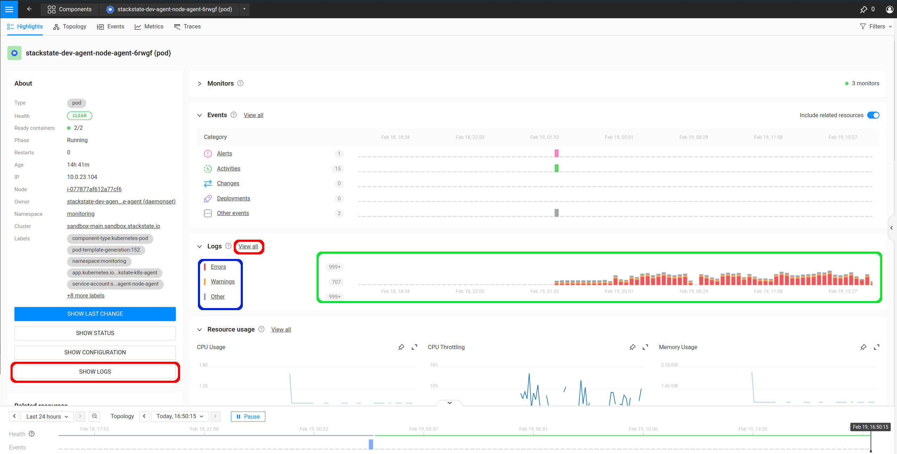
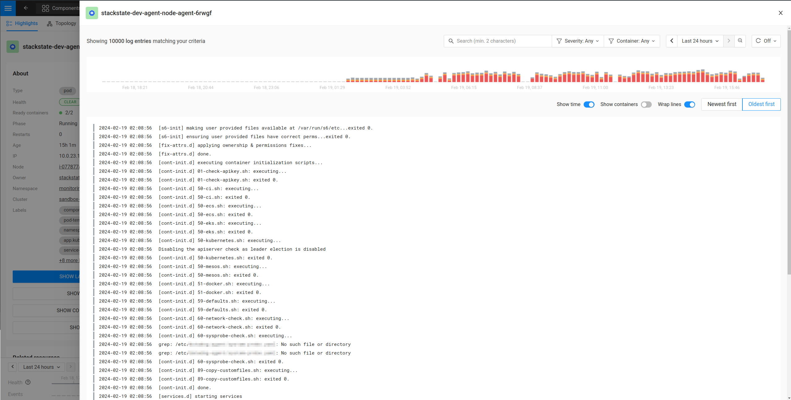
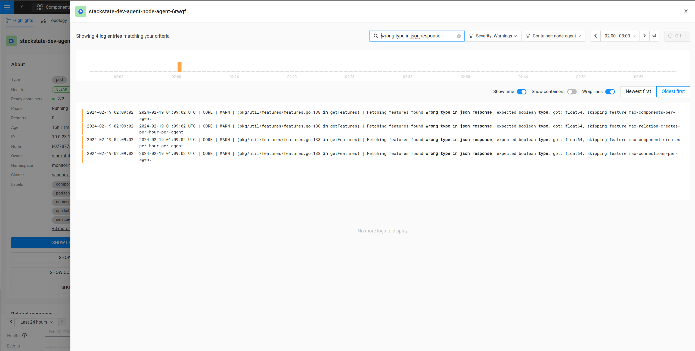

# Explore logs

## Navigate to Logs

You can explore the container logs of any Kubernetes environment that is configured with log shipping through the StackState UI.
This can be done by drilling down to `pod` level through any of the provided paradigms (Services, Deployments, Stateful Sets, Daemon Sets, etc.) from the Kubernetes menu on the left

For simplicity, and completeness, the example uses the `Pods` paradigm directly, and a pod was chosen that contains multiple containers, as to be able to distinguish between Pod logs and Container logs.  The Pod view will have multiple log-related entry points.

## Viewing the Logs

To view all the logs associated with this Pod, click on either of the two options circled in red.  To filter by log entry type (Errors, Warnings, Other), select one of the items circled in blue.  The histogram displaying proportionality between the log entry types is circled in green.

### The Logs Drawer

The Logs Drawer facilitates a visually pleasing experience to navigating log files in a way that enhances the troubleshooting experience.

For simplicity, the example only deals with unfiltered selections (circled in red), which will display all log lines, of all containers, of any log entry type.  Selecting either of the two options circled in red opens up the log drawer with no filtering applied:

From this point onward, one could start to drill in closer to the problem by applying options to the provided filters (search string match, severity, container, log window interval).  Several options are available for sorting and display preference directly below the histogram in the logs drawer.

* Search String Match will take an input search term and filter out any log line that does not contain it.
* Severity options are `Any`, `Error`, `Warning`, and `Other`. Selecting anything but `Any` will exclude all log lines that don't match the selection.
* Container options will include `Any`, and a list of containers in the Pod.  Selecting anything but `Any` will restrict output to that produced by the selected container.
* Log Window Interval options will be a date-time picker interface that allows you to specify a `from` and `to` interval.  Changing this from the default will exclude all log entries that fall outside the selected period. 

As an example, all four can be seen in action below:

The image above has the following filters applied:

* Search term: `wrong type in json response`
* Severity: `Warning`
* Container: `node-agent`
* Log Window Interval: Between `02:00am` and `03:00am` of the current day.