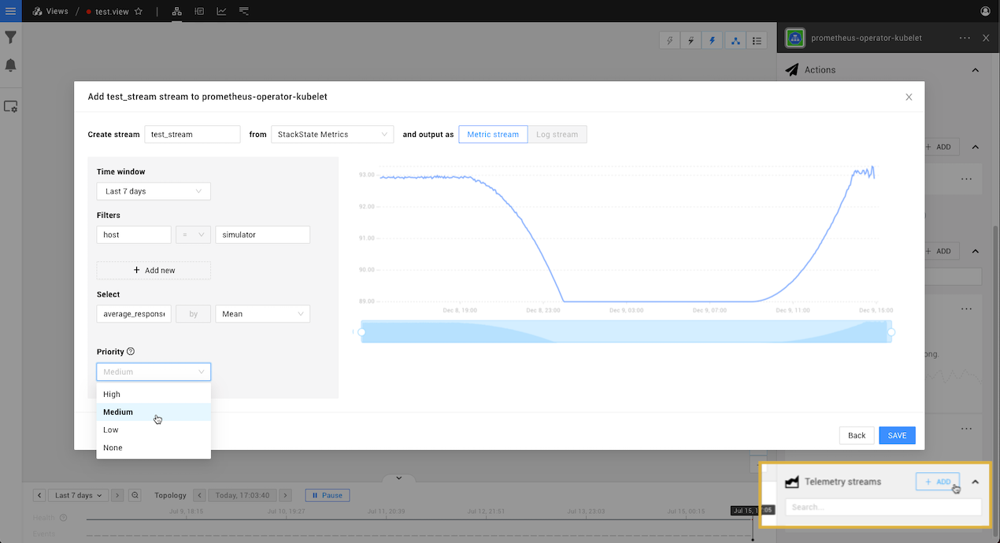

# Add a telemetry stream

## Overview

Elements in StackState can have a telemetry \(metrics or log\) stream assigned. This provides additional insight into your topology and is required, for example, to [monitor the health of an element](../health-state/add-a-health-check.md). If a telemetry stream was not automatically been assigned to an element or you want to add a custom telemetry stream, you can do this manually from the StackState UI.

## Add a telemetry stream to an element

Telemetry streams can be added to any element in the StackState Topology Perspective.

1. Select the element that you want to add a telemetry stream to.
2. Click **+ ADD** next to **Telemetry streams** on the right of the screen.
3. Provide the following details:
   * **Name** - A name for the telemetry stream. This will be visible in the StackState UI.
   * **Data source** - The data source for the telemetry stream. You can select from the standard data sources or add your own in **Settings** &gt; **Telemetry Sources**.
4. Click **NEXT**
5. At the top of the **Add a new stream** popup, select whether to output the telemetry stream as a Metric stream or a Log stream:
   * **Metric stream** \(default\) - use for metrics. Allows for various aggregation methods and will be visualized as a timeseries line chart.
   * **Log stream** - use for streams that contain logs and events. Will be visualized as a bar chart.
6. Provide the following details:
   * **Time window** - The selection of time to be shown in the StackState UI. The time window is used for display purposes only and does not affect handling in any way.
   * **Filters** - Select the data relevant to the element. For example, if the data source contains data about all services on a host, select the specific host and service to attach data for.
   * **Select** - select the metric you want to retrieve and the function to apply to it.
   * **Priority** - Optional, you can [set a priority for the telemetry stream](../../configure/telemetry/how_to_use_the_priority_field_for_components.md). This will influence the order in which the stream is displayed in the StackState UI and the way the stream is handled by other services, such as the [Autonomous Anomaly Detector](../../stackpacks/add-ons/aad.md).
7. The stream preview on the right will update to show the incoming metric values based on the details you provide.
8. Click **SAVE** to add the stream to the element.
   * You will receive a notification that the stream has been successfully completed.
9. A graph of the selected telemetry stream data will be visible in the list of **Telemetry streams** on the right of the screen. You can inspect data in the stream using the [telemetry inspector](browse-telemetry.md).

## See also

* [Autonomous Anomaly Detector](../../stackpacks/add-ons/aad.md)
* [Monitor the health of an element](../health-state/add-a-health-check.md)
* [Browse data in a telemetry stream](browse-telemetry.md)
* [Use templates to add telemetry streams to your own integrations](../../configure/telemetry/telemetry_synchronized_topology.md "StackState Self-Hosted only")
* [Set a priority for the telemetry stream](../../configure/telemetry/how_to_use_the_priority_field_for_components.md "StackState Self-Hosted only")
