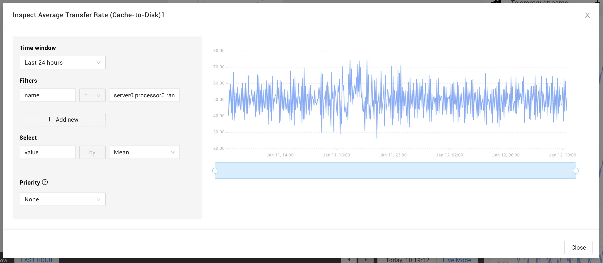

# Browse telemetry


This page describes StackState v4.5.x.
The StackState 4.5 version range is End of Life (EOL) and no longer supported. We encourage customers still running the 4.5 version range to upgrade to a more recent release.

Go to the [documentation for the latest StackState release](https://docs.stackstate.com/use/metrics-and-events/browse-telemetry).


## Overview

The StackState UI displays a visualization of filtered data for each configured telemetry stream.

Telemetry streams are added to elements automatically when they are imported to StackState or you can manually [add a single telemetry stream](add-telemetry-to-element.md) to a single component.

## Telemetry inspector

Click on any of the telemetry stream charts, or select **Inspect stream** from its context menu, to open the telemetry inspector.

Within the telemetry inspector you can adjust the selected metric as well as the filters, time window and aggregation applied to the data source. Changes made here will not be saved to the telemetry stream attached to the element.

## See also

* [Add a single telemetry stream to a component](add-telemetry-to-element.md)
* [Monitor a telemetry stream with a health check](../health-state/add-a-health-check.md)
* [Use templates to add telemetry streams to your own integrations](../../configure/telemetry/telemetry_synchronized_topology.md "StackState Self-Hosted only")
