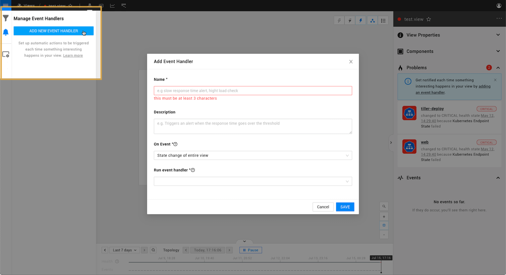

# Send event notifications

## Overview

When something goes wrong within your IT environment, StackState can send event notifications to alert you or your team mates. A message can be sent in the form of an email, Slack message, mobile ping or an HTTP POST request to any URL. Event notifications can contain detailed content on the trigger event and possible root cause. 

## Event handlers

Event handlers can be added to a StackState view to send event notifications or trigger actions in response to health state change events or problem events that are generated within the view. The event handler will listen to generated events and run a configured event handler function when the configured [event type](#event-types-for-notifications) is generated.

You can add an event handler to a view from the StackState UI [Manage Event Handlers](/use/stackstate-ui/views/manage-event-handlers.md) pane.

## Event types for notifications

Event handlers can be configured to respond to [state change events](event-notifications.md#state-change-events) and [problem events](event-notifications.md#problem-events).

### State change events

Metrics and events data flow through StackState topology elements in telemetry streams. These telemetry streams are used by [health checks](../health-state/add-a-health-check.md) to determine the health state of an element. For every change in health state, at least one state change event is generated. Use the [Manage Event Handlers](/use/stackstate-ui/views/manage-event-handlers.md) pane to add an event handler to the view and trigger an event notification or action whenever state changed events are generated.

The event types generated when an element state changes are described in the table below.

| Event type | Description |
| :--- | :--- |
| `HealthStateChangedEvent` | **State change of an element** Generated when the health state of an element changes. These events will be listed in the StackState UI [Events Perspective](../stackstate-ui/perspectives/events_perspective.md). |
| `PropagatedStateChangedEvent` | **Propagated state change of an element** Generated whenever the health state of one of an element’s dependencies changes. These events are not visible in the StackState UI, but can be used for trigger an event notification. |
| `ViewStateChangedEvent` | **State change of entire view** Generated only when the health state of a significant number of elements in a view changes. These events are not visible in the StackState UI, but can be used to trigger event notifications. **Note** that there may be a slight delay between the generation of a `HealthStateChangedEvent` for an element and the resulting `ViewStateChangedEvent`. This can cause the reported state of a view to differ from the actual state of elements within it. |

### Problem events

StackState groups unhealthy components in a view into problems, each with a common root cause. For every change to a problem, at least one problem event is generated. Use the [Manage Event Handlers](/use/stackstate-ui/views/manage-event-handlers.md) pane to add an event handler to the view and trigger an event notification or action whenever problem events are generated.

Changes to a problem result in the following event types being generated:

| Event type | Description |
| :--- | :--- |
| `ProblemCreated` | A new problem has been created. |
| `ProblemUpdated` | New information is available for a problem. For example, a new root cause or contributing cause being added to the problem, or an update to a check on an existing unhealthy component. |
| `ProblemSubsumed` | A change in root cause has caused an existing problem to be joined with another problem. |
| `ProblemResolved` | The root cause component and all contributing cause components have reported a CLEAR \(green\) health state. No unhealthy components remain in the problem. |

➡️ [Learn more about the problem lifecycle](/use/problem-analysis/about-problems.md#problem-lifecycle)

## See also

* [Add a health check](../health-state/add-a-health-check.md)
* [Configure an SMTP server to send email event notifications](../../configure/topology/configure-email-event-notifications.md "StackState Self-Hosted only")
* [Custom event handlers](../../develop/developer-guides/custom-functions/event-handler-functions.md "StackState Self-Hosted only")
* [Create a custom event handler function](../../develop/developer-guides/custom-functions/event-handler-functions.md "StackState Self-Hosted only")
