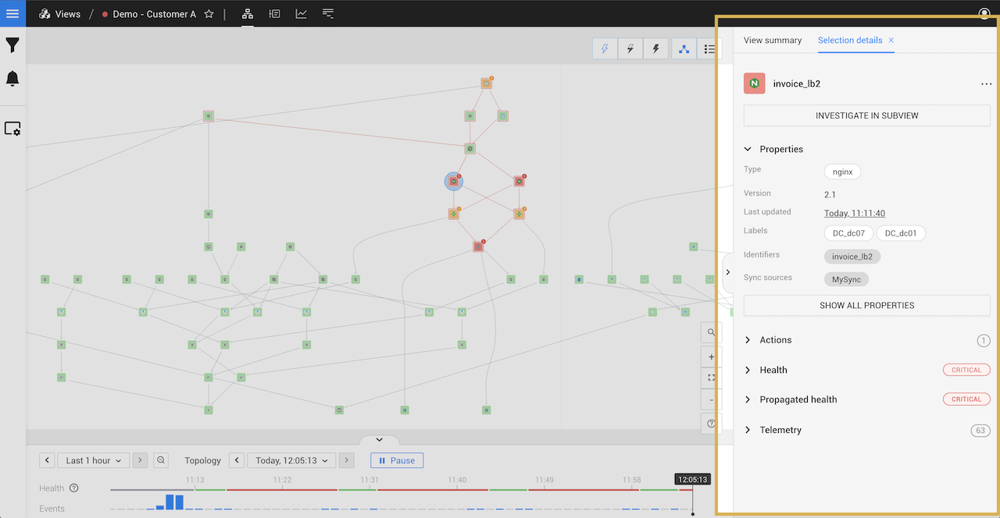
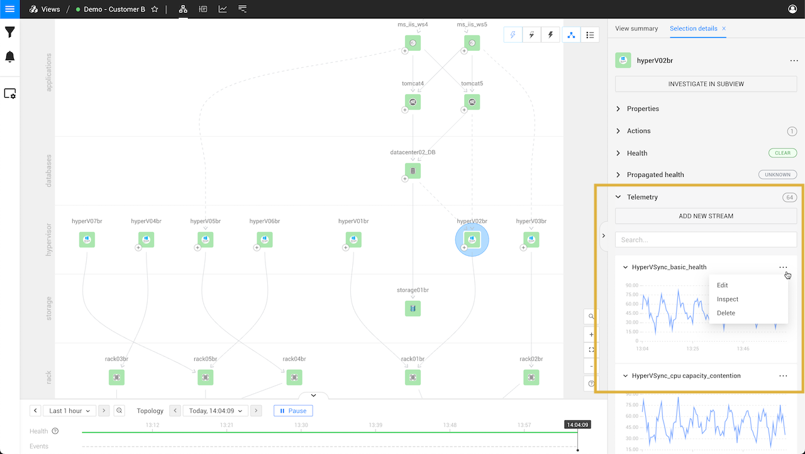

# Set telemetry stream priority

## Overview

Telemetry streams in the right-hand component pane of the StackState UI are displayed in order of telemetry stream priority. There are four levels of priority: `High`, `Medium`, `Low`, and `None`. By default, all streams have priority set to `none`. 

Stream priority is used in StackState to help determine the following:

* The order in which streams are displayed in the **Telemetry** list in the [component and relation details pane](/use/concepts/components.md#component-details-pane) on the right-hand side of the StackState UI. Streams are ordered by priority (highest at the top) and then alphabetically.
* The streams that are shown as [Top metrics](/use/metrics-and-events/top-metrics.md) in the component context menu - this is the pop-up displayed when you hover the mouse pointer over a component in the Topology Perspective. The most recent metric received from the first three streams in the **Telemetry** list will be displayed.
* The order in which streams are displayed in the [Metrics Perspective](/use/stackstate-ui/perspectives/metrics-perspective.md).
* The [streams selected for monitoring by the Autonomous Anomaly Detector](/stackpacks/add-ons/aad.md#how-are-metric-streams-selected).

## Set the telemetry stream priority

To change the priority of a specific stream, follow the instructions below.

### 1. Open the Component Details pane

Locate the component that you want to edit Telemetry streams for. Click on the component to open the Component Details pane on the right of the screen - see the screenshot below:

This displays the details of the component, such as Properties, Health status, and Telemetry.

### 2. Choose the telemetry streams to prioritize

Components can have multiple Telemetry streams. They are presented in a column, so not all of them are visible at first. Let's say that instead of `BytesReceivedRate`, you want to see `PacketsReceivedRate` right after the `basic_health` stream. Click on the triple dots menu in the top-right corner of the `basic_health` stream and choose **Edit**:

### 3. Set stream priority

In the `basic_health` stream edit screen, set the Priority field to `High`, as this stream should be presented at the top of the list. Click **Save** and confirm the change:

Now navigate to the `PacketsReceivedRate` stream and open the stream editing screen. Set the Priority field here to `Medium`:

All streams have their priority set to `None` by default, so the `PacketsReceivedRate` stream is presented above them and below the `basic_health` stream, which has its priority set to `High`.

